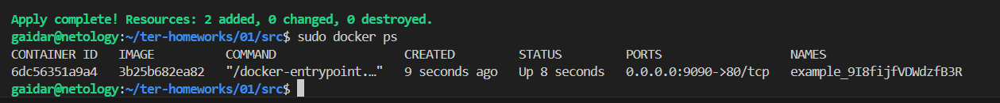
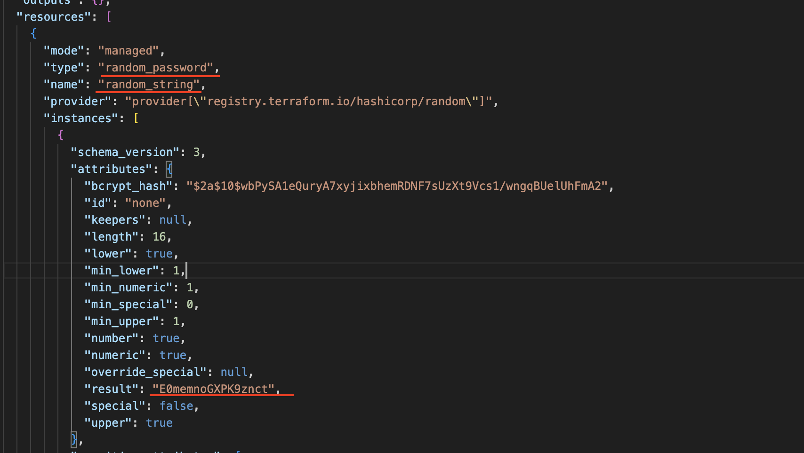

Версия установленного terraform


# Пункт 3

Cекретное содержимое созданного ресурса random_password

"result": "9I8fijfVDWdzfB3R",

#Пункт 4

"1nginx" name не может начинаться с цифр

Переменная random_password.random_string_FAKE.resulT написана с ошибками. мы не задавали имя random_string_FAKE в resource "random_password", а так-же в переменной resulT допущена синтаксическая ошибка. Правильное написание переменных наглядно можно увидеть в файле terraform.tfstate

resource "docker_container" не сможет найти image, который мы указали ему в качесте переменных из resource "docker_image", ведь мы его не раскомментировали (он выше 29 строки). Плюсом ко всему в resource "docker_image" следует указать имя, которое мы указали в качестве переменной в resource "docker_container"

#Пункт 5

[Исправленный код (ссылка на github)](https://github.com/gaidarvu/ter-homeworks/blob/main/01/src/main.tf)



#Пункт 6

При выполнении команды terraform apply с флагом -auto-approve может привести к неожиданным послетствиям. Этот флаг автоматически одобряет все изменения, которые terraform собирается внести. Выполняя команду с данным флагом, мы должны чётко понимать какие изменения последуют после выполнения кода. В противном случае есть большая вероятность случайных изменений или удалений ресурсов. В любом случае лучше применять конфигурацию с подтверждением ручного ввода без флага -auto-approve или перед выполнением кода сделать terraform plan

Данный флаг может быть полезен тем, что убирает необходимость ручного подтверждения, команда будет выполняться быстрее. Это полезно в разработческих средах или в тестовых пайплайнах, где скорость является важным фактором. В некоторых случаях развертывание может быть заранее запланировано и протестировано. Использование -auto-approve может быть частью четкого процесса, где все изменения уже были проверены, и нет необходимости в дополнительных подтверждениях.



#Пункт 7

Cодержимое файла terraform.tfstate

```js
{
  "version": 4,
  "terraform_version": "1.9.8",
  "serial": 11,
  "lineage": "8eb799a7-e4ab-2dad-4396-1f2911fa3e5f",
  "outputs": {},
  "resources": [],
  "check_results": null
}
```