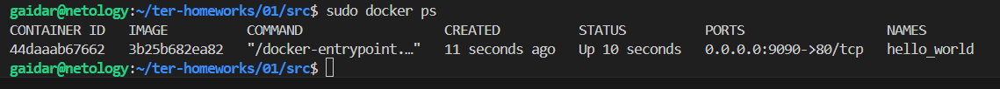

1nginx name не может начинаться с цифр

Переменная random_password.random_string_FAKE.resulT написана с ошибками. мы не задавали имя random_string_FAKE в resource "random_password", а так-же в переменной resulT допущена синтаксическая ошибка. Правильное написание переменных наглядно можно увидеть в файле terraform.tfstate

resource "docker_container" не сможет найти image, который мы указали ему в качесте переменных из resource "docker_image", ведь мы его не раскомментировали (он выше 29 строки). Плюсом ко всему в resource "docker_image" следует указать имя, которое мы указали в качестве переменной в resource "docker_container"

При выполнении команды terraform apply с флагом -auto-approve может привести к неожиданным послетствиям. Этот флаг автоматически одобряет все изменения, которые terraform собирается внести. Выполняя команду с данным флагом, мы должны чётко понимать какие изменения последуют после выполнения кода. В противном случае есть большая вероятность случайных изменений или удалений ресурсов. В любом случае лучше применять конфигурацию с подтверждением ручного ввода без флага -auto-approve или перед выполнением кода сделать terraform plan

