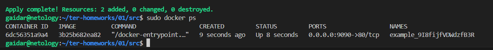
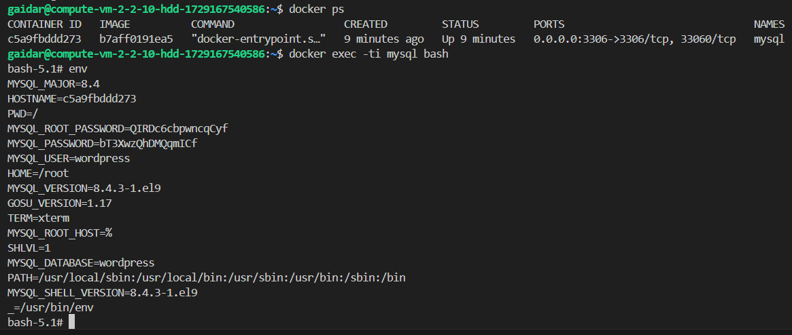

# Домашнее задание к занятию «Введение в Terraform»

### Цели задания

1. Установить и настроить Terrafrom.
2. Научиться использовать готовый код.

------

### Чек-лист готовности к домашнему заданию

1. Скачайте и установите **Terraform** версии ~>1.8.4 . Приложите скриншот вывода команды ```terraform --version```.
2. Скачайте на свой ПК этот git-репозиторий. Исходный код для выполнения задания расположен в директории **01/src**.
3. Убедитесь, что в вашей ОС установлен docker.

#### Решение

1. Установленная версия ``Terraform``

```text
alekseykashin@MacBook-Pro-Aleksej src % terraform -version
Terraform v1.8.4
on darwin_arm64

Your version of Terraform is out of date! The latest version
is 1.9.5. You can update by downloading from https://www.terraform.io/downloads.html
```
3. Установленная версия ``Docker``

```text
alekseykashin@MacBook-Pro-Aleksej src % docker --version
Docker version 27.1.1, build 6312585
```

------

### Инструменты и дополнительные материалы, которые пригодятся для выполнения задания

1. Репозиторий с ссылкой на зеркало для установки и настройки Terraform: [ссылка](https://github.com/netology-code/devops-materials).
2. Установка docker: [ссылка](https://docs.docker.com/engine/install/ubuntu/). 
------
### Внимание!! Обязательно предоставляем на проверку получившийся код в виде ссылки на ваш github-репозиторий!
------

### Задание 1

1. Перейдите в каталог [**src**](https://github.com/netology-code/ter-homeworks/tree/main/01/src). Скачайте все необходимые зависимости, использованные в проекте. 
2. Изучите файл **.gitignore**. В каком terraform-файле, согласно этому .gitignore, допустимо сохранить личную, секретную информацию?(логины,пароли,ключи,токены итд)
3. Выполните код проекта. Найдите  в state-файле секретное содержимое созданного ресурса **random_password**, пришлите в качестве ответа конкретный ключ и его значение.
4. Раскомментируйте блок кода, примерно расположенный на строчках 29–42 файла **main.tf**.
Выполните команду ```terraform validate```. Объясните, в чём заключаются намеренно допущенные ошибки. Исправьте их.
5. Выполните код. В качестве ответа приложите: исправленный фрагмент кода и вывод команды ```docker ps```.
6. Замените имя docker-контейнера в блоке кода на ```hello_world```. Не перепутайте имя контейнера и имя образа. Мы всё ещё продолжаем использовать name = "nginx:latest". Выполните команду ```terraform apply -auto-approve```.
Объясните своими словами, в чём может быть опасность применения ключа  ```-auto-approve```. Догадайтесь или нагуглите зачем может пригодиться данный ключ? В качестве ответа дополнительно приложите вывод команды ```docker ps```.
8. Уничтожьте созданные ресурсы с помощью **terraform**. Убедитесь, что все ресурсы удалены. Приложите содержимое файла **terraform.tfstate**. 
9. Объясните, почему при этом не был удалён docker-образ **nginx:latest**. Ответ **ОБЯЗАТЕЛЬНО НАЙДИТЕ В ПРЕДОСТАВЛЕННОМ КОДЕ**, а затем **ОБЯЗАТЕЛЬНО ПОДКРЕПИТЕ** строчкой из документации [**terraform провайдера docker**](https://docs.comcloud.xyz/providers/kreuzwerker/docker/latest/docs).  (ищите в классификаторе resource docker_image )


------

#### Решение

1. Скачал
2. В файле с расширением *.tfvars 
3. Скачали зависимости ``main.tf``

    ```text
    alekseykashin@MBP-Aleksej src % terraform init    
    Initializing the backend...
    Initializing provider plugins...
    - Finding kreuzwerker/docker versions matching "~> 3.0.1"...
    - Finding latest version of hashicorp/random...
    - Installing kreuzwerker/docker v3.0.2...
    - Installed kreuzwerker/docker v3.0.2 (unauthenticated)
    - Installing hashicorp/random v3.6.2...
    - Installed hashicorp/random v3.6.2 (unauthenticated)
    Terraform has created a lock file .terraform.lock.hcl to record the provider
    selections it made above. Include this file in your version control repository
    so that Terraform can guarantee to make the same selections by default when
    you run "terraform init" in the future.

    ╷
    │ Warning: Incomplete lock file information for providers
    │ 
    │ Due to your customized provider installation methods, Terraform was forced to
    │ calculate lock file checksums locally for the following providers:
    │   - hashicorp/random
    │   - kreuzwerker/docker
    │ 
    │ The current .terraform.lock.hcl file only includes checksums for
    │ darwin_arm64, so Terraform running on another platform will fail to install
    │ these providers.
    │ 
    │ To calculate additional checksums for another platform, run:
    │   terraform providers lock -platform=linux_amd64
    │ (where linux_amd64 is the platform to generate)
    ╵
    Terraform has been successfully initialized!

    You may now begin working with Terraform. Try running "terraform plan" to see
    any changes that are required for your infrastructure. All Terraform commands
    should now work.

    If you ever set or change modules or backend configuration for Terraform,
    rerun this command to reinitialize your working directory. If you forget, other
    commands will detect it and remind you to do so if necessary.
    ```

4. Применяем ``main.tf``

    ```text
    alekseykashin@MBP-Aleksej src % terraform apply

    Terraform used the selected providers to generate the following execution plan. Resource actions are indicated with the
    following symbols:
      + create

    Terraform will perform the following actions:

      # random_password.random_string will be created
      + resource "random_password" "random_string" {
          + bcrypt_hash = (sensitive value)
          + id          = (known after apply)
          + length      = 16
          + lower       = true
          + min_lower   = 1
          + min_numeric = 1
          + min_special = 0
          + min_upper   = 1
          + number      = true
          + numeric     = true
          + result      = (sensitive value)
          + special     = false
          + upper       = true
        }

    Plan: 1 to add, 0 to change, 0 to destroy.

    Do you want to perform these actions?
      Terraform will perform the actions described above.
      Only 'yes' will be accepted to approve.

      Enter a value: yes

    random_password.random_string: Creating...
    random_password.random_string: Creation complete after 0s [id=none]

    Apply complete! Resources: 1 added, 0 changed, 0 destroyed.
    alekseykashin@MBP-Aleksej src % 
    ```

5. Значение ключа 
6. Раскрываем код, проверяем файл ``main.tf``

    ```text
    alekseykashin@MBP-Aleksej ~ % cd ~/nettology/ter-homeworks/01
    alekseykashin@MBP-Aleksej 01 % cd src
    alekseykashin@MBP-Aleksej src % terraform validate
    ╷
    │ Error: Invalid resource name
    │ 
    │   on main.tf line 29, in resource "docker_container" "1nginx":
    │   29: resource "docker_container" "1nginx" {
    │ 
    │ A name must start with a letter or underscore and may contain only letters,
    │ digits, underscores, and dashes.
    ╵
    ```

    Пишет что метка на конкретный ресурс может начинать только с буквы или с символа подчеркивания
    Правим код

    ```text
    alekseykashin@MBP-Aleksej src % cat main.tf
    ...


    resource "docker_image" {
      name         = "nginx:latest"
      keep_locally = true
    }

    resource "docker_container" "_nginx" {
      image = docker_image.nginx.image_id
      name  = "example_${random_password.random_string_FAKE.resulT}"

      ports {
        internal = 80
        external = 9090
      }
    }
    ```

    Проверяем его еще раз

    ```text
    alekseykashin@MBP-Aleksej src % terraform validate
    ╷
    │ Error: Missing name for resource
    │ 
    │   on main.tf line 24, in resource "docker_image":
    │   24: resource "docker_image" {
    │ 
    │ All resource blocks must have 2 labels (type, name).
    ╵
    alekseykashin@MBP-Aleksej src % 
    ```

    Не хватает метки(label) ``nginx`` для ресурса ``docker_image``
    Правим

    ```text
    alekseykashin@MBP-Aleksej src % cat main.tf
    ...

    resource "docker_image" "nginx" {
      name         = "nginx:latest"
      keep_locally = true
    }

    resource "docker_container" "_nginx" {
      image = docker_image.nginx.image_id
      name  = "example_${random_password.random_string_FAKE.resulT}"

      ports {
        internal = 80
        external = 9090
      }
    }
    ```

    Проверяем повторно

    ```text
    alekseykashin@MBP-Aleksej src % terraform validate
    ╷
    │ Error: Reference to undeclared resource
    │ 
    │   on main.tf line 31, in resource "docker_container" "_nginx":
    │   31:   name  = "example_${random_password.random_string_FAKE.resulT}"
    │ 
    │ A managed resource "random_password" "random_string_FAKE" has not been
    │ declared in the root module.
    ```

    Косячить мы не перестали, неправильная метка на ресурс ``random_password``.``random_string``
    Чиним

    ```text
    alekseykashin@MBP-Aleksej src % cat main.tf       

    ....

    resource "docker_image" "nginx" {
      name         = "nginx:latest"
      keep_locally = true
    }

    resource "docker_container" "_nginx" {
      image = docker_image.nginx.image_id
      name  = "example_${random_password.random_string.resulT}"

      ports {
        internal = 80
        external = 9090
      }
    }
    ```

    Чекаем, надеюсь что это успешный успех

    ```text
    alekseykashin@MBP-Aleksej src % terraform validate
    ╷
    │ Error: Unsupported attribute
    │ 
    │   on main.tf line 31, in resource "docker_container" "_nginx":
    │   31:   name  = "example_${random_password.random_string.resulT}"
    │ 
    │ This object has no argument, nested block, or exported attribute named
    │ "resulT". Did you mean "result"?
    ╵
    ```

    Эпик фэйл.
    Чиним

    ```text
    alekseykashin@MBP-Aleksej src % cat main.tf       
    ...

    resource "docker_image" "nginx" {
      name         = "nginx:latest"
      keep_locally = true
    }

    resource "docker_container" "_nginx" {
      image = docker_image.nginx.image_id
      name  = "example_${random_password.random_string.result}"

      ports {
        internal = 80
        external = 9090
      }
    }
    ```

    Проверяем

    ```text
    alekseykashin@MBP-Aleksej src % terraform validate
    Success! The configuration is valid.

    ```

    win

7. Меняем имя докер контейнера на ```hello_world``` и применяем ```main.tf```, опсаность ```-auto-approve``` в том что план автоматичски применится, мы не будем знать о изменениях (ожидаемых / не ожидаемых), есть возможность что кто то изменил еще крме нас, один из множества файликов с ```*.tf```, а мы без проверки его раскатили и что нибудь порушили. Этот параметр полезен в сценариях, когда требуется пропустить этап утверждения вручную, нарпимер при интеграции ```Terraform``` в конвейерах ```CI/CD```

    ```text
    alekseykashin@MBP-Aleksej src % cat main.tf       
    ...

    resource "docker_image" "nginx" {
      name         = "nginx:latest"
      keep_locally = true
    }

    resource "docker_container" "hello_world" {
      image = docker_image.nginx.image_id
      name  = "example_${random_password.random_string.result}"

      ports {
        internal = 80
        external = 9090
      }
    }
    ```

    Применяем инфру ```terraform```

    ```text
    alekseykashin@MBP-Aleksej src % terraform apply -auto-approve

    Terraform used the selected providers to generate the following execution plan. Resource actions are indicated with the following
    symbols:
      + create

    Terraform will perform the following actions:

      # docker_container.hello_world will be created
      + resource "docker_container" "hello_world" {
          + attach                                      = false
          + bridge                                      = (known after apply)
          + command                                     = (known after apply)
          + container_logs                              = (known after apply)
          + container_read_refresh_timeout_milliseconds = 15000
          + entrypoint                                  = (known after apply)
          + env                                         = (known after apply)
          + exit_code                                   = (known after apply)
          + hostname                                    = (known after apply)
          + id                                          = (known after apply)
          + image                                       = (known after apply)
          + init                                        = (known after apply)
          + ipc_mode                                    = (known after apply)
          + log_driver                                  = (known after apply)
          + logs                                        = false
          + must_run                                    = true
          + name                                        = (sensitive value)
          + network_data                                = (known after apply)
          + read_only                                   = false
          + remove_volumes                              = true
          + restart                                     = "no"
          + rm                                          = false
          + runtime                                     = (known after apply)
          + security_opts                               = (known after apply)
          + shm_size                                    = (known after apply)
          + start                                       = true
          + stdin_open                                  = false
          + stop_signal                                 = (known after apply)
          + stop_timeout                                = (known after apply)
          + tty                                         = false
          + wait                                        = false
          + wait_timeout                                = 60

          + healthcheck (known after apply)

          + labels (known after apply)

          + ports {
              + external = 9090
              + internal = 80
              + ip       = "0.0.0.0"
              + protocol = "tcp"
            }
        }

      # docker_image.nginx will be created
      + resource "docker_image" "nginx" {
          + id           = (known after apply)
          + image_id     = (known after apply)
          + keep_locally = true
          + name         = "nginx:latest"
          + repo_digest  = (known after apply)
        }

      # random_password.random_string will be created
      + resource "random_password" "random_string" {
          + bcrypt_hash = (sensitive value)
          + id          = (known after apply)
          + length      = 16
          + lower       = true
          + min_lower   = 1
          + min_numeric = 1
          + min_special = 0
          + min_upper   = 1
          + number      = true
          + numeric     = true
          + result      = (sensitive value)
          + special     = false
          + upper       = true
        }

    Plan: 3 to add, 0 to change, 0 to destroy.
    random_password.random_string: Creating...
    docker_image.nginx: Creating...
    docker_image.nginx: Creation complete after 0s [id=sha256:195245f0c79279e8b8e012efa02c91dad4cf7d0e44c0f4382fea68cd93088e6cnginx:latest]
    random_password.random_string: Creation complete after 0s [id=none]
    docker_container.hello_world: Creating...
    docker_container.hello_world: Creation complete after 0s [id=d94628b8203521b2c8825273af83e95ad84912c6e70333d86a981842f72d5892]

    Apply complete! Resources: 3 added, 0 changed, 0 destroyed.
    alekseykashin@MBP-Aleksej src % docker ps
    CONTAINER ID   IMAGE          COMMAND                  CREATED          STATUS          PORTS                  NAMES
    d94628b82035   195245f0c792   "/docker-entrypoint.…"   20 seconds ago   Up 20 seconds   0.0.0.0:9090->80/tcp   example_Zj2vkP7cS7CAFbmF
    ```

8. Удаляем все ресурсы с помощью ```terraform apply -destroy```, убеждаемся что ресурсы удалены [terraform.tfstate](./terraform.tfstate) [terraform.tfstate.backup](./terraform.tfstate.backup)

    ```text
    alekseykashin@MBP-Aleksej src % docker ps
    CONTAINER ID   IMAGE          COMMAND                  CREATED          STATUS          PORTS                  NAMES
    d94628b82035   195245f0c792   "/docker-entrypoint.…"   20 seconds ago   Up 20 seconds   0.0.0.0:9090->80/tcp   example_Zj2vkP7cS7CAFbmF
    alekseykashin@MBP-Aleksej src % terraform apply -destroy -auto-approve
    random_password.random_string: Refreshing state... [id=none]
    docker_image.nginx: Refreshing state... [id=sha256:195245f0c79279e8b8e012efa02c91dad4cf7d0e44c0f4382fea68cd93088e6cnginx:latest]
    docker_container.hello_world: Refreshing state... [id=d94628b8203521b2c8825273af83e95ad84912c6e70333d86a981842f72d5892]

    Terraform used the selected providers to generate the following execution plan. Resource actions are indicated with the following
    symbols:
      - destroy

    Terraform will perform the following actions:

      # docker_container.hello_world will be destroyed
      - resource "docker_container" "hello_world" {
          - attach                                      = false -> null
          - command                                     = [
              - "nginx",
              - "-g",
              - "daemon off;",
            ] -> null
          - container_read_refresh_timeout_milliseconds = 15000 -> null
          - cpu_shares                                  = 0 -> null
          - dns                                         = [] -> null
          - dns_opts                                    = [] -> null
          - dns_search                                  = [] -> null
          - entrypoint                                  = [
              - "/docker-entrypoint.sh",
            ] -> null
          - env                                         = [] -> null
          - group_add                                   = [] -> null
          - hostname                                    = "d94628b82035" -> null
          - id                                          = "d94628b8203521b2c8825273af83e95ad84912c6e70333d86a981842f72d5892" -> null
          - image                                       = "sha256:195245f0c79279e8b8e012efa02c91dad4cf7d0e44c0f4382fea68cd93088e6c" -> null
          - init                                        = false -> null
          - ipc_mode                                    = "private" -> null
          - log_driver                                  = "json-file" -> null
          - log_opts                                    = {} -> null
          - logs                                        = false -> null
          - max_retry_count                             = 0 -> null
          - memory                                      = 0 -> null
          - memory_swap                                 = 0 -> null
          - must_run                                    = true -> null
          - name                                        = (sensitive value) -> null
          - network_data                                = [
              - {
                  - gateway                   = "172.17.0.1"
                  - global_ipv6_prefix_length = 0
                  - ip_address                = "172.17.0.2"
                  - ip_prefix_length          = 16
                  - mac_address               = "02:42:ac:11:00:02"
                  - network_name              = "bridge"
                    # (2 unchanged attributes hidden)
                },
            ] -> null
          - network_mode                                = "bridge" -> null
          - privileged                                  = false -> null
          - publish_all_ports                           = false -> null
          - read_only                                   = false -> null
          - remove_volumes                              = true -> null
          - restart                                     = "no" -> null
          - rm                                          = false -> null
          - runtime                                     = "runc" -> null
          - security_opts                               = [] -> null
          - shm_size                                    = 64 -> null
          - start                                       = true -> null
          - stdin_open                                  = false -> null
          - stop_signal                                 = "SIGQUIT" -> null
          - stop_timeout                                = 0 -> null
          - storage_opts                                = {} -> null
          - sysctls                                     = {} -> null
          - tmpfs                                       = {} -> null
          - tty                                         = false -> null
          - wait                                        = false -> null
          - wait_timeout                                = 60 -> null
            # (7 unchanged attributes hidden)

          - ports {
              - external = 9090 -> null
              - internal = 80 -> null
              - ip       = "0.0.0.0" -> null
              - protocol = "tcp" -> null
            }
        }

      # docker_image.nginx will be destroyed
      - resource "docker_image" "nginx" {
          - id           = "sha256:195245f0c79279e8b8e012efa02c91dad4cf7d0e44c0f4382fea68cd93088e6cnginx:latest" -> null
          - image_id     = "sha256:195245f0c79279e8b8e012efa02c91dad4cf7d0e44c0f4382fea68cd93088e6c" -> null
          - keep_locally = true -> null
          - name         = "nginx:latest" -> null
          - repo_digest  = "nginx@sha256:04ba374043ccd2fc5c593885c0eacddebabd5ca375f9323666f28dfd5a9710e3" -> null
        }

      # random_password.random_string will be destroyed
      - resource "random_password" "random_string" {
          - bcrypt_hash = (sensitive value) -> null
          - id          = "none" -> null
          - length      = 16 -> null
          - lower       = true -> null
          - min_lower   = 1 -> null
          - min_numeric = 1 -> null
          - min_special = 0 -> null
          - min_upper   = 1 -> null
          - number      = true -> null
          - numeric     = true -> null
          - result      = (sensitive value) -> null
          - special     = false -> null
          - upper       = true -> null
        }

    Plan: 0 to add, 0 to change, 3 to destroy.
    docker_container.hello_world: Destroying... [id=d94628b8203521b2c8825273af83e95ad84912c6e70333d86a981842f72d5892]
    docker_container.hello_world: Destruction complete after 0s
    docker_image.nginx: Destroying... [id=sha256:195245f0c79279e8b8e012efa02c91dad4cf7d0e44c0f4382fea68cd93088e6cnginx:latest]
    random_password.random_string: Destroying... [id=none]
    random_password.random_string: Destruction complete after 0s
    docker_image.nginx: Destruction complete after 0s

    Apply complete! Resources: 0 added, 0 changed, 3 destroyed.
    alekseykashin@MBP-Aleksej src % docker ps
    CONTAINER ID   IMAGE     COMMAND   CREATED   STATUS    PORTS     NAMES
    alekseykashin@MBP-Aleksej src % 
    ```

9. Если значение ```keep_locally = true```, то изображение Docker не будет удалено при операции destroy. Если значение ```keep_locally = false```, то изображение будет удалено из локального хранилища docker при операции destroy.  

## Дополнительное задание (со звёздочкой*)

**Настоятельно рекомендуем выполнять все задания со звёздочкой.** Они помогут глубже разобраться в материале.   
Задания со звёздочкой дополнительные, не обязательные к выполнению и никак не повлияют на получение вами зачёта по этому домашнему заданию. 

### Задание 2*

1. Создайте в облаке ВМ. Сделайте это через web-консоль, чтобы не слить по незнанию токен от облака в github(это тема следующей лекции). Если хотите - попробуйте сделать это через terraform, прочитав документацию yandex cloud. Используйте файл ```personal.auto.tfvars``` и гитигнор или иной, безопасный способ передачи токена!
2. Подключитесь к ВМ по ssh и установите стек docker.
3. Найдите в документации docker provider способ настроить подключение terraform на вашей рабочей станции к remote docker context вашей ВМ через ssh.
4. Используя terraform и  remote docker context, скачайте и запустите на вашей ВМ контейнер ```mysql:8``` на порту ```127.0.0.1:3306```, передайте ENV-переменные. Сгенерируйте разные пароли через random_password и передайте их в контейнер, используя интерполяцию из примера с nginx.(```name  = "example_${random_password.random_string.result}"```  , двойные кавычки и фигурные скобки обязательны!) 
```
    environment:
      - "MYSQL_ROOT_PASSWORD=${...}"
      - MYSQL_DATABASE=wordpress
      - MYSQL_USER=wordpress
      - "MYSQL_PASSWORD=${...}"
      - MYSQL_ROOT_HOST="%"
```

6. Зайдите на вашу ВМ , подключитесь к контейнеру и проверьте наличие секретных env-переменных с помощью команды ```env```. Запишите ваш финальный код в репозиторий.

#### Решение

1. Cоздаем VM в облаке чере web-консоль 

2. Заходим на VM и устанавливаем ```docker```

    ```text
    alekseykashin@MBP-Aleksej ~ % docker ps
    CONTAINER ID   IMAGE     COMMAND   CREATED   STATUS    PORTS     NAMES
    alekseykashin@MBP-Aleksej ~ % ssh red0c@51.250.1.252
    The authenticity of host '51.250.1.252 (51.250.1.252)' can't be established.
    ED25519 key fingerprint is SHA256:Zc0CrfLcCTrvyp2ytFwIgdraGYvuBVnWVTCf5cHB0TE.
    This key is not known by any other names.
    Are you sure you want to continue connecting (yes/no/[fingerprint])? yes
    Warning: Permanently added '51.250.1.252' (ED25519) to the list of known hosts.
    Welcome to Ubuntu 20.04.6 LTS (GNU/Linux 5.4.0-193-generic x86_64)

    * Documentation:  https://help.ubuntu.com
    * Management:     https://landscape.canonical.com
    * Support:        https://ubuntu.com/pro

    The programs included with the Ubuntu system are free software;
    the exact distribution terms for each program are described in the
    individual files in /usr/share/doc/*/copyright.

    Ubuntu comes with ABSOLUTELY NO WARRANTY, to the extent permitted by
    applicable law.

    red0c@compute-vm-2-2-20-hdd-1725707530678:~$ sudo apt-get update
    red0c@compute-vm-2-2-20-hdd-1725707530678:~$ sudo apt install docker.io
    red0c@compute-vm-2-2-20-hdd-1725707530678:~$ docker --version
    Docker version 24.0.7, build 24.0.7-0ubuntu2~20.04.1
    red0c@compute-vm-2-2-20-hdd-1725707530678:~$ sudo adduser $USER docker
    Adding user `red0c' to group `docker' ...
    Adding user red0c to group docker
    Done.
    red0c@compute-vm-2-2-20-hdd-1725707530678:~$ newgrp docker
    ```

3. Настраиваем подключение провайдера к VM через SSH, а так же настраиваем ENV переменные

    ```text
    alekseykashin@MBP-Aleksej task_2 % cat main.tf
    terraform {
      required_providers {
        docker = {
          source  = "kreuzwerker/docker"
          version = "~> 3.0.1"
        }
      }
      required_version = "~>1.9.5" /* Многострочный комментарий.
    Требуемая версия terraform */
    }
    provider "docker" {
      host     = "ssh://red0c@51.250.1.252:22"
    }

    #однострочный комментарий

    resource "random_password" "admin" {
      length      = 8
      special     = false
      min_upper   = 2
      min_lower   = 2
      min_numeric = 2
    }

    resource "random_password" "user" {
      length      = 8
      special     = false
      min_upper   = 2
      min_lower   = 2
      min_numeric = 2
    }

    resource "docker_image" "mysql" {
      name         = "mysql:8"
      keep_locally = false
    }

    resource "docker_container" "db_mysql" {
      image = docker_image.mysql.image_id
      name  = "my_db"
      env = [
          "MYSQL_ROOT_PASSWORD=${random_password.admin.result}",
          "MYSQL_DATABASE=example",
          "MYSQL_USER=user",
          "MYSQL_PASSWORD=${random_password.user.result}",
          "MYSQL_ROOT_HOST=%"
      ]
      ports {
        internal = 3306
        #xternal = 9090
      }
    }
    alekseykashin@MBP-Aleksej task_2 % 
    ```

4. Применяем инфру ```terraform```

    ```text
    alekseykashin@MBP-Aleksej task_2 % terraform apply

    Terraform used the selected providers to generate the following execution plan. Resource actions are indicated with the following symbols:
      + create

    Terraform will perform the following actions:

      # docker_container.db_mysql will be created
      + resource "docker_container" "db_mysql" {
          + attach                                      = false
          + bridge                                      = (known after apply)
          + command                                     = (known after apply)
          + container_logs                              = (known after apply)
          + container_read_refresh_timeout_milliseconds = 15000
          + entrypoint                                  = (known after apply)
          + env                                         = (sensitive value)
          + exit_code                                   = (known after apply)
          + hostname                                    = (known after apply)
          + id                                          = (known after apply)
          + image                                       = (known after apply)
          + init                                        = (known after apply)
          + ipc_mode                                    = (known after apply)
          + log_driver                                  = (known after apply)
          + logs                                        = false
          + must_run                                    = true
          + name                                        = "my_db"
          + network_data                                = (known after apply)
          + read_only                                   = false
          + remove_volumes                              = true
          + restart                                     = "no"
          + rm                                          = false
          + runtime                                     = (known after apply)
          + security_opts                               = (known after apply)
          + shm_size                                    = (known after apply)
          + start                                       = true
          + stdin_open                                  = false
          + stop_signal                                 = (known after apply)
          + stop_timeout                                = (known after apply)
          + tty                                         = false
          + wait                                        = false
          + wait_timeout                                = 60

          + healthcheck (known after apply)

          + labels (known after apply)

          + ports {
              + external = (known after apply)
              + internal = 3306
              + ip       = "0.0.0.0"
              + protocol = "tcp"
            }
        }

      # docker_image.mysql will be created
      + resource "docker_image" "mysql" {
          + id           = (known after apply)
          + image_id     = (known after apply)
          + keep_locally = false
          + name         = "mysql:8"
          + repo_digest  = (known after apply)
        }

      # random_password.admin will be created
      + resource "random_password" "admin" {
          + bcrypt_hash = (sensitive value)
          + id          = (known after apply)
          + length      = 8
          + lower       = true
          + min_lower   = 2
          + min_numeric = 2
          + min_special = 0
          + min_upper   = 2
          + number      = true
          + numeric     = true
          + result      = (sensitive value)
          + special     = false
          + upper       = true
        }

      # random_password.user will be created
      + resource "random_password" "user" {
          + bcrypt_hash = (sensitive value)
          + id          = (known after apply)
          + length      = 8
          + lower       = true
          + min_lower   = 2
          + min_numeric = 2
          + min_special = 0
          + min_upper   = 2
          + number      = true
          + numeric     = true
          + result      = (sensitive value)
          + special     = false
          + upper       = true
        }

    Plan: 4 to add, 0 to change, 0 to destroy.

    Do you want to perform these actions?
      Terraform will perform the actions described above.
      Only 'yes' will be accepted to approve.

      Enter a value: yes

    random_password.admin: Creating...
    random_password.user: Creating...
    random_password.user: Creation complete after 0s [id=none]
    random_password.admin: Creation complete after 0s [id=none]
    docker_image.mysql: Creating...
    docker_image.mysql: Still creating... [10s elapsed]
    docker_image.mysql: Creation complete after 19s [id=sha256:750b67184e7aeeb9d1bf9279cd311502a17a2d9fa230c77b332d3b51655209f3mysql:8]
    docker_container.db_mysql: Creating...
    docker_container.db_mysql: Creation complete after 5s [id=4feab4027e65ab38881cd8de51488acde84f51e84cc9c1db5973e21eae37f519]

    Apply complete! Resources: 4 added, 0 changed, 0 destroyed.
    ```

4. Проверяем что контейнер поднялся на VM

    ```
    red0c@compute-vm-2-2-20-hdd-1725707530678:~$ docker ps
    CONTAINER ID   IMAGE          COMMAND                  CREATED         STATUS         PORTS                                NAMES
    4feab4027e65   750b67184e7a   "docker-entrypoint.s…"   8 minutes ago   Up 8 minutes   33060/tcp, 0.0.0.0:32768->3306/tcp   my_db
    ```

5. Заходим в контейнер my_sql, проверяем переменные окружения

    ```
    red0c@compute-vm-2-2-20-hdd-1725707530678:~$ docker exec -it my_db bash
    bash-5.1# env | grep MYSQL
    MYSQL_MAJOR=8.4
    MYSQL_ROOT_PASSWORD=Mz18Hbig
    MYSQL_PASSWORD=5a9UcPSw
    MYSQL_USER=user
    MYSQL_VERSION=8.4.2-1.el9
    MYSQL_ROOT_HOST=%
    MYSQL_DATABASE=example
    MYSQL_SHELL_VERSION=8.4.1-1.el9
    bash-5.1# 
    ```

### Задание 3*
1. Установите [opentofu](https://opentofu.org/)(fork terraform с лицензией Mozilla Public License, version 2.0) любой версии
2. Попробуйте выполнить тот же код с помощью ```tofu apply```, а не terraform apply.
------

### Правила приёма работы

Домашняя работа оформляется в отдельном GitHub-репозитории в файле README.md.   
Выполненное домашнее задание пришлите ссылкой на .md-файл в вашем репозитории.

### Критерии оценки

Зачёт ставится, если:

* выполнены все задания,
* ответы даны в развёрнутой форме,
* приложены соответствующие скриншоты и файлы проекта,
* в выполненных заданиях нет противоречий и нарушения логики.

На доработку работу отправят, если:

* задание выполнено частично или не выполнено вообще,
* в логике выполнения заданий есть противоречия и существенные недостатки. 

