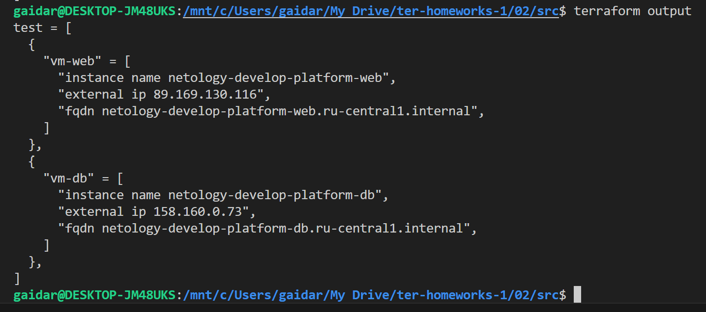

## Задание 1

cloud_id и folder_id обозначил в personal.auto.tfvars

В boot_disk всё-же указал размер и тип создаваемого диска, чтобы не создавал по умолчанию.

В platform_id = "standart-v4" явно допущена ошибка. Правильно standard. Опции v4 пока не существует.
На всех платформах в яндекс облаке можно выбрать минимум 2 ядра vCPU
А так-же производительность vCPU в 5% обеспечивается только на standard-v1 и standard-v2
С точки зрения экономии выбираем standard-v2
Конечная запись будет выглядеть platform_id = "standard-v2"
А параметры производительности будут такими:
```js
  resources {
    cores         = 2
    memory        = 1
    core_fraction = 5
  }
```

Для авторизации закомментировал token и сгенерировал authorized_key.json


Параметры preemptible = true и core_fraction=5 в процессе обучения могут пригодиться для экономии средств, которых должно хватить на весь срок обучения. Урезая параметры процессора и выставляя прерывание виртуалке мы получаем идеальный вариант для обучения. Делать постоянные terraform apply и затем через какое-то время terraform destroy на производительных тачках расточительно

## Задание 4



[Финальный код (ссылка на github repo)](https://github.com/gaidarvu/ter-homeworks/tree/main/02/src)
