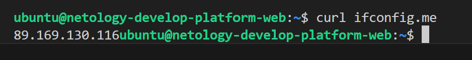
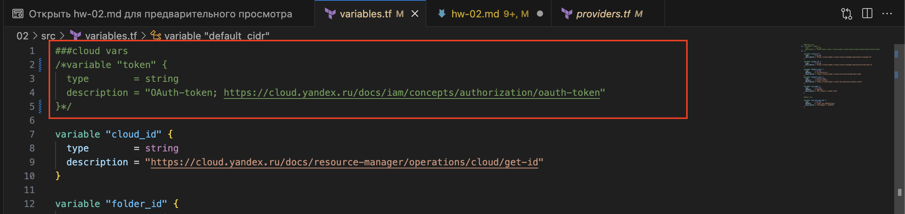

## Задание 1

Словарь с переменными provider "yandex" из variables.tf конфликтует с provider "yandex" из providers.tf. Пришлось перенести переменные из этого словаря в variable "cloud_id", variable "folder_id", variable "default_zone", которые обозначены выше и требуют ввести переменную из консоли во время выполнения кода. Сам словарь provider "yandex" закомментировал.

В boot_disk всё-же указал размер и тип создаваемого диска, чтобы не создавал по умолчанию.

В platform_id = "standart-v4" явно допущена ошибка. Правильно standard. Опции v4 пока не существует.
На всех платформах в яндекс облаке можно выбрать минимум 2 ядра vCPU
А так-же производительность vCPU в 5% обеспечивается только на standard-v1 и standard-v2
С точки зрения экономии выбираем standard-v2
Конечная запись будет выглядеть platform_id = "standard-v2"
А параметры производительности будут такими:
```js
  resources {
    cores         = 2
    memory        = 1
    core_fraction = 5
  }
```

Для авторизации закомментировал token и сгенерировал authorized_key.json




Параметры preemptible = true и core_fraction=5 в процессе обучения могут пригодиться для экономии средств, которых должно хватить на весь срок обучения. Урезая параметры процессора и выставляя прерывание виртуалке мы получаем идеальный вариант для обучения. Делать постоянные terraform apply и затем через какое-то время terraform destroy на производительных тачках расточительно

## Задание 2

### Пункт 2


### Пункт 3


### Пункт 4


### Пункт 5

[Исправленный код (ссылка на github)](https://github.com/gaidarvu/ter-homeworks/blob/main/01/src/main.tf)


### Пункт 6




### Пункт 7

```js
{
  "version": 4,
  "terraform_version": "1.9.8",
  "serial": 11,
  "lineage": "8eb799a7-e4ab-2dad-4396-1f2911fa3e5f",
  "outputs": {},
  "resources": [],
  "check_results": null
}
```

### Пункт 8


## Задание 2

[Финальный код main.tf (ссылка на github)](https://github.com/gaidarvu/ter-homeworks/blob/main/01/src_ycloud/main.tf)

