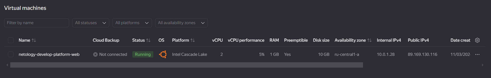

# Домашнее задание к занятию «Основы Terraform. Yandex Cloud»

### Цели задания

1. Создать свои ресурсы в облаке Yandex Cloud с помощью Terraform.
2. Освоить работу с переменными Terraform.


### Чек-лист готовности к домашнему заданию

1. Зарегистрирован аккаунт в Yandex Cloud. Использован промокод на грант.
2. Установлен инструмент Yandex CLI.
3. Исходный код для выполнения задания расположен в директории [**02/src**](https://github.com/netology-code/ter-homeworks/tree/main/02/src).


### Задание 0

1. Ознакомьтесь с [документацией к security-groups в Yandex Cloud](https://cloud.yandex.ru/docs/vpc/concepts/security-groups?from=int-console-help-center-or-nav). 
Этот функционал понадобится к следующей лекции.

------
### Внимание!! Обязательно предоставляем на проверку получившийся код в виде ссылки на ваш github-репозиторий!
------

### Задание 1
В качестве ответа всегда полностью прикладывайте ваш terraform-код в git.
Убедитесь что ваша версия **Terraform** ~>1.8.4

1. Изучите проект. В файле variables.tf объявлены переменные для Yandex provider.
2. Создайте сервисный аккаунт и ключ. [service_account_key_file](https://terraform-provider.yandexcloud.net).
4. Сгенерируйте новый или используйте свой текущий ssh-ключ. Запишите его открытую(public) часть в переменную **vms_ssh_public_root_key**.
5. Инициализируйте проект, выполните код. Исправьте намеренно допущенные синтаксические ошибки. Ищите внимательно, посимвольно. Ответьте, в чём заключается их суть.
6. Подключитесь к консоли ВМ через ssh и выполните команду ``` curl ifconfig.me```.
Примечание: К OS ubuntu "out of a box, те из коробки" необходимо подключаться под пользователем ubuntu: ```"ssh ubuntu@vm_ip_address"```. Предварительно убедитесь, что ваш ключ добавлен в ssh-агент: ```eval $(ssh-agent) && ssh-add``` Вы познакомитесь с тем как при создании ВМ создать своего пользователя в блоке metadata в следующей лекции.;
8. Ответьте, как в процессе обучения могут пригодиться параметры ```preemptible = true``` и ```core_fraction=5``` в параметрах ВМ.

В качестве решения приложите:

- скриншот ЛК Yandex Cloud с созданной ВМ, где видно внешний ip-адрес;
- скриншот консоли, curl должен отобразить тот же внешний ip-адрес;
- ответы на вопросы.

#### Решение

1. Создаем сервисный аккаунт, добавляем роль читателя и редактора, создаем ключ авторизации для SA и сохраняем его локально.

    ```text
    alekseykashin@MacBook-Pro-Aleksej 02 % yc iam service-account create --name bender
    done (1s)
    id: ajei165vijfjpc1ge22i
    folder_id: b1gvqnla1h39vg6o82d0
    created_at: "2024-09-09T15:38:21.672858453Z"
    name: bender

    alekseykashin@MacBook-Pro-Aleksej 02 % yc resource-manager folder add-access-binding default --role viewer --subject serviceAccount:ajei165vijfjpc1ge22i 
    done (2s)
    effective_deltas:
      - action: ADD
        access_binding:
          role_id: viewer
          subject:
            id: ajei165vijfjpc1ge22i
            type: serviceAccount

    alekseykashin@MacBook-Pro-Aleksej 02 % yc resource-manager folder add-access-binding default --role editor --subject serviceAccount:ajei165vijfjpc1ge22i
    done (2s)
    effective_deltas:
      - action: ADD
        access_binding:
          role_id: editor
          subject:
            id: ajei165vijfjpc1ge22i
            type: serviceAccount

    alekseykashin@MacBook-Pro-Aleksej 02 % yc iam key create --service-account-name bender -o ~/.yc-bender-key.json
    id: aje6t8s6hkps16giffqu
    service_account_id: ajei165vijfjpc1ge22i
    created_at: "2024-09-09T16:08:39.634195103Z"
    key_algorithm: RSA_2048

    alekseykashin@MacBook-Pro-Aleksej 02 % 
    ```

2. Инициализируем проект и проверяем его

    ```text
    alekseykashin@MacBook-Pro-Aleksej src % terraform init
    Initializing the backend...
    Initializing provider plugins...
    - Finding latest version of yandex-cloud/yandex...
    - Installing yandex-cloud/yandex v0.128.0...
    - Installed yandex-cloud/yandex v0.128.0 (unauthenticated)
    Terraform has created a lock file .terraform.lock.hcl to record the provider
    selections it made above. Include this file in your version control repository
    so that Terraform can guarantee to make the same selections by default when
    you run "terraform init" in the future.

    ╷
    │ Warning: Incomplete lock file information for providers
    │ 
    │ Due to your customized provider installation methods, Terraform was forced to calculate lock file checksums locally for the following providers:
    │   - yandex-cloud/yandex
    │ 
    │ The current .terraform.lock.hcl file only includes checksums for darwin_arm64, so Terraform running on another platform will fail to install these
    │ providers.
    │ 
    │ To calculate additional checksums for another platform, run:
    │   terraform providers lock -platform=linux_amd64
    │ (where linux_amd64 is the platform to generate)
    ╵
    Terraform has been successfully initialized!

    You may now begin working with Terraform. Try running "terraform plan" to see
    any changes that are required for your infrastructure. All Terraform commands
    should now work.

    If you ever set or change modules or backend configuration for Terraform,
    rerun this command to reinitialize your working directory. If you forget, other
    commands will detect it and remind you to do so if necessary.
    alekseykashin@MacBook-Pro-Aleksej src % terraform validate
    Success! The configuration is valid.
    ```

3. Выполняем проект, просит подставить в переменные значения ```var.cloud_id, var.folder_id, var.token```

    ```text
    alekseykashin@MacBook-Pro-Aleksej src % terraform apply   
    var.cloud_id
      https://cloud.yandex.ru/docs/resource-manager/operations/cloud/get-id

      Enter a value: 

    var.folder_id
      https://cloud.yandex.ru/docs/resource-manager/operations/folder/get-id

      Enter a value: 

    var.token
      OAuth-token; https://cloud.yandex.ru/docs/iam/concepts/authorization/oauth-token

      Enter a value: 

    data.yandex_compute_image.ubuntu: Reading...

    data.yandex_compute_image.ubuntu: Read complete after 1s [id=fd8ivkpagklognhslumh]
    ```

    Комменчу переменную ```var.token``` т.к. в место него используем креды от сервисного акканута. , прописываю недостающие перменные ```var.cloud_id, var.folder_id``` в файл ```personal.auto.tfvars```. Запускаем повторно сборку

    ```text
    alekseykashin@MacBook-Pro-Aleksej src % terraform apply -auto-approve
    data.yandex_compute_image.ubuntu: Reading...
    data.yandex_compute_image.ubuntu: Read complete after 0s [id=fd8ivkpagklognhslumh]
    .....
    yandex_vpc_network.develop: Creating...
    ╷
    │ Error: Error while requesting API to create network: server-request-id = 1cd56a54-c51c-48ff-9b7d-4bdda124845d server-trace-id = ec843c79e1384207:c3fbf82cf9e6e05d:ec843c79e1384207:1 client-request-id = f1170b58-466b-44bb-900a-8f1a68e50860 client-trace-id = b7515c5c-73fa-41fe-bd2c-66f58df732fa rpc error: code = ResourceExhausted desc = Quota limit vpc.networks.count exceeded
    │ 
    │   with yandex_vpc_network.develop,
    │   on main.tf line 1, in resource "yandex_vpc_network" "develop":
    │    1: resource "yandex_vpc_network" "develop" {
    │ 
    ╵
    alekseykashin@MacBook-Pro-Aleksej src % 
    ```

    Нехватило кол-во квот на сети, удалил лишние, перезапускаю сборку

    ```text
    yandex_compute_instance.platform: Creating...
    ╷
    │ Error: Error while requesting API to create instance: server-request-id = afb7afe9-c98d-4746-bce2-4325a4e6b3e2 server-trace-id = bfce3cc2f96634ef:f9ec80c058481932:bfce3cc2f96634ef:1 client-request-id = 0fe21444-8875-44d2-a748-9c81e9b35c3f client-trace-id = 5a8f4cec-b5c9-451f-b518-15ebc455b0a6 rpc error: code = FailedPrecondition desc = Platform "standart-v4" not found
    │ 
    │   with yandex_compute_instance.platform,
    │   on main.tf line 15, in resource "yandex_compute_instance" "platform":
    │   15: resource "yandex_compute_instance" "platform" {
    │ 
    ╵
    alekseykashin@MacBook-Pro-Aleksej src % 

    ```

    Нету такой платформы как ```standart-v4```, меняю на ```standard-v1``` , перезапускаю сборку

    ```text
    Plan: 1 to add, 0 to change, 0 to destroy.
    yandex_compute_instance.platform: Creating...
    ╷
    │ Error: Error while requesting API to create instance: server-request-id = 976c6373-62fb-4206-8394-4ce1fb3e0b63 server-trace-id = 3d5fe530fcb8e55a:a7e320d6912022aa:3d5fe530fcb8e55a:1 client-request-id = 4457bd75-41e1-4758-ae35-be9c798122d4 client-trace-id = 98fbd463-4268-46a1-9399-e68db5e08496 rpc error: code = InvalidArgument desc = the specified number of cores is not available on platform "standard-v1"; allowed core number: 2, 4
    │ 
    │   with yandex_compute_instance.platform,
    │   on main.tf line 15, in resource "yandex_compute_instance" "platform":
    │   15: resource "yandex_compute_instance" "platform" {
    │ 
    ╵
    ```

    Не запускается на 1 ядре, необходимо 2 или 4, меняю на 2 ядра , перезапускаю сборку

    ```text
    alekseykashin@MacBook-Pro-Aleksej src % terraform apply -auto-approve      
    data.yandex_compute_image.ubuntu: Reading...
    yandex_vpc_network.develop: Refreshing state... [id=enpvolqpn5vhm8elv72r]
    data.yandex_compute_image.ubuntu: Read complete after 1s [id=fd8ivkpagklognhslumh]
    yandex_vpc_subnet.develop: Refreshing state... [id=e9b0sulj2c2nv5gj28g2]

    Terraform used the selected providers to generate the following execution plan.
    Resource actions are indicated with the following symbols:
      + create

    Terraform will perform the following actions:

      # yandex_compute_instance.platform will be created
      + resource "yandex_compute_instance" "platform" {
          + created_at                = (known after apply)
          + folder_id                 = (known after apply)
          + fqdn                      = (known after apply)
          + gpu_cluster_id            = (known after apply)
          + hostname                  = (known after apply)
          + id                        = (known after apply)
          + maintenance_grace_period  = (known after apply)
          + maintenance_policy        = (known after apply)
          + metadata                  = {
              + "serial-port-enable" = "1"
              + "ssh-keys"           = "ubuntu:ssh-ed25519 AAAAC3NzaC1lZDI1NTE5AAAAIAQw34uSQmX8BJUmGYwojbsanVHd8+BLc0/mzlpDr3tb alekseykashin@MacBook-Pro-Aleksej.local"
            }
          + name                      = "netology-develop-platform-web"
          + network_acceleration_type = "standard"
          + platform_id               = "standard-v1"
          + service_account_id        = (known after apply)
          + status                    = (known after apply)
          + zone                      = (known after apply)

          + boot_disk {
              + auto_delete = true
              + device_name = (known after apply)
              + disk_id     = (known after apply)
              + mode        = (known after apply)

              + initialize_params {
                  + block_size  = (known after apply)
                  + description = (known after apply)
                  + image_id    = "fd8ivkpagklognhslumh"
                  + name        = (known after apply)
                  + size        = (known after apply)
                  + snapshot_id = (known after apply)
                  + type        = "network-hdd"
                }
            }

          + metadata_options (known after apply)

          + network_interface {
              + index              = (known after apply)
              + ip_address         = (known after apply)
              + ipv4               = true
              + ipv6               = (known after apply)
              + ipv6_address       = (known after apply)
              + mac_address        = (known after apply)
              + nat                = true
              + nat_ip_address     = (known after apply)
              + nat_ip_version     = (known after apply)
              + security_group_ids = (known after apply)
              + subnet_id          = "e9b0sulj2c2nv5gj28g2"
            }

          + placement_policy (known after apply)

          + resources {
              + core_fraction = 5
              + cores         = 2
              + memory        = 1
            }

          + scheduling_policy {
              + preemptible = true
            }
        }

    Plan: 1 to add, 0 to change, 0 to destroy.
    yandex_compute_instance.platform: Creating...
    yandex_compute_instance.platform: Still creating... [10s elapsed]
    yandex_compute_instance.platform: Still creating... [20s elapsed]
    yandex_compute_instance.platform: Still creating... [30s elapsed]
    yandex_compute_instance.platform: Still creating... [40s elapsed]
    yandex_compute_instance.platform: Creation complete after 50s [id=fhm6sf53d2t9hqbj4gh9]

    Apply complete! Resources: 1 added, 0 changed, 0 destroyed.
    ```

    

4. Подключаемся к VM

      ```text
      alekseykashin@MacBook-Pro-Aleksej src % ssh ubuntu@84.201.134.220
      Welcome to Ubuntu 20.04.6 LTS (GNU/Linux 5.4.0-193-generic x86_64)

      * Documentation:  https://help.ubuntu.com
      * Management:     https://landscape.canonical.com
      * Support:        https://ubuntu.com/pro
      New release '22.04.3 LTS' available.
      Run 'do-release-upgrade' to upgrade to it.

      Last login: Mon Sep  9 18:20:23 2024 from 94.25.169.40
      To run a command as administrator (user "root"), use "sudo <command>".
      See "man sudo_root" for details.

      ubuntu@fhm6sf53d2t9hqbj4gh9:~$ curl ifconfig.me
      84.201.134.220ubuntu@fhm6sf53d2t9hqbj4gh9:~$ 
      ubuntu@fhm6sf53d2t9hqbj4gh9:~$ 
      ```
  
5. ```core_fraction``` указывает базовую производительность для ядра в процентах, ```preemptible``` это флаг прерываемости VM (если указан флаг ```true```)

### Задание 2

1. Замените все хардкод-**значения** для ресурсов **yandex_compute_image** и **yandex_compute_instance** на **отдельные** переменные. К названиям переменных ВМ добавьте в начало префикс **vm_web_** .  Пример: **vm_web_name**.
2. Объявите нужные переменные в файле variables.tf, обязательно указывайте тип переменной. Заполните их **default** прежними значениями из main.tf. 
3. Проверьте terraform plan. Изменений быть не должно. 

#### Решение 

1. Добавляем переменные в ```variables.tf```, заполняем дефолтными значениями

```text
alekseykashin@MacBook-Pro-Aleksej src % cat variables.tf
###cloud vars
/*variable "token" {
  type        = string
  description = "OAuth-token; https://cloud.yandex.ru/docs/iam/concepts/authorization/oauth-token"
}*/

variable "cloud_id" {
  type        = string
  description = "https://cloud.yandex.ru/docs/resource-manager/operations/cloud/get-id"
}

variable "folder_id" {
  type        = string
  description = "https://cloud.yandex.ru/docs/resource-manager/operations/folder/get-id"
}

variable "default_zone" {
  type        = string
  default     = "ru-central1-a"
  description = "https://cloud.yandex.ru/docs/overview/concepts/geo-scope"
}
variable "default_cidr" {
  type        = list(string)
  default     = ["10.0.1.0/24"]
  description = "https://cloud.yandex.ru/docs/vpc/operations/subnet-create"
}

variable "vpc_name" {
  type        = string
  default     = "develop"
  description = "VPC network & subnet name"
}

###ssh vars

variable "vms_ssh_root_key" {
  type        = string
  default     = "<your_ssh_ed25519_key>"
  description = "ssh-keygen -t ed25519"
}

variable "vm_web_platform_family" {
  type = string
  default = "ubuntu-2004-lts"
}

variable "vm_web_platform" {
  type    = object({
    name = string
    platform_id = string
    resources = object({
      core = number
      memory = number
      core_fraction = number 
    })
    scheduling_policy = object({
      preemptible = bool
    })
    network_interface = object({
      nat = bool
    })
    metadata = object({
      serial-port-enable = number
      ssh-user = string
    })
    true_flg = bool
  })
  default = {
    name = "netology-develop-platform-web"
    platform_id = "standard-v1"
    resources = {
      core=2
      memory=1
      core_fraction=5
    }
    scheduling_policy = {
      preemptible = true
    }
    network_interface = {
      nat = true
    }
    metadata = {
      serial-port-enable = 1
      ssh-user  = "ubuntu"
    }
    true_flg = true 
  } 
}%                                                                                                         alekseykashin@MacBook-Pro-Aleksej src % cat main.tf     
resource "yandex_vpc_network" "develop" {
  name = var.vpc_name
}
resource "yandex_vpc_subnet" "develop" {
  name           = var.vpc_name
  zone           = var.default_zone
  network_id     = yandex_vpc_network.develop.id
  v4_cidr_blocks = var.default_cidr
}


data "yandex_compute_image" "ubuntu" {
  family = var.vm_web_platform_family
}
resource "yandex_compute_instance" "platform" {
  name        = var.vm_web_platform["name"]
  platform_id = var.vm_web_platform["platform_id"]
  
  resources {
    cores         = var.vm_web_platform.resources["core"]
    memory        = var.vm_web_platform.resources["memory"]
    core_fraction = var.vm_web_platform.resources["core_fraction"]
  }
  boot_disk {
    initialize_params {
      image_id = data.yandex_compute_image.ubuntu.image_id
    }
  }
  scheduling_policy {
    preemptible = var.vm_web_platform.scheduling_policy["preemptible"]
  }
  network_interface {
    subnet_id = yandex_vpc_subnet.develop.id
    nat       = var.vm_web_platform.network_interface["nat"]
  }

  metadata = {
    serial-port-enable = var.vm_web_platform.metadata["serial-port-enable"]
    ssh-keys           = "${var.vm_web_platform.metadata["ssh-user"]}:${var.vms_ssh_root_key}"
  }

}
alekseykashin@MacBook-Pro-Aleksej src % 
```

2. Проверяем план, изменений нет

```text
alekseykashin@MacBook-Pro-Aleksej src % terraform plan
data.yandex_compute_image.ubuntu: Reading...
yandex_vpc_network.develop: Refreshing state... [id=enpvolqpn5vhm8elv72r]
data.yandex_compute_image.ubuntu: Read complete after 0s [id=fd8ivkpagklognhslumh]
yandex_vpc_subnet.develop: Refreshing state... [id=e9b0sulj2c2nv5gj28g2]
yandex_compute_instance.platform: Refreshing state... [id=fhm6sf53d2t9hqbj4gh9]

No changes. Your infrastructure matches the configuration.

Terraform has compared your real infrastructure against your configuration and found no differences, so no
changes are needed.
alekseykashin@MacBook-Pro-Aleksej src % 
```


### Задание 3

1. Создайте в корне проекта файл 'vms_platform.tf' . Перенесите в него все переменные первой ВМ.
2. Скопируйте блок ресурса и создайте с его помощью вторую ВМ в файле main.tf: **"netology-develop-platform-db"** ,  ```cores  = 2, memory = 2, core_fraction = 20```. Объявите её переменные с префиксом **vm_db_** в том же файле ('vms_platform.tf').  ВМ должна работать в зоне "ru-central1-b"
3. Примените изменения.

#### Решение 

1. Создал файл ```vms_platform.tf```, перенес ```variables, compute, subnet```, листинг

    ``` text
    alekseykashin@MacBook-Pro-Aleksej src % cat vms_platform.tf          
    variable "default_zone_b" {
      type        = string
      default     = "ru-central1-b"
      description = "https://cloud.yandex.ru/docs/overview/concepts/geo-scope"
    }

    variable "subnet_b" {
        type = object({
          name = string
          v4_cidr_blocks = list(string)
        })
        default = {
          name = "develop_b"
          v4_cidr_blocks = ["10.0.2.0/24"]
        }
    }

    variable "vm_db_platform" {
      type    = object({
        name = string
        platform_id = string
        resources = object({
          core = number
          memory = number
          core_fraction = number 
        })
        scheduling_policy = object({
          preemptible = bool
        })
        network_interface = object({
          nat = bool
        })
        metadata = object({
          serial-port-enable = number
          ssh-user = string
        })
        true_flg = bool
      })
      default = {
        name = "netology-develop-platform-db"
        platform_id = "standard-v1"
        resources = {
          core=2
          memory=2
          core_fraction=20
        }
        scheduling_policy = {
          preemptible = true
        }
        network_interface = {
          nat = true
        }
        metadata = {
          serial-port-enable = 1
          ssh-user  = "ubuntu"
        }
        true_flg = true 
      } 
    }

    resource "yandex_vpc_subnet" "develop_b" {
      name           = var.subnet_b.name
      zone           = var.default_zone_b
      network_id     = yandex_vpc_network.develop.id
      v4_cidr_blocks = var.subnet_b.v4_cidr_blocks
    }

    resource "yandex_compute_instance" "platform_db" {
      name        = var.vm_db_platform["name"]
      platform_id = var.vm_db_platform["platform_id"]
      zone = var.default_zone_b
      
      resources {
        cores         = var.vm_db_platform.resources["core"]
        memory        = var.vm_db_platform.resources["memory"]
        core_fraction = var.vm_db_platform.resources["core_fraction"]
      }
      boot_disk {
        initialize_params {
          image_id = data.yandex_compute_image.ubuntu.image_id
        }
      }
      scheduling_policy {
        preemptible = var.vm_db_platform.scheduling_policy["preemptible"]
      }
      network_interface {
        subnet_id = yandex_vpc_subnet.develop_b.id
        nat       = var.vm_db_platform.network_interface["nat"]
      }

      metadata = {
        serial-port-enable = var.vm_db_platform.metadata["serial-port-enable"]
        ssh-keys           = "${var.vm_db_platform.metadata["ssh-user"]}:${var.vms_ssh_root_key}"
      }

    }%   
    ```

2. Применяем проект

    ```text
    alekseykashin@MacBook-Pro-Aleksej src % terraform apply -auto-approve
    data.yandex_compute_image.ubuntu: Reading...
    yandex_vpc_network.develop: Refreshing state... [id=enpvolqpn5vhm8elv72r]
    data.yandex_compute_image.ubuntu: Read complete after 1s [id=fd8ivkpagklognhslumh]
    yandex_vpc_subnet.develop: Refreshing state... [id=e9b0sulj2c2nv5gj28g2]
    yandex_vpc_subnet.develop_b: Refreshing state... [id=e2ls60bgt0cotrg4reuc]
    yandex_compute_instance.platform: Refreshing state... [id=fhm6sf53d2t9hqbj4gh9]
    yandex_compute_instance.platform_db: Refreshing state... [id=epd87onchji7mo9begh3]

    Terraform will perform the following actions:

      # yandex_compute_instance.platform_db will be created
      + resource "yandex_compute_instance" "platform_db" {
          + created_at                = (known after apply)
          + folder_id                 = (known after apply)
          + fqdn                      = (known after apply)
          + gpu_cluster_id            = (known after apply)
          + hostname                  = (known after apply)
          + id                        = (known after apply)
          + maintenance_grace_period  = (known after apply)
          + maintenance_policy        = (known after apply)
          + metadata                  = {
              + "serial-port-enable" = "1"
              + "ssh-keys"           = "ubuntu:ssh-ed25519 AAAAC3NzaC1lZDI1NTE5AAAAIAQw34uSQmX8BJUmGYwojbsanVHd8+BLc0/mzlpDr3tb alekseykashin@MacBook-Pro-Aleksej.local"
            }
          + name                      = "netology-develop-platform-db"
          + network_acceleration_type = "standard"
          + platform_id               = "standard-v1"
          + service_account_id        = (known after apply)
          + status                    = (known after apply)
          + zone                      = "ru-central1-b"

          + boot_disk {
              + auto_delete = true
              + device_name = (known after apply)
              + disk_id     = (known after apply)
              + mode        = (known after apply)

              + initialize_params {
                  + block_size  = (known after apply)
                  + description = (known after apply)
                  + image_id    = "fd8ivkpagklognhslumh"
                  + name        = (known after apply)
                  + size        = (known after apply)
                  + snapshot_id = (known after apply)
                  + type        = "network-hdd"
                }
            }

          + metadata_options (known after apply)

          + network_interface {
              + index              = (known after apply)
              + ip_address         = (known after apply)
              + ipv4               = true
              + ipv6               = (known after apply)
              + ipv6_address       = (known after apply)
              + mac_address        = (known after apply)
              + nat                = true
              + nat_ip_address     = (known after apply)
              + nat_ip_version     = (known after apply)
              + security_group_ids = (known after apply)
              + subnet_id          = (known after apply)
            }

          + placement_policy (known after apply)

          + resources {
              + core_fraction = 20
              + cores         = 2
              + memory        = 2
            }

          + scheduling_policy {
              + preemptible = true
            }
        }

      # yandex_vpc_subnet.develop_b will be created
      + resource "yandex_vpc_subnet" "develop_b" {
          + created_at     = (known after apply)
          + folder_id      = (known after apply)
          + id             = (known after apply)
          + labels         = (known after apply)
          + name           = "develop_b"
          + network_id     = "enpvolqpn5vhm8elv72r"
          + v4_cidr_blocks = [
              + "10.0.2.0/24",
            ]
          + v6_cidr_blocks = (known after apply)
          + zone           = "ru-central1-b"
        }

    Plan: 2 to add, 0 to change, 0 to destroy.
    yandex_vpc_subnet.develop_b: Creating...
    yandex_vpc_subnet.develop_b: Creation complete after 1s [id=e2li31a86d9d0t71umtk]
    yandex_compute_instance.platform_db: Creating...
    yandex_compute_instance.platform_db: Still creating... [10s elapsed]
    yandex_compute_instance.platform_db: Still creating... [20s elapsed]
    yandex_compute_instance.platform_db: Still creating... [30s elapsed]
    yandex_compute_instance.platform_db: Still creating... [40s elapsed]
    yandex_compute_instance.platform_db: Creation complete after 41s [id=epdn63h859t6s2crdsr4]

    Apply complete! Resources: 2 added, 0 changed, 0 destroyed.
    ```

    Результат в YC 


### Задание 4

1. Объявите в файле outputs.tf **один** output , содержащий: instance_name, external_ip, fqdn для каждой из ВМ в удобном лично для вас формате.(без хардкода!!!)
2. Примените изменения.

В качестве решения приложите вывод значений ip-адресов команды ```terraform output```.

#### Решние

1. Добавляем output содержащий: ```instance_name, external_ip, fqdn``` для каждой из ВМ

    ```text
    alekseykashin@MacBook-Pro-Aleksej src % cat outputs.tf
    output "vm" {

      value = [
        { web = [
                    "name: ${yandex_compute_instance.platform.name}",
                    "hostname: ${yandex_compute_instance.platform.fqdn}",
                    "external_ip: ${yandex_compute_instance.platform.network_interface[0].nat_ip_address}", 
                ] 
        },
        { db = [
                    "name: ${yandex_compute_instance.platform_db.name}",
                    "hostname: ${yandex_compute_instance.platform_db.fqdn}",
                    "external_ip: ${yandex_compute_instance.platform_db.network_interface[0].nat_ip_address}"
                ] 
        }
      ]
    }
    alekseykashin@MacBook-Pro-Aleksej src % 
    ```

2. Применяем изменения

    ```text
    alekseykashin@MacBook-Pro-Aleksej src % terraform apply -auto-approve
    data.yandex_compute_image.ubuntu: Reading...
    yandex_vpc_network.develop: Refreshing state... [id=enpvolqpn5vhm8elv72r]
    data.yandex_compute_image.ubuntu: Read complete after 1s [id=fd8ivkpagklognhslumh]
    yandex_vpc_subnet.develop_b: Refreshing state... [id=e2li31a86d9d0t71umtk]
    yandex_vpc_subnet.develop: Refreshing state... [id=e9b0sulj2c2nv5gj28g2]
    yandex_compute_instance.platform: Refreshing state... [id=fhm6sf53d2t9hqbj4gh9]
    yandex_compute_instance.platform_db: Refreshing state... [id=epdn63h859t6s2crdsr4]

    Note: Objects have changed outside of Terraform

    Terraform detected the following changes made outside of Terraform since the last "terraform apply" which may have affected
    this plan:

      # yandex_compute_instance.platform has changed
      ~ resource "yandex_compute_instance" "platform" {
            id                        = "fhm6sf53d2t9hqbj4gh9"
            name                      = "netology-develop-platform-web"
            # (14 unchanged attributes hidden)

          ~ network_interface {
              + nat_ip_address     = "51.250.4.124"
                # (10 unchanged attributes hidden)
            }

            # (5 unchanged blocks hidden)
        }

      # yandex_compute_instance.platform_db has changed
      ~ resource "yandex_compute_instance" "platform_db" {
            id                        = "epdn63h859t6s2crdsr4"
            name                      = "netology-develop-platform-db"
            # (13 unchanged attributes hidden)

          ~ network_interface {
              ~ nat_ip_address     = "89.169.170.197" -> "89.169.160.14"
                # (10 unchanged attributes hidden)
            }

            # (5 unchanged blocks hidden)
        }


    Unless you have made equivalent changes to your configuration, or ignored the relevant attributes using ignore_changes, the
    following plan may include actions to undo or respond to these changes.

    ─────────────────────────────────────────────────────────────────────────────────────────────────────────────────────────────

    Changes to Outputs:
      + vm = [
          + {
              + web = [
                  + "name: netology-develop-platform-web",
                  + "hostname: fhm6sf53d2t9hqbj4gh9.auto.internal",
                  + "external_ip: 51.250.4.124",
                ]
            },
          + {
              + db = [
                  + "name: netology-develop-platform-db",
                  + "hostname: epdn63h859t6s2crdsr4.auto.internal",
                  + "external_ip: 89.169.160.14",
                ]
            },
        ]

    You can apply this plan to save these new output values to the Terraform state, without changing any real infrastructure.

    Apply complete! Resources: 0 added, 0 changed, 0 destroyed.

    Outputs:

    vm = [
      {
        "web" = [
          "name: netology-develop-platform-web",
          "hostname: fhm6sf53d2t9hqbj4gh9.auto.internal",
          "external_ip: 51.250.4.124",
        ]
      },
      {
        "db" = [
          "name: netology-develop-platform-db",
          "hostname: epdn63h859t6s2crdsr4.auto.internal",
          "external_ip: 89.169.160.14",
        ]
      },
    ]
    alekseykashin@MacBook-Pro-Aleksej src % 
    ```
    

3. Проверяем через комнаду ```terraform output```

    ```text
    alekseykashin@MacBook-Pro-Aleksej src % terraform output
    vm = [
      {
        "web" = [
          "name:netology-develop-platform-web",
          "hostname: fhm6sf53d2t9hqbj4gh9.auto.internal",
          "external_ip: 51.250.4.124",
        ]
      },
      {
        "db" = [
          "name:netology-develop-platform-db",
          "hostname: epdn63h859t6s2crdsr4.auto.internal",
          "external_ip: 89.169.160.14",
        ]
      },
    ]
    alekseykashin@MacBook-Pro-Aleksej src % 
    ```

### Задание 5

1. В файле locals.tf опишите в **одном** local-блоке имя каждой ВМ, используйте интерполяцию ${..} с НЕСКОЛЬКИМИ переменными по примеру из лекции.
2. Замените переменные внутри ресурса ВМ на созданные вами local-переменные.
3. Примените изменения.

#### Решение

1. В файле ```locals.tf```, используем интерполяцию опишем имена VM через locals и применим их

    ```text
    alekseykashin@MacBook-Pro-Aleksej src % cat locals.tf
    locals {
        web_name = "${var.vpc_name}-${var.vm_web_platform["name"]}"
        db_name = "${var.subnet_b["name"]}-${var.vm_db_platform["name"]}"
    }%
    ```

2. Применяем изменения
    ```text
    alekseykashin@MacBook-Pro-Aleksej src % terraform apply -auto-approve
    data.yandex_compute_image.ubuntu: Reading...
    yandex_vpc_network.develop: Refreshing state... [id=enpvolqpn5vhm8elv72r]
    data.yandex_compute_image.ubuntu: Read complete after 1s [id=fd8ivkpagklognhslumh]
    yandex_vpc_subnet.develop: Refreshing state... [id=e9b0sulj2c2nv5gj28g2]
    yandex_vpc_subnet.develop_b: Refreshing state... [id=e2li31a86d9d0t71umtk]
    yandex_compute_instance.platform: Refreshing state... [id=fhmhh4o9sjor4m0f9k33]

    Terraform used the selected providers to generate the following execution plan. Resource actions are indicated with the
    following symbols:
      + create

    Terraform will perform the following actions:

      # yandex_compute_instance.platform_db will be created
      + resource "yandex_compute_instance" "platform_db" {
          + created_at                = (known after apply)
          + folder_id                 = (known after apply)
          + fqdn                      = (known after apply)
          + gpu_cluster_id            = (known after apply)
          + hostname                  = (known after apply)
          + id                        = (known after apply)
          + maintenance_grace_period  = (known after apply)
          + maintenance_policy        = (known after apply)
          + metadata                  = {
              + "serial-port-enable" = "1"
              + "ssh-keys"           = "ubuntu:ssh-ed25519 AAAAC3NzaC1lZDI1NTE5AAAAIAQw34uSQmX8BJUmGYwojbsanVHd8+BLc0/mzlpDr3tb alekseykashin@MacBook-Pro-Aleksej.local"
            }
          + name                      = "develop-b-platform-db"
          + network_acceleration_type = "standard"
          + platform_id               = "standard-v1"
          + service_account_id        = (known after apply)
          + status                    = (known after apply)
          + zone                      = "ru-central1-b"

          + boot_disk {
              + auto_delete = true
              + device_name = (known after apply)
              + disk_id     = (known after apply)
              + mode        = (known after apply)

              + initialize_params {
                  + block_size  = (known after apply)
                  + description = (known after apply)
                  + image_id    = "fd8ivkpagklognhslumh"
                  + name        = (known after apply)
                  + size        = (known after apply)
                  + snapshot_id = (known after apply)
                  + type        = "network-hdd"
                }
            }

          + metadata_options (known after apply)

          + network_interface {
              + index              = (known after apply)
              + ip_address         = (known after apply)
              + ipv4               = true
              + ipv6               = (known after apply)
              + ipv6_address       = (known after apply)
              + mac_address        = (known after apply)
              + nat                = true
              + nat_ip_address     = (known after apply)
              + nat_ip_version     = (known after apply)
              + security_group_ids = (known after apply)
              + subnet_id          = (known after apply)
            }

          + placement_policy (known after apply)

          + resources {
              + core_fraction = 20
              + cores         = 2
              + memory        = 2
            }

          + scheduling_policy {
              + preemptible = true
            }
        }

      # yandex_vpc_subnet.develop_b will be created
      + resource "yandex_vpc_subnet" "develop_b" {
          + created_at     = (known after apply)
          + folder_id      = (known after apply)
          + id             = (known after apply)
          + labels         = (known after apply)
          + name           = "develop-b"
          + network_id     = "enpvolqpn5vhm8elv72r"
          + v4_cidr_blocks = [
              + "10.0.2.0/24",
            ]
          + v6_cidr_blocks = (known after apply)
          + zone           = "ru-central1-b"
        }

    Plan: 2 to add, 0 to change, 0 to destroy.

    Changes to Outputs:
      ~ vm = [
          ~ {
              ~ web = [
                  ~ "name: netology-develop-platform-web" -> "name: develop-platform-web",
                  ~ "hostname: fhml8j9sfhjt02buu76v.auto.internal" -> "hostname: fhmhh4o9sjor4m0f9k33.auto.internal",
                  ~ "external_ip: 89.169.139.175" -> "external_ip: 89.169.155.231",
                ]
            },
          ~ {
              ~ db = [
                  ~ "name: netology-develop-platform-db" -> "name: develop-b-platform-db",
                  ~ "hostname: epd10te0polmna8o2sf2.auto.internal" -> (known after apply),
                  ~ "external_ip: 89.169.168.171" -> (known after apply),
                ]
            },
        ]
    yandex_vpc_subnet.develop_b: Creating...
    yandex_vpc_subnet.develop_b: Creation complete after 2s [id=e2lgipeq8ietmlt2ml3k]
    yandex_compute_instance.platform_db: Creating...
    yandex_compute_instance.platform_db: Still creating... [10s elapsed]
    yandex_compute_instance.platform_db: Still creating... [20s elapsed]
    yandex_compute_instance.platform_db: Still creating... [30s elapsed]
    yandex_compute_instance.platform_db: Still creating... [40s elapsed]
    yandex_compute_instance.platform_db: Creation complete after 40s [id=epd6mbe4tksvcnc84mpd]

    Apply complete! Resources: 2 added, 0 changed, 0 destroyed.

    Outputs:

    vm = [
      {
        "web" = [
          "name: develop-platform-web",
          "hostname: fhmhh4o9sjor4m0f9k33.auto.internal",
          "external_ip: 89.169.155.231",
        ]
      },
      {
        "db" = [
          "name: develop-b-platform-db",
          "hostname: epd6mbe4tksvcnc84mpd.auto.internal",
          "external_ip: 89.169.167.215",
        ]
      },
    ]
    alekseykashin@MacBook-Pro-Aleksej src % 
    ```


### Задание 6

1. Вместо использования трёх переменных  ".._cores",".._memory",".._core_fraction" в блоке  resources {...}, объедините их в единую map-переменную **vms_resources** и  внутри неё конфиги обеих ВМ в виде вложенного map(object).  
   ```
   пример из terraform.tfvars:
   vms_resources = {
     web={
       cores=2
       memory=2
       core_fraction=5
       hdd_size=10
       hdd_type="network-hdd"
       ...
     },
     db= {
       cores=2
       memory=4
       core_fraction=20
       hdd_size=10
       hdd_type="network-ssd"
       ...
     }
   }
   ```
3. Создайте и используйте отдельную map(object) переменную для блока metadata, она должна быть общая для всех ваших ВМ.
   ```
   пример из terraform.tfvars:
   metadata = {
     serial-port-enable = 1
     ssh-keys           = "ubuntu:ssh-ed25519 AAAAC..."
   }
   ```  
  
5. Найдите и закоментируйте все, более не используемые переменные проекта.
6. Проверьте terraform plan. Изменений быть не должно.

------

#### Решение 

1. Я изначально создал два объекта которые бы исключали весь харкод, все перенес переменные в ```vm_web_platform, vm_db_platform```, тут можно объединить эти две переменные в map(object)

- Создал переменную ```vms``` c маппой обьектов в variables.tf, перменные ```vm_web_platform, vm_db_platform``` закомментировал

    ```text
    alekseykashin@MacBook-Pro-Aleksej src % cat variables.tf
    ...

    variable "vms" {
      type = map(object({
        name        = string
        platform_id = string
        resources   = object({
          core = number
          memory = number
          core_fraction = number 
        })
        scheduling_policy = object({
          preemptible = bool
        })
        network_interface = object({
          nat = bool
        })
        metadata = object({
          serial-port-enable = number
          ssh-user = string
        })
        true_flg = bool
      }))
      default = {
          "web" = {
            name = "platform-web"
            platform_id = "standard-v1"
            resources = {
              core=2
              memory=1
              core_fraction=5
            }
            scheduling_policy = {
              preemptible = true
            }
            network_interface = {
              nat = true
            }
            metadata = {
              serial-port-enable = 1
              ssh-user  = "ubuntu"
            }
            true_flg = true 
          }
          "db" = {
            name = "platform-db"
            platform_id = "standard-v1"
            resources = {
              core=2
              memory=2
              core_fraction=20
            }
            scheduling_policy = {
              preemptible = true
            }
            network_interface = {
              nat = true
            }
            metadata = {
              serial-port-enable = 1
              ssh-user  = "ubuntu"
            }
            true_flg = true 
          }
      }
    }
    ```

- Переиспользвал переменную ```vms``` в ```platform``` main.tf

    ```text
    alekseykashin@MacBook-Pro-Aleksej src % cat main.tf   

    ...

    resource "yandex_compute_instance" "platform" {
      name        = local.web_name
      platform_id = var.vms["web"]["platform_id"]
      
      resources {
        cores         = var.vms["web"].resources["core"]
        memory        = var.vms["web"].resources["memory"]
        core_fraction = var.vms["web"].resources["core_fraction"]
      }
      boot_disk {
        initialize_params {
          image_id = data.yandex_compute_image.ubuntu.image_id
        }
      }
      scheduling_policy {
        preemptible = var.vms["web"].scheduling_policy["preemptible"]
      }
      network_interface {
        subnet_id = yandex_vpc_subnet.develop.id
        nat       = var.vms["web"].network_interface["nat"]
      }

      metadata = {
        serial-port-enable = var.vms["web"].metadata["serial-port-enable"]
        ssh-keys           = "${var.vms["web"].metadata["ssh-user"]}:${var.vms_ssh_root_key}"
      }

    }
    alekseykashin@MacBook-Pro-Aleksej src % 
    ```

- Переиспользвал переменную ```vms``` в ```platform_db``` vms_platform.tf

    ```text
    alekseykashin@MacBook-Pro-Aleksej src % cat vms_platform.tf

    ...

    resource "yandex_compute_instance" "platform_db" {
      name        = local.db_name
      platform_id = var.vms["db"]["platform_id"]
      zone = var.default_zone_b
      
      resources {
        cores         = var.vms["db"].resources["core"]
        memory        = var.vms["db"].resources["memory"]
        core_fraction = var.vms["db"].resources["core_fraction"]
      }
      boot_disk {
        initialize_params {
          image_id = data.yandex_compute_image.ubuntu.image_id
        }
      }
      scheduling_policy {
        preemptible = var.vms["db"].scheduling_policy["preemptible"]
      }
      network_interface {
        subnet_id = yandex_vpc_subnet.develop_b.id
        nat       = var.vms["db"].network_interface["nat"]
      }

      metadata = {
        serial-port-enable = var.vms["db"].metadata["serial-port-enable"]
        ssh-keys           = "${var.vms["db"].metadata["ssh-user"]}:${var.vms_ssh_root_key}"
      }

    }%                                                                                                                            alekseykashin@MacBook-Pro-Aleksej src % 
    ```

2. В заднаии 6 нехватает пункта 2,4
3. Тут я не понял зачем использовать map(object) переменную для metadata если она должна быть общая для всех ваших ВМ, не достаточно будет переменной типа ```object```, да и вызов будет максимальный странный, если мапу использовать, как пример ```var.vms_metadata["metadata"]["sh-user"]```, вообщем я оставил на старом, если надо выделить в отдельную переменну (маппу объектов) готов изменить.
4. Порверяем что ничего не изменилось

    ```text
    alekseykashin@MacBook-Pro-Aleksej src % terraform plan     
    data.yandex_compute_image.ubuntu: Reading...
    yandex_vpc_network.develop: Refreshing state... [id=enpvolqpn5vhm8elv72r]
    data.yandex_compute_image.ubuntu: Read complete after 1s [id=fd8ivkpagklognhslumh]
    yandex_vpc_subnet.develop: Refreshing state... [id=e9b0sulj2c2nv5gj28g2]
    yandex_vpc_subnet.develop_b: Refreshing state... [id=e2lgipeq8ietmlt2ml3k]
    yandex_compute_instance.platform_db: Refreshing state... [id=epd6mbe4tksvcnc84mpd]
    yandex_compute_instance.platform: Refreshing state... [id=fhmhh4o9sjor4m0f9k33]

    No changes. Your infrastructure matches the configuration.

    Terraform has compared your real infrastructure against your configuration and found no differences, so no changes are
    needed.
    alekseykashin@MacBook-Pro-Aleksej src % 
    ```

## Дополнительное задание (со звёздочкой*)

**Настоятельно рекомендуем выполнять все задания со звёздочкой.**   
Они помогут глубже разобраться в материале. Задания со звёздочкой дополнительные, не обязательные к выполнению и никак не повлияют на получение вами зачёта по этому домашнему заданию. 


------
### Задание 7*

Изучите содержимое файла console.tf. Откройте terraform console, выполните следующие задания: 

1. Напишите, какой командой можно отобразить **второй** элемент списка test_list.
2. Найдите длину списка test_list с помощью функции length(<имя переменной>).
3. Напишите, какой командой можно отобразить значение ключа admin из map test_map.
4. Напишите interpolation-выражение, результатом которого будет: "John is admin for production server based on OS ubuntu-20-04 with X vcpu, Y ram and Z virtual disks", используйте данные из переменных test_list, test_map, servers и функцию length() для подстановки значений.

**Примечание**: если не догадаетесь как вычленить слово "admin", погуглите: "terraform get keys of map"

В качестве решения предоставьте необходимые команды и их вывод.

#### Решение 

1. Можно через обращение к массиву/листа через индекс, в данном у случае 2 элемент к 1 т.к. нумерация начинается с 0

    ```text
    > local.test_list[1]
    "staging"
    >  
    ```

2. Длина массива/листа

    ```text
    > length(local.test_list)
    3
    ```

3. Обрщаемся по ключу ```admin"```

    ```text
    > local.test_map["admin"]
    "John"
    ```

4. Собираем строку подобную "John is admin for production server based on OS ubuntu-20-04 with X vcpu, Y ram and Z virtual disks"

    ```text
    > "${local.test_map["admin"]} is ${keys(local.test_map)[0]} for ${local.test_list[2]} server based on OS ${local.servers[local.test_list[2]]["image"]} with ${local.servers[local.test_list[2]]["cpu"]} vcpu, ${local.servers[local.test_list[2]]["ram"]} ram and ${length(local.servers[local.test_list[2]].disks)} virtual disks"
    "John is admin for production server based on OS ubuntu-20-04 with 10 vcpu, 40 ram and 4 virtual disks"
    >  
    ```

------

### Задание 8*
1. Напишите и проверьте переменную test и полное описание ее type в соответствии со значением из terraform.tfvars:
```
test = [
  {
    "dev1" = [
      "ssh -o 'StrictHostKeyChecking=no' ubuntu@62.84.124.117",
      "10.0.1.7",
    ]
  },
  {
    "dev2" = [
      "ssh -o 'StrictHostKeyChecking=no' ubuntu@84.252.140.88",
      "10.0.2.29",
    ]
  },
  {
    "prod1" = [
      "ssh -o 'StrictHostKeyChecking=no' ubuntu@51.250.2.101",
      "10.0.1.30",
    ]
  },
]
```
2. Напишите выражение в terraform console, которое позволит вычленить строку "ssh -o 'StrictHostKeyChecking=no' ubuntu@62.84.124.117" из этой переменной.
------

------

#### Решение 

Или тут надо что то умнее чем это?

    ```text
    > local.test[0].dev1[0]
    "ssh -o 'StrictHostKeyChecking=no' ubuntu@62.84.124.117"
    >  
    ```

### Задание 9*

Используя инструкцию https://cloud.yandex.ru/ru/docs/vpc/operations/create-nat-gateway#tf_1, настройте для ваших ВМ nat_gateway. Для проверки уберите внешний IP адрес (nat=false) у ваших ВМ и проверьте доступ в интернет с ВМ, подключившись к ней через serial console. Для подключения предварительно через ssh измените пароль пользователя: ```sudo passwd ubuntu```

### Правила приёма работыДля подключения предварительно через ssh измените пароль пользователя: sudo passwd ubuntu
В качестве результата прикрепите ссылку на MD файл с описанием выполненой работы в вашем репозитории. Так же в репозитории должен присутсвовать ваш финальный код проекта.

**Важно. Удалите все созданные ресурсы**.


### Критерии оценки

Зачёт ставится, если:

* выполнены все задания,
* ответы даны в развёрнутой форме,
* приложены соответствующие скриншоты и файлы проекта,
* в выполненных заданиях нет противоречий и нарушения логики.

На доработку работу отправят, если:

* задание выполнено частично или не выполнено вообще,
* в логике выполнения заданий есть противоречия и существенные недостатки. 

