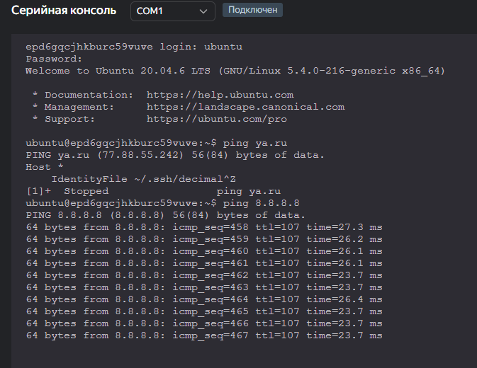

### Решение  к домашнему заданию к занятию «Основы Terraform. Yandex Cloud»  

## Задание 1  

**Ошибки:**  
 1. default     = "standard-v1" #standar**t**-v4 неправильно! И могут быть только v1, v2 и v3

2.
```hcl
    resource "yandex_compute_instance" "platform" {  
    name        = var.vm_web_name  
    platform_id = var.vm_web_platform_id  
    resources {  
        cores         = 2 #было 1, но говорит, что минимум надо 2
        memory        = 1  
        core_fraction = 5
    } 
  }
```
**curl ifconfig.me**  

**yandex cloud console**


**параметры preemptible = true и core_fraction=5 в параметрах ВМ.:**  
preemptible: Прерываемые виртуальные машины доступны по более низкой цене в сравнении с обычными  
core_fraction: экономия ресурсов

## Задание 2  
Заменил все хардкод-значения для ресурсов yandex_compute_image и yandex_compute_instance на отдельные переменные.

## Задание 3  


## Задание 4    
**Outputs:**  


## Задание 5  
**Interpolation:**    


## Задание 6  


## Задание 7
```bash
"${local.test_map.admin} is ${keys(local.test_map)[0]} for ${local.test_list[2]} server based on OS ${local.servers.production.image} with ${local.servers.production.cpu} cpu, ${local.servers.production.ram} ram and ${length(local.servers.production.disks)} virtual disks"
```
## Задание 8
переменная test:  

```hcl
variable "test" {
  type = list(map(list(string)))
}
```

terraform console:  


## Задание 9  
nat_gateway:  

