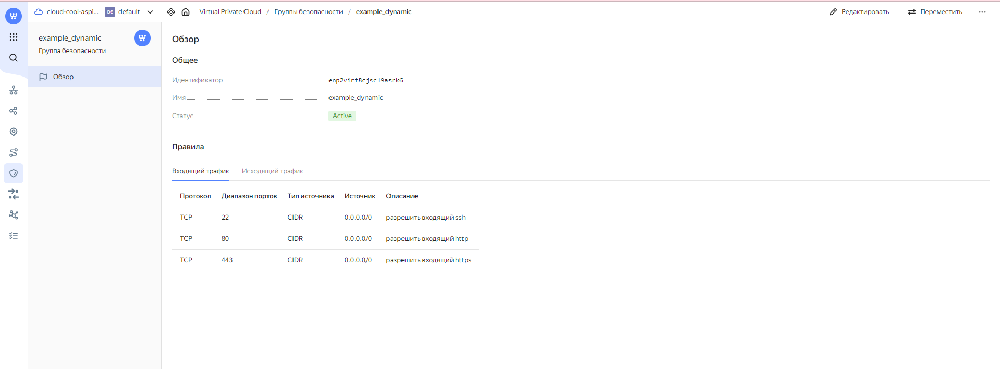

### Задание 1

Cкриншот входящих правил «Группы безопасности» в ЛК Yandex.



------


### Задание 2

Листинг файлов ```count_vm.tf```, ```for_each-vm.tf```, ```variables.tf``` и ```locals.tf```

<details>
  <summary>count_vm.tf</summary>
    
```bash
data "yandex_compute_image" "ubuntu-2004-lts" {
  family = "ubuntu-2004-lts"
}

resource "yandex_compute_instance" "web" {
  count = 2
  name  = "${local.vm_web_name}-${count.index+1}"
  platform_id = var.default_resources.platform

  resources {
    cores = var.default_resources.resources.cores
    memory = var.default_resources.resources.memory
    core_fraction  = var.default_resources.resources.core_fraction
  }

  boot_disk {
    initialize_params {
      image_id = data.yandex_compute_image.ubuntu-2004-lts.image_id
      type = var.default_resources.disk_type
      size = var.default_resources.resources.disk_size
    }
  }

  metadata = local.ssh_settings
  scheduling_policy { preemptible = true }

  network_interface {
    subnet_id = yandex_vpc_subnet.develop.id
    security_group_ids = [yandex_vpc_security_group.example.id]
    nat       = true
  }

  allow_stopping_for_update = true
}
  ```
</details>

<details>
  <summary>for_each-vm.tf</summary>
    
```bash
resource "yandex_compute_instance" "database" {
  depends_on  = [yandex_compute_instance.web ]
  for_each = {for vm in var.each_vm: vm.vm_name => vm}
  name        = each.key
  platform_id = var.default_resources.platform


  resources {
    cores  = each.value.cores
    memory = each.value.memory
    core_fraction = each.value.core_fraction
  }

  boot_disk {
    initialize_params {
      image_id = data.yandex_compute_image.ubuntu-2004-lts.image_id
      type =  var.default_resources.disk_type
      size = each.value.disk_size
    }
  }

  metadata = local.ssh_settings

  scheduling_policy { preemptible = true }

  network_interface {
    subnet_id = yandex_vpc_subnet.develop.id
    nat       = true
  }
  allow_stopping_for_update = true
}
  ```
</details>

<details>
  <summary>variables.tf</summary>
    
```bash
###cloud vars
variable "token" {
  type        = string
  description = "OAuth-token; https://cloud.yandex.ru/docs/iam/concepts/authorization/oauth-token"
}

variable "cloud_id" {
  type        = string
  description = "https://cloud.yandex.ru/docs/resource-manager/operations/cloud/get-id"
}

variable "folder_id" {
  type        = string
  description = "https://cloud.yandex.ru/docs/resource-manager/operations/folder/get-id"
}

variable "default_zone" {
  type        = string
  default     = "ru-central1-a"
  description = "https://cloud.yandex.ru/docs/overview/concepts/geo-scope"
}
variable "default_cidr" {
  type        = list(string)
  default     = ["10.0.1.0/24"]
  description = "https://cloud.yandex.ru/docs/vpc/operations/subnet-create"
}

variable "vpc_name" {
  type        = string
  default     = "develop"
  description = "VPC network&subnet name"
}

variable "default_resources" {
  type = object({platform=string,disk_type=string,resources=map(number)})
  description = "Default min resources"
  default = {
    resources = {
      cores = 2
      memory = 1
      core_fraction = 5
      disk_size = 5
    }
    platform = "standard-v2"
    disk_type = "network-hdd"
  }
}

variable "each_vm" {
  type = list(object({
    vm_name = string
    cores = number
    memory = number
    disk_size = number
    core_fraction = number
  }))
  description = "Resources for DB VM master and replica"
  default = [
    {
      vm_name = "main"
      cores = 4
      memory = 4
      disk_size = 20
      core_fraction = 100
    },
    {
      vm_name = "replica"
      cores = 2
      memory  = 2
      disk_size = 10
      core_fraction = 20
    }
  ]
}


variable "company" {
  type        = string
  default     = "netology"
}

variable "environment" {
  type        = string
  default     = "develop"
}

variable "project_name" {
  type        = string
  default     = "platform"
}

variable "vm_role" {
  type        =  list(string)
  default     =  ["web", "db"]
}
  ```
</details>

<details>
  <summary>locals.tf</summary>

```bash
locals{
  ssh_settings = {
    serial-port-enable = 1
    ssh-keys  = "ubuntu:${file("~/.ssh/id_ed25519.pub")}"
  }
  vm_web_name = "${var.company}-${var.environment}-${var.project_name}-${var.vm_role[0]}"
}
  ```
</details>
------


### Задание 3

Листинг файла ```disk_vm.tf```

<details>
  <summary>disk_vm.tf</summary>

```bash
resource "yandex_compute_disk" "default" {
  count = 3
  name = "disk-${count.index + 1}"
  type = var.default_resources.disk_type
  zone = var.default_zone
  size  = 1
}

resource "yandex_compute_instance" "storage" {
  name  = "storage"
  platform_id = var.default_resources.platform

  resources {
    cores = var.default_resources.resources.cores
    memory = var.default_resources.resources.memory
    core_fraction  = var.default_resources.resources.core_fraction
  }

  boot_disk {
    initialize_params {
      image_id = data.yandex_compute_image.ubuntu-2004-lts.image_id
      type = var.default_resources.disk_type
      size = var.default_resources.resources.disk_size
    }
  }

  dynamic "secondary_disk" {
    for_each = {for  disk in yandex_compute_disk.default: disk.name => disk}
    content {
     disk_id = secondary_disk.value.id
     }
  }

  metadata = local.ssh_settings
  scheduling_policy { preemptible = true }

  network_interface {
    subnet_id = yandex_vpc_subnet.develop.id
    security_group_ids = [yandex_vpc_security_group.example.id]
    nat       = true
  }
  allow_stopping_for_update = true
```
</details>

------


### Задание 4

Содержимое файла ```ansible.tf```

<details>
  <summary>disk_vm.tf</summary>

```bash
resource  "local_file" "hosts" {
  filename = "${abspath(path.module)}/hosts.cfg"
  content = templatefile("${abspath(path.module)}/hosts.tftpl",{
    webservers= [for i in yandex_compute_instance.web: i ]
    databases=  [for k,v in yandex_compute_instance.database: v ]
    storages= tolist( [yandex_compute_instance.storage])
  })
}
```
</details>
4. Выполните код. Приложите скриншот получившегося файла. 

Для общего зачёта создайте в вашем GitHub-репозитории новую ветку terraform-03. Закоммитьте в эту ветку свой финальный код проекта, пришлите ссылку на коммит.   
**Удалите все созданные ресурсы**.