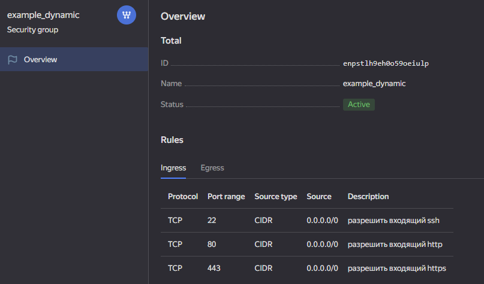

## Задание 1



```js
  resources {
    cores         = 2
    memory        = 1
    core_fraction = 5
  }
```

Для авторизации закомментировал token и сгенерировал authorized_key.json


## Задание 4


[Финальный код (ссылка на github repo)](https://github.com/gaidarvu/ter-homeworks/tree/main/02/src)
