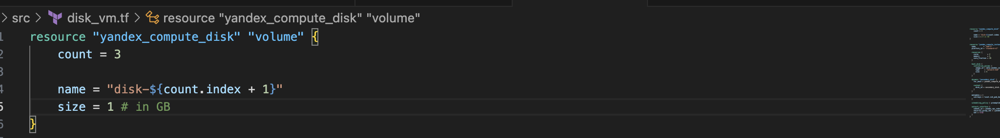

# Домашнее задание к занятию «Управляющие конструкции в коде Terraform»

### Цели задания

1. Отработать основные принципы и методы работы с управляющими конструкциями Terraform.
2. Освоить работу с шаблонизатором Terraform (Interpolation Syntax).

------

### Чек-лист готовности к домашнему заданию

1. Зарегистрирован аккаунт в Yandex Cloud. Использован промокод на грант.
2. Установлен инструмент Yandex CLI.
3. Доступен исходный код для выполнения задания в директории [**03/src**](https://github.com/netology-code/ter-homeworks/tree/main/03/src).
4. Любые ВМ, использованные при выполнении задания, должны быть прерываемыми, для экономии средств.

------

### Внимание!! Обязательно предоставляем на проверку получившийся код в виде ссылки на ваш github-репозиторий!
Убедитесь что ваша версия **Terraform** ~>1.8.4
Теперь пишем красивый код, хардкод значения не допустимы!
------

### Задание 1

1. Изучите проект.
2. Заполните файл personal.auto.tfvars.
3. Инициализируйте проект, выполните код. Он выполнится, даже если доступа к preview нет.

Примечание. Если у вас не активирован preview-доступ к функционалу «Группы безопасности» в Yandex Cloud, запросите доступ у поддержки облачного провайдера. Обычно его выдают в течение 24-х часов.

Приложите скриншот входящих правил «Группы безопасности» в ЛК Yandex Cloud или скриншот отказа в предоставлении доступа к preview-версии.

#### Решение 

1. Прописываем в файл ```personal.auto.tfvars```, инициализируем проект и применяем его

```bash session
alekseykashin@MacBook-Pro-Aleksej ~ % cd ~/nettology/ter-homeworks/03/src
alekseykashin@MacBook-Pro-Aleksej src % terraform init 
Initializing the backend...
Initializing provider plugins...
- Reusing previous version of yandex-cloud/yandex from the dependency lock file
- Using previously-installed yandex-cloud/yandex v0.129.0

Terraform has been successfully initialized!

You may now begin working with Terraform. Try running "terraform plan" to see
any changes that are required for your infrastructure. All Terraform commands
should now work.

If you ever set or change modules or backend configuration for Terraform,
rerun this command to reinitialize your working directory. If you forget, other
commands will detect it and remind you to do so if necessary.
alekseykashin@MacBook-Pro-Aleksej src % terraform validate
Success! The configuration is valid.

alekseykashin@MacBook-Pro-Aleksej src % terraform apply    

Terraform used the selected providers to generate the following execution plan.
Resource actions are indicated with the following symbols:
  + create

Terraform will perform the following actions:

  # yandex_vpc_network.develop will be created
  + resource "yandex_vpc_network" "develop" {
      + created_at                = (known after apply)
      + default_security_group_id = (known after apply)
      + folder_id                 = (known after apply)
      + id                        = (known after apply)
      + labels                    = (known after apply)
      + name                      = "develop"
      + subnet_ids                = (known after apply)
    }

  # yandex_vpc_security_group.example will be created
  + resource "yandex_vpc_security_group" "example" {
      + created_at = (known after apply)
      + folder_id  = "b1gvqnla1h39vg6o82d0"
      + id         = (known after apply)
      + labels     = (known after apply)
      + name       = "example_dynamic"
      + network_id = (known after apply)
      + status     = (known after apply)

      + egress {
          + description       = "разрешить весь исходящий трафик"
          + from_port         = 0
          + id                = (known after apply)
          + labels            = (known after apply)
          + port              = -1
          + protocol          = "TCP"
          + to_port           = 65365
          + v4_cidr_blocks    = [
              + "0.0.0.0/0",
            ]
          + v6_cidr_blocks    = []
            # (2 unchanged attributes hidden)
        }

      + ingress {
          + description       = "разрешить входящий  http"
          + from_port         = -1
          + id                = (known after apply)
          + labels            = (known after apply)
          + port              = 80
          + protocol          = "TCP"
          + to_port           = -1
          + v4_cidr_blocks    = [
              + "0.0.0.0/0",
            ]
          + v6_cidr_blocks    = []
            # (2 unchanged attributes hidden)
        }
      + ingress {
          + description       = "разрешить входящий https"
          + from_port         = -1
          + id                = (known after apply)
          + labels            = (known after apply)
          + port              = 443
          + protocol          = "TCP"
          + to_port           = -1
          + v4_cidr_blocks    = [
              + "0.0.0.0/0",
            ]
          + v6_cidr_blocks    = []
            # (2 unchanged attributes hidden)
        }
      + ingress {
          + description       = "разрешить входящий ssh"
          + from_port         = -1
          + id                = (known after apply)
          + labels            = (known after apply)
          + port              = 22
          + protocol          = "TCP"
          + to_port           = -1
          + v4_cidr_blocks    = [
              + "0.0.0.0/0",
            ]
          + v6_cidr_blocks    = []
            # (2 unchanged attributes hidden)
        }
    }

  # yandex_vpc_subnet.develop will be created
  + resource "yandex_vpc_subnet" "develop" {
      + created_at     = (known after apply)
      + folder_id      = (known after apply)
      + id             = (known after apply)
      + labels         = (known after apply)
      + name           = "develop"
      + network_id     = (known after apply)
      + v4_cidr_blocks = [
          + "10.0.1.0/24",
        ]
      + v6_cidr_blocks = (known after apply)
      + zone           = "ru-central1-a"
    }

Plan: 3 to add, 0 to change, 0 to destroy.

Do you want to perform these actions?
  Terraform will perform the actions described above.
  Only 'yes' will be accepted to approve.

  Enter a value: yes

yandex_vpc_network.develop: Creating...
yandex_vpc_network.develop: Creation complete after 4s [id=enp3l1a73ctl2ckkqh76]
yandex_vpc_subnet.develop: Creating...
yandex_vpc_security_group.example: Creating...
yandex_vpc_subnet.develop: Creation complete after 0s [id=e9bo7si6l98ocsf05vql]
yandex_vpc_security_group.example: Creation complete after 2s [id=enphhqofjnvf5jnljmtu]

Apply complete! Resources: 3 added, 0 changed, 0 destroyed.
alekseykashin@MacBook-Pro-Aleksej src % 
```
------


### Задание 2

1. Создайте файл count-vm.tf. Опишите в нём создание двух **одинаковых** ВМ  web-1 и web-2 (не web-0 и web-1) с минимальными параметрами, используя мета-аргумент **count loop**. Назначьте ВМ созданную в первом задании группу безопасности.(как это сделать узнайте в документации провайдера yandex/compute_instance )
2. Создайте файл for_each-vm.tf. Опишите в нём создание двух ВМ для баз данных с именами "main" и "replica" **разных** по cpu/ram/disk_volume , используя мета-аргумент **for_each loop**. Используйте для обеих ВМ одну общую переменную типа:
```
variable "each_vm" {
  type = list(object({  vm_name=string, cpu=number, ram=number, disk_volume=number }))
}
```  
При желании внесите в переменную все возможные параметры.
4. ВМ из пункта 2.1 должны создаваться после создания ВМ из пункта 2.2.
5. Используйте функцию file в local-переменной для считывания ключа ~/.ssh/id_rsa.pub и его последующего использования в блоке metadata, взятому из ДЗ 2.
6. Инициализируйте проект, выполните код.

------
#### Решение 

1. Создаем файл ```count-vm.tf```, добавляем метааргумент ```count=2``` (позволяет создать N экземляра модуля в котором используется)


2. Добавдяем VM группу безопасноти через ```security_group_ids```


3. Создаем в variable.tf переменную ```vms_db``` маппу объектов

```bash session
alekseykashin@MacBook-Pro-Aleksej src % cat variables.tf

...

variable "vms_db" {
  type = map(object({
    name        = string
    platform_id = string
    resources   = object({
      core = number
      memory = number
      core_fraction = number 
    })
    boot_disk = object({
      type = string
      size = number
    })
    scheduling_policy = object({
      preemptible = bool
    })
    network_interface = object({
      nat = bool
    })
    metadata = object({
      serial-port-enable = number
      ssh-user = string
    })
    true_flg = bool
  }))
  default = {
      "db-1" = {
        name = "db-master"
        platform_id = "standard-v1"
        resources = {
          core=2
          memory=2
          core_fraction=20
        }
        boot_disk = {
          type = "network-hdd"
          size = 10
        }
        scheduling_policy = {
          preemptible = true
        }
        network_interface = {
          nat = true
        }
        metadata = {
          serial-port-enable = 1
          ssh-user  = "ubuntu"
        }
        true_flg = true 
      }
      "db-2" = {
        name = "db-slave"
        platform_id = "standard-v1"
        resources = {
          core=2
          memory=2
          core_fraction=5
        }
        boot_disk = {
          type = "network-hdd"
          size = 5
        }
        scheduling_policy = {
          preemptible = true
        }
        network_interface = {
          nat = true
        }
        metadata = {
          serial-port-enable = 1
          ssh-user  = "ubuntu"
        }
        true_flg = true 
      }
  }
}%   
```

4. Создаем for_each-vm.tf, описываем создание ```vms-db``` через переменну ```vms_db``` и метааргумент ```for each```, так же вынес все переменные в объект


5. Прописываем зависимость создания ```vms-web``` от ```vms-db```


6. Создаем ```locals.tf```, добавляем переменную ```shh_pub_key```, ```shh_key```, добавляем их в 


Прописываем в ```shh_key``` в ```vms-db```


Прописываем в ```shh_pub_key``` в ```vms-web```


Прописываем переменные

6. Инициализируйте проект, выполните код.


```bash session
alekseykashin@MacBook-Pro-Aleksej src % terraform apply   
data.yandex_compute_image.ubuntu-2004-lts: Reading...
yandex_vpc_network.develop: Refreshing state... [id=enp27uruo2tohk2eic5e]
data.yandex_compute_image.ubuntu-2004-lts: Read complete after 1s [id=fd8ivkpagklognhslumh]
yandex_vpc_subnet.develop: Refreshing state... [id=e9be3q8m8lmvf4r2tjse]
yandex_vpc_security_group.example: Refreshing state... [id=enp0lqitjq2v41f0e33a]
yandex_compute_instance.vms-db["db-2"]: Refreshing state... [id=fhmq6hk3gsn2gfn9c5lj]
yandex_compute_instance.vms-db["db-1"]: Refreshing state... [id=fhm3ad29qg1ak3rm51u5]
yandex_compute_instance.vms-web[0]: Refreshing state... [id=fhm2d3uap2jgs637rmjb]
yandex_compute_instance.vms-web[1]: Refreshing state... [id=fhm0qscgobdtuhjv76u3]

Terraform used the selected providers to generate the following execution plan. Resource actions
are indicated with the following symbols:
  + create

Terraform will perform the following actions:

  # yandex_compute_instance.vms-db["db-1"] will be created
  + resource "yandex_compute_instance" "vms-db" {
      + created_at                = (known after apply)
      + folder_id                 = (known after apply)
      + fqdn                      = (known after apply)
      + gpu_cluster_id            = (known after apply)
      + hostname                  = (known after apply)
      + id                        = (known after apply)
      + maintenance_grace_period  = (known after apply)
      + maintenance_policy        = (known after apply)
      + metadata                  = {
          + "ssh-keys" = <<-EOT
                ubuntu:ssh-ed25519 AAAAC3NzaC1lZDI1NTE5AAAAIAQw34uSQmX8BJUmGYwojbsanVHd8+BLc0/mzlpDr3tb alekseykashin@MacBook-Pro-Aleksej.local
            EOT
        }
      + name                      = "db-master"
      + network_acceleration_type = "standard"
      + platform_id               = "standard-v1"
      + service_account_id        = (known after apply)
      + status                    = (known after apply)
      + zone                      = (known after apply)

      + boot_disk {
          + auto_delete = true
          + device_name = (known after apply)
          + disk_id     = (known after apply)
          + mode        = (known after apply)

          + initialize_params {
              + block_size  = (known after apply)
              + description = (known after apply)
              + image_id    = "fd8ivkpagklognhslumh"
              + name        = (known after apply)
              + size        = 10
              + snapshot_id = (known after apply)
              + type        = "network-hdd"
            }
        }

      + metadata_options (known after apply)

      + network_interface {
          + index              = (known after apply)
          + ip_address         = (known after apply)
          + ipv4               = true
          + ipv6               = (known after apply)
          + ipv6_address       = (known after apply)
          + mac_address        = (known after apply)
          + nat                = true
          + nat_ip_address     = (known after apply)
          + nat_ip_version     = (known after apply)
          + security_group_ids = (known after apply)
          + subnet_id          = "e9be3q8m8lmvf4r2tjse"
        }

      + placement_policy (known after apply)

      + resources {
          + core_fraction = 20
          + cores         = 2
          + memory        = 2
        }

      + scheduling_policy {
          + preemptible = true
        }
    }

  # yandex_compute_instance.vms-db["db-2"] will be created
  + resource "yandex_compute_instance" "vms-db" {
      + created_at                = (known after apply)
      + folder_id                 = (known after apply)
      + fqdn                      = (known after apply)
      + gpu_cluster_id            = (known after apply)
      + hostname                  = (known after apply)
      + id                        = (known after apply)
      + maintenance_grace_period  = (known after apply)
      + maintenance_policy        = (known after apply)
      + metadata                  = {
          + "ssh-keys" = <<-EOT
                ubuntu:ssh-ed25519 AAAAC3NzaC1lZDI1NTE5AAAAIAQw34uSQmX8BJUmGYwojbsanVHd8+BLc0/mzlpDr3tb alekseykashin@MacBook-Pro-Aleksej.local
            EOT
        }
      + name                      = "db-slave"
      + network_acceleration_type = "standard"
      + platform_id               = "standard-v1"
      + service_account_id        = (known after apply)
      + status                    = (known after apply)
      + zone                      = (known after apply)

      + boot_disk {
          + auto_delete = true
          + device_name = (known after apply)
          + disk_id     = (known after apply)
          + mode        = (known after apply)

          + initialize_params {
              + block_size  = (known after apply)
              + description = (known after apply)
              + image_id    = "fd8ivkpagklognhslumh"
              + name        = (known after apply)
              + size        = 5
              + snapshot_id = (known after apply)
              + type        = "network-hdd"
            }
        }

      + metadata_options (known after apply)

      + network_interface {
          + index              = (known after apply)
          + ip_address         = (known after apply)
          + ipv4               = true
          + ipv6               = (known after apply)
          + ipv6_address       = (known after apply)
          + mac_address        = (known after apply)
          + nat                = true
          + nat_ip_address     = (known after apply)
          + nat_ip_version     = (known after apply)
          + security_group_ids = (known after apply)
          + subnet_id          = "e9be3q8m8lmvf4r2tjse"
        }

      + placement_policy (known after apply)

      + resources {
          + core_fraction = 5
          + cores         = 2
          + memory        = 2
        }

      + scheduling_policy {
          + preemptible = true
        }
    }

  # yandex_compute_instance.vms-web[0] will be created
  + resource "yandex_compute_instance" "vms-web" {
      + created_at                = (known after apply)
      + folder_id                 = (known after apply)
      + fqdn                      = (known after apply)
      + gpu_cluster_id            = (known after apply)
      + hostname                  = (known after apply)
      + id                        = (known after apply)
      + maintenance_grace_period  = (known after apply)
      + maintenance_policy        = (known after apply)
      + metadata                  = {
          + "ssh-keys" = <<-EOT
                ubuntu:ssh-ed25519 AAAAC3NzaC1lZDI1NTE5AAAAIAQw34uSQmX8BJUmGYwojbsanVHd8+BLc0/mzlpDr3tb alekseykashin@MacBook-Pro-Aleksej.local
            EOT
        }
      + name                      = "web-1"
      + network_acceleration_type = "standard"
      + platform_id               = "standard-v1"
      + service_account_id        = (known after apply)
      + status                    = (known after apply)
      + zone                      = (known after apply)

      + boot_disk {
          + auto_delete = true
          + device_name = (known after apply)
          + disk_id     = (known after apply)
          + mode        = (known after apply)

          + initialize_params {
              + block_size  = (known after apply)
              + description = (known after apply)
              + image_id    = "fd8ivkpagklognhslumh"
              + name        = (known after apply)
              + size        = 5
              + snapshot_id = (known after apply)
              + type        = "network-hdd"
            }
        }

      + metadata_options (known after apply)

      + network_interface {
          + index              = (known after apply)
          + ip_address         = (known after apply)
          + ipv4               = true
          + ipv6               = (known after apply)
          + ipv6_address       = (known after apply)
          + mac_address        = (known after apply)
          + nat                = true
          + nat_ip_address     = (known after apply)
          + nat_ip_version     = (known after apply)
          + security_group_ids = [
              + "enp0lqitjq2v41f0e33a",
            ]
          + subnet_id          = "e9be3q8m8lmvf4r2tjse"
        }

      + placement_policy (known after apply)

      + resources {
          + core_fraction = 20
          + cores         = 2
          + memory        = 1
        }

      + scheduling_policy {
          + preemptible = true
        }
    }

  # yandex_compute_instance.vms-web[1] will be created
  + resource "yandex_compute_instance" "vms-web" {
      + created_at                = (known after apply)
      + folder_id                 = (known after apply)
      + fqdn                      = (known after apply)
      + gpu_cluster_id            = (known after apply)
      + hostname                  = (known after apply)
      + id                        = (known after apply)
      + maintenance_grace_period  = (known after apply)
      + maintenance_policy        = (known after apply)
      + metadata                  = {
          + "ssh-keys" = <<-EOT
                ubuntu:ssh-ed25519 AAAAC3NzaC1lZDI1NTE5AAAAIAQw34uSQmX8BJUmGYwojbsanVHd8+BLc0/mzlpDr3tb alekseykashin@MacBook-Pro-Aleksej.local
            EOT
        }
      + name                      = "web-2"
      + network_acceleration_type = "standard"
      + platform_id               = "standard-v1"
      + service_account_id        = (known after apply)
      + status                    = (known after apply)
      + zone                      = (known after apply)

      + boot_disk {
          + auto_delete = true
          + device_name = (known after apply)
          + disk_id     = (known after apply)
          + mode        = (known after apply)

          + initialize_params {
              + block_size  = (known after apply)
              + description = (known after apply)
              + image_id    = "fd8ivkpagklognhslumh"
              + name        = (known after apply)
              + size        = 5
              + snapshot_id = (known after apply)
              + type        = "network-hdd"
            }
        }

      + metadata_options (known after apply)

      + network_interface {
          + index              = (known after apply)
          + ip_address         = (known after apply)
          + ipv4               = true
          + ipv6               = (known after apply)
          + ipv6_address       = (known after apply)
          + mac_address        = (known after apply)
          + nat                = true
          + nat_ip_address     = (known after apply)
          + nat_ip_version     = (known after apply)
          + security_group_ids = [
              + "enp0lqitjq2v41f0e33a",
            ]
          + subnet_id          = "e9be3q8m8lmvf4r2tjse"
        }

      + placement_policy (known after apply)

      + resources {
          + core_fraction = 20
          + cores         = 2
          + memory        = 1
        }

      + scheduling_policy {
          + preemptible = true
        }
    }

Plan: 4 to add, 0 to change, 0 to destroy.

Do you want to perform these actions?
  Terraform will perform the actions described above.
  Only 'yes' will be accepted to approve.

  Enter a value: yes

yandex_compute_instance.vms-db["db-1"]: Creating...
yandex_compute_instance.vms-db["db-2"]: Creating...
yandex_compute_instance.vms-db["db-2"]: Still creating... [10s elapsed]
yandex_compute_instance.vms-db["db-1"]: Still creating... [10s elapsed]
yandex_compute_instance.vms-db["db-1"]: Still creating... [20s elapsed]
yandex_compute_instance.vms-db["db-2"]: Still creating... [20s elapsed]
yandex_compute_instance.vms-db["db-1"]: Still creating... [30s elapsed]
yandex_compute_instance.vms-db["db-2"]: Still creating... [30s elapsed]
yandex_compute_instance.vms-db["db-1"]: Creation complete after 35s [id=fhmsd7fbp33a3mk7bgvg]
yandex_compute_instance.vms-db["db-2"]: Still creating... [40s elapsed]
yandex_compute_instance.vms-db["db-2"]: Creation complete after 42s [id=fhmso8eii1ie60d2ob82]
yandex_compute_instance.vms-web[0]: Creating...
yandex_compute_instance.vms-web[1]: Creating...
yandex_compute_instance.vms-web[0]: Still creating... [10s elapsed]
yandex_compute_instance.vms-web[1]: Still creating... [10s elapsed]
yandex_compute_instance.vms-web[1]: Still creating... [20s elapsed]
yandex_compute_instance.vms-web[0]: Still creating... [20s elapsed]
yandex_compute_instance.vms-web[0]: Still creating... [30s elapsed]
yandex_compute_instance.vms-web[1]: Still creating... [30s elapsed]
yandex_compute_instance.vms-web[0]: Creation complete after 36s [id=fhmod5roakeje1745fh6]
yandex_compute_instance.vms-web[1]: Still creating... [40s elapsed]
yandex_compute_instance.vms-web[1]: Creation complete after 41s [id=fhmbgg8kbuloqmeg8jji]

Apply complete! Resources: 4 added, 0 changed, 0 destroyed.
alekseykashin@MacBook-Pro-Aleksej src % 
```


### Задание 3

1. Создайте 3 одинаковых виртуальных диска размером 1 Гб с помощью ресурса yandex_compute_disk и мета-аргумента count в файле **disk_vm.tf** .
2. Создайте в том же файле **одиночную**(использовать count или for_each запрещено из-за задания №4) ВМ c именем "storage"  . Используйте блок **dynamic secondary_disk{..}** и мета-аргумент for_each для подключения созданных вами дополнительных дисков.

#### Решение

1. Создаем файл ```disk_vm.tf```, создаем 3 диска через ```yandex_compute_disk``` и метааргумент ```count=3```



2. Создаем виртуальну машину и через динамический блок, добавляем 3 диска. 


3. Проверяем изменения

```bash session
alekseykashin@MacBook-Pro-Aleksej src % terraform apply
data.yandex_compute_image.ubuntu-2004-lts: Reading...
yandex_vpc_network.develop: Refreshing state... [id=enp27uruo2tohk2eic5e]
yandex_compute_disk.volume[1]: Refreshing state... [id=fhmh810jvf2d2gc6urll]
yandex_compute_disk.volume[2]: Refreshing state... [id=fhmeqb3ukljmvk60qc5j]
yandex_compute_disk.volume[0]: Refreshing state... [id=fhmtadcd853eparv1tc9]
data.yandex_compute_image.ubuntu-2004-lts: Read complete after 1s [id=fd8ivkpagklognhslumh]
yandex_vpc_subnet.develop: Refreshing state... [id=e9be3q8m8lmvf4r2tjse]
yandex_vpc_security_group.example: Refreshing state... [id=enp0lqitjq2v41f0e33a]
yandex_compute_instance.vms-db["db-2"]: Refreshing state... [id=fhmso8eii1ie60d2ob82]
yandex_compute_instance.vms-db["db-1"]: Refreshing state... [id=fhmsd7fbp33a3mk7bgvg]
yandex_compute_instance.vms-web-with-volume: Refreshing state... [id=fhm040d6dgqpo79m11sr]
yandex_compute_instance.vms-web[1]: Refreshing state... [id=fhmbgg8kbuloqmeg8jji]
yandex_compute_instance.vms-web[0]: Refreshing state... [id=fhmod5roakeje1745fh6]

Terraform used the selected providers to generate the following execution plan. Resource actions are indicated with the following symbols:
  + create

Terraform will perform the following actions:

  # yandex_compute_disk.volume[0] will be created
  + resource "yandex_compute_disk" "volume" {
      + block_size  = 4096
      + created_at  = (known after apply)
      + folder_id   = (known after apply)
      + id          = (known after apply)
      + name        = "disk-1"
      + product_ids = (known after apply)
      + size        = 1
      + status      = (known after apply)
      + type        = "network-hdd"
      + zone        = (known after apply)

      + disk_placement_policy (known after apply)
    }

  # yandex_compute_disk.volume[1] will be created
  + resource "yandex_compute_disk" "volume" {
      + block_size  = 4096
      + created_at  = (known after apply)
      + folder_id   = (known after apply)
      + id          = (known after apply)
      + name        = "disk-2"
      + product_ids = (known after apply)
      + size        = 1
      + status      = (known after apply)
      + type        = "network-hdd"
      + zone        = (known after apply)

      + disk_placement_policy (known after apply)
    }

  # yandex_compute_disk.volume[2] will be created
  + resource "yandex_compute_disk" "volume" {
      + block_size  = 4096
      + created_at  = (known after apply)
      + folder_id   = (known after apply)
      + id          = (known after apply)
      + name        = "disk-3"
      + product_ids = (known after apply)
      + size        = 1
      + status      = (known after apply)
      + type        = "network-hdd"
      + zone        = (known after apply)

      + disk_placement_policy (known after apply)
    }

  # yandex_compute_instance.vms-web-with-volume will be created
  + resource "yandex_compute_instance" "vms-web-with-volume" {
      + created_at                = (known after apply)
      + folder_id                 = (known after apply)
      + fqdn                      = (known after apply)
      + gpu_cluster_id            = (known after apply)
      + hostname                  = (known after apply)
      + id                        = (known after apply)
      + maintenance_grace_period  = (known after apply)
      + maintenance_policy        = (known after apply)
      + metadata                  = {
          + "ssh-keys" = <<-EOT
                ssh-ed25519 AAAAC3NzaC1lZDI1NTE5AAAAIAQw34uSQmX8BJUmGYwojbsanVHd8+BLc0/mzlpDr3tb alekseykashin@MacBook-Pro-Aleksej.local
            EOT
        }
      + name                      = "web-3"
      + network_acceleration_type = "standard"
      + platform_id               = "standard-v1"
      + service_account_id        = (known after apply)
      + status                    = (known after apply)
      + zone                      = (known after apply)

      + boot_disk {
          + auto_delete = true
          + device_name = (known after apply)
          + disk_id     = (known after apply)
          + mode        = (known after apply)

          + initialize_params {
              + block_size  = (known after apply)
              + description = (known after apply)
              + image_id    = "fd8ivkpagklognhslumh"
              + name        = (known after apply)
              + size        = 5
              + snapshot_id = (known after apply)
              + type        = "network-hdd"
            }
        }

      + metadata_options (known after apply)

      + network_interface {
          + index              = (known after apply)
          + ip_address         = (known after apply)
          + ipv4               = true
          + ipv6               = (known after apply)
          + ipv6_address       = (known after apply)
          + mac_address        = (known after apply)
          + nat                = true
          + nat_ip_address     = (known after apply)
          + nat_ip_version     = (known after apply)
          + security_group_ids = [
              + "enp0lqitjq2v41f0e33a",
            ]
          + subnet_id          = "e9be3q8m8lmvf4r2tjse"
        }

      + placement_policy (known after apply)

      + resources {
          + core_fraction = 20
          + cores         = 2
          + memory        = 1
        }

      + scheduling_policy {
          + preemptible = true
        }

      + secondary_disk {
          + auto_delete = false
          + device_name = (known after apply)
          + disk_id     = (known after apply)
          + mode        = "READ_WRITE"
        }
      + secondary_disk {
          + auto_delete = false
          + device_name = (known after apply)
          + disk_id     = (known after apply)
          + mode        = "READ_WRITE"
        }
      + secondary_disk {
          + auto_delete = false
          + device_name = (known after apply)
          + disk_id     = (known after apply)
          + mode        = "READ_WRITE"
        }
    }

Plan: 4 to add, 0 to change, 0 to destroy.

Do you want to perform these actions?
  Terraform will perform the actions described above.
  Only 'yes' will be accepted to approve.

  Enter a value: yes

yandex_compute_disk.volume[1]: Creating...
yandex_compute_disk.volume[0]: Creating...
yandex_compute_disk.volume[2]: Creating...
yandex_compute_disk.volume[1]: Still creating... [10s elapsed]
yandex_compute_disk.volume[0]: Still creating... [10s elapsed]
yandex_compute_disk.volume[2]: Still creating... [10s elapsed]
yandex_compute_disk.volume[0]: Creation complete after 10s [id=fhmkm5llrqbr6bu9hbuc]
yandex_compute_disk.volume[2]: Creation complete after 11s [id=fhmf4siuaqhfvbcpqgr0]
yandex_compute_disk.volume[1]: Creation complete after 11s [id=fhmbi656en5on5io41s6]
yandex_compute_instance.vms-web-with-volume: Creating...
yandex_compute_instance.vms-web-with-volume: Still creating... [10s elapsed]
yandex_compute_instance.vms-web-with-volume: Still creating... [20s elapsed]
yandex_compute_instance.vms-web-with-volume: Still creating... [30s elapsed]
yandex_compute_instance.vms-web-with-volume: Still creating... [40s elapsed]
yandex_compute_instance.vms-web-with-volume: Creation complete after 40s [id=fhmrp3tjllcm398h75gb]

Apply complete! Resources: 4 added, 0 changed, 0 destroyed.
alekseykashin@MacBook-Pro-Aleksej src % 
```

Итого:

Созданы 3 диска

К машине ```web-3``` поодключены 3 диска


------

### Задание 4

1. В файле ansible.tf создайте inventory-файл для ansible.
Используйте функцию tepmplatefile и файл-шаблон для создания ansible inventory-файла из лекции.
Готовый код возьмите из демонстрации к лекции [**demonstration2**](https://github.com/netology-code/ter-homeworks/tree/main/03/demo).
Передайте в него в качестве переменных группы виртуальных машин из задания 2.1, 2.2 и 3.2, т. е. 5 ВМ.
2. Инвентарь должен содержать 3 группы и быть динамическим, т. е. обработать как группу из 2-х ВМ, так и 999 ВМ.
3. Добавьте в инвентарь переменную  [**fqdn**](https://cloud.yandex.ru/docs/compute/concepts/network#hostname).
``` 
[webservers]
web-1 ansible_host=<внешний ip-адрес> fqdn=<полное доменное имя виртуальной машины>
web-2 ansible_host=<внешний ip-адрес> fqdn=<полное доменное имя виртуальной машины>

[databases]
main ansible_host=<внешний ip-адрес> fqdn=<полное доменное имя виртуальной машины>
replica ansible_host<внешний ip-адрес> fqdn=<полное доменное имя виртуальной машины>

[storage]
storage ansible_host=<внешний ip-адрес> fqdn=<полное доменное имя виртуальной машины>
```
Пример fqdn: ```web1.ru-central1.internal```(в случае указания переменной hostname(не путать с переменной name)); ```fhm8k1oojmm5lie8i22a.auto.internal```(в случае отсутвия перменной hostname - автоматическая генерация имени,  зона изменяется на auto). нужную вам переменную найдите в документации провайдера или terraform console.
4. Выполните код. Приложите скриншот получившегося файла. 

Для общего зачёта создайте в вашем GitHub-репозитории новую ветку terraform-03. Закоммитьте в эту ветку свой финальный код проекта, пришлите ссылку на коммит.   
**Удалите все созданные ресурсы**.

#### Решение 

1. Создаем ```ansible.tf ```, в котором будет создавать ansible inventory-файл через ```tepmplatefile```, прописываем лист групп инстансов, разделяем их на подгуппы ```["webservers", "databases", "storage"]```, приводим host к единому ввиду листов(объект) (я не понял почему yandex_compute_instance.vms-web-with-volume я не могу через tolist([]) конвернуть, я получаю ошибку Invalid value for "v" parameter: cannot convert tuple to list of any single type, хотя если смотреть через консоль то все хорошо конвертится в лист объектов)

```bash session
alekseykashin@MacBook-Pro-Aleksej src % cat ansible.tf
resource "local_file" "hosts_templatefile" {
  content = templatefile(
    "${path.module}/hosts.tftpl", 
    { 
        group_hosts = tolist(
            [
                {
                    group = "webservers"
                    hosts = yandex_compute_instance.vms-web[*]
                },
                {
                    group = "databases"
                    hosts = values(yandex_compute_instance.vms-db)
                },
                {
                    group = "storage"
                    hosts = yandex_compute_instance.vms-web-with-volume[*] # Только так получилось конвертнуть в list объектов
                }
            ]
        )
    }
  )

  filename = "${abspath(path.module)}/hosts.ini"
}
alekseykashin@MacBook-Pro-Aleksej src % 
```

2. Создаем файл шаблон ```hosts.tftpl```, немного меняем код, добавляем 1 цикл который будет работать со списком групп и будет отображать ```group```, а второй хостовые данные имя/хост/fqdn.

```bash session
alekseykashin@MacBook-Pro-Aleksej src % cat hosts.tftpl  
%{~ for g_host in group_hosts ~}
[${g_host["group"]}]
    %{~ for host in g_host["hosts"] ~}
    ${host["name"]} ansible_host=${host["network_interface"][0]["nat_ip_address"]} fqdn=${host["fqdn"]}
    %{~ endfor ~}
%{~ endfor ~}%                                                                                          alekseykashin@MacBook-Pro-Aleksej src % 
```

3. Применяем

```bash session
alekseykashin@MacBook-Pro-Aleksej src % terraform apply  
data.yandex_compute_image.ubuntu-2004-lts: Reading...
yandex_vpc_network.develop: Refreshing state... [id=enp27uruo2tohk2eic5e]
yandex_compute_disk.volume[1]: Refreshing state... [id=fhmbi656en5on5io41s6]
yandex_compute_disk.volume[0]: Refreshing state... [id=fhmkm5llrqbr6bu9hbuc]
yandex_compute_disk.volume[2]: Refreshing state... [id=fhmf4siuaqhfvbcpqgr0]
data.yandex_compute_image.ubuntu-2004-lts: Read complete after 1s [id=fd8ivkpagklognhslumh]
yandex_vpc_subnet.develop: Refreshing state... [id=e9be3q8m8lmvf4r2tjse]
yandex_vpc_security_group.example: Refreshing state... [id=enp0lqitjq2v41f0e33a]
yandex_compute_instance.vms-db["db-1"]: Refreshing state... [id=fhmu9aidcn9nksrauvki]
yandex_compute_instance.vms-db["db-2"]: Refreshing state... [id=fhmgivf5denjbc7p78ld]
yandex_compute_instance.vms-web-with-volume: Refreshing state... [id=fhm8rd2139dv90d72he5]
yandex_compute_instance.vms-web[0]: Refreshing state... [id=fhmur0g92cbpi3vs6fs3]
yandex_compute_instance.vms-web[1]: Refreshing state... [id=fhmvcce9puostehui2un]
local_file.hosts_templatefile: Refreshing state... [id=4c54badb52b5e9bc27e36aa8314b0cd36ea9d4a2]

Terraform used the selected providers to generate the following execution plan. Resource actions are
indicated with the following symbols:
  + create

Terraform will perform the following actions:

  # local_file.hosts_templatefile will be created
  + resource "local_file" "hosts_templatefile" {
      + content              = <<-EOT
            [webservers]
                web-1 ansible_host=89.169.154.34 fqdn=fhmur0g92cbpi3vs6fs3.auto.internal
                web-2 ansible_host=89.169.156.75 fqdn=fhmvcce9puostehui2un.auto.internal
            [databases]
                db-master ansible_host=89.169.141.133 fqdn=fhmu9aidcn9nksrauvki.auto.internal
                db-slave ansible_host=89.169.140.127 fqdn=fhmgivf5denjbc7p78ld.auto.internal
            [storage]
                web-3 ansible_host=89.169.142.135 fqdn=fhm8rd2139dv90d72he5.auto.internal
        EOT
      + content_base64sha256 = (known after apply)
      + content_base64sha512 = (known after apply)
      + content_md5          = (known after apply)
      + content_sha1         = (known after apply)
      + content_sha256       = (known after apply)
      + content_sha512       = (known after apply)
      + directory_permission = "0777"
      + file_permission      = "0777"
      + filename             = "/Users/alekseykashin/nettology/ter-homeworks/03/src/hosts.ini"
      + id                   = (known after apply)
    }

Plan: 1 to add, 0 to change, 0 to destroy.

Do you want to perform these actions?
  Terraform will perform the actions described above.
  Only 'yes' will be accepted to approve.

  Enter a value: yes

local_file.hosts_templatefile: Creating...
local_file.hosts_templatefile: Creation complete after 0s [id=4c54badb52b5e9bc27e36aa8314b0cd36ea9d4a2]

Apply complete! Resources: 1 added, 0 changed, 0 destroyed.
alekseykashin@MacBook-Pro-Aleksej src % 
```

4. Читаем ```inventory-файл```, успех все записалось

```bash session
alekseykashin@MacBook-Pro-Aleksej src % cat /Users/alekseykashin/nettology/ter-homeworks/03/src/hosts.ini
[webservers]
    web-1 ansible_host=89.169.154.34 fqdn=fhmur0g92cbpi3vs6fs3.auto.internal
    web-2 ansible_host=89.169.156.75 fqdn=fhmvcce9puostehui2un.auto.internal
[databases]
    db-master ansible_host=89.169.141.133 fqdn=fhmu9aidcn9nksrauvki.auto.internal
    db-slave ansible_host=89.169.140.127 fqdn=fhmgivf5denjbc7p78ld.auto.internal
[storage]
    web-3 ansible_host=89.169.142.135 fqdn=fhm8rd2139dv90d72he5.auto.internal
alekseykashin@MacBook-Pro-Aleksej src % 
```


------

## Дополнительные задания (со звездочкой*)

**Настоятельно рекомендуем выполнять все задания со звёздочкой.** Они помогут глубже разобраться в материале.   
Задания со звёздочкой дополнительные, не обязательные к выполнению и никак не повлияют на получение вами зачёта по этому домашнему заданию. 

### Задание 5* (необязательное)
1. Напишите output, который отобразит ВМ из ваших ресурсов count и for_each в виде списка словарей :
``` 
[
 {
  "name" = 'имя ВМ1'
  "id"   = 'идентификатор ВМ1'
  "fqdn" = 'Внутренний FQDN ВМ1'
 },
 {
  "name" = 'имя ВМ2'
  "id"   = 'идентификатор ВМ2'
  "fqdn" = 'Внутренний FQDN ВМ2'
 },
 ....
...итд любое количество ВМ в ресурсе(те требуется итерация по ресурсам, а не хардкод) !!!!!!!!!!!!!!!!!!!!!
]
```
Приложите скриншот вывода команды ```terrafrom output```.

#### Решение 

1. Создаем ```outputs.tf```, объединяем словари в один лист, и создаем маппу/оъект для атрибутов, создаем list необходимых атрибутов

```bash session
alekseykashin@MacBook-Pro-Aleksej src % cat outputs.tf
output "vm" {

  value = [for k in concat(yandex_compute_instance.vms-web, values(yandex_compute_instance.vms-db), yandex_compute_instance.vms-web-with-volume[*]): {
    name = k.name,
    id = k.id,
    fqdn = k.fqdn
  }]
}
```

2. Вывод
```bash session
alekseykashin@MacBook-Pro-Aleksej src % terraform output
vm = [
  {
    "fqdn" = "fhmur0g92cbpi3vs6fs3.auto.internal"
    "id" = "fhmur0g92cbpi3vs6fs3"
    "name" = "web-1"
  },
  {
    "fqdn" = "fhmvcce9puostehui2un.auto.internal"
    "id" = "fhmvcce9puostehui2un"
    "name" = "web-2"
  },
  {
    "fqdn" = "fhmu9aidcn9nksrauvki.auto.internal"
    "id" = "fhmu9aidcn9nksrauvki"
    "name" = "db-master"
  },
  {
    "fqdn" = "fhmgivf5denjbc7p78ld.auto.internal"
    "id" = "fhmgivf5denjbc7p78ld"
    "name" = "db-slave"
  },
  {
    "fqdn" = "fhm8rd2139dv90d72he5.auto.internal"
    "id" = "fhm8rd2139dv90d72he5"
    "name" = "web-3"
  },
]
alekseykashin@MacBook-Pro-Aleksej src % 
```
------

### Задание 6* (необязательное)

1. Используя null_resource и local-exec, примените ansible-playbook к ВМ из ansible inventory-файла.
Готовый код возьмите из демонстрации к лекции [**demonstration2**](https://github.com/netology-code/ter-homeworks/tree/main/03/demo).
3. Модифицируйте файл-шаблон hosts.tftpl. Необходимо отредактировать переменную ```ansible_host="<внешний IP-address или внутренний IP-address если у ВМ отсутвует внешний адрес>```.

Для проверки работы уберите у ВМ внешние адреса(nat=false). Этот вариант используется при работе через bastion-сервер.
Для зачёта предоставьте код вместе с основной частью задания.

### Правила приёма работы

В своём git-репозитории создайте новую ветку terraform-03, закоммитьте в эту ветку свой финальный код проекта. Ответы на задания и необходимые скриншоты оформите в md-файле в ветке terraform-03.

В качестве результата прикрепите ссылку на ветку terraform-03 в вашем репозитории.

Важно. Удалите все созданные ресурсы.

### Задание 7* (необязательное)
Ваш код возвращает вам следущий набор данных: 
```
> local.vpc
{
  "network_id" = "enp7i560tb28nageq0cc"
  "subnet_ids" = [
    "e9b0le401619ngf4h68n",
    "e2lbar6u8b2ftd7f5hia",
    "b0ca48coorjjq93u36pl",
    "fl8ner8rjsio6rcpcf0h",
  ]
  "subnet_zones" = [
    "ru-central1-a",
    "ru-central1-b",
    "ru-central1-c",
    "ru-central1-d",
  ]
}
```
Предложите выражение в terraform console, которое удалит из данной переменной 3 элемент из: subnet_ids и subnet_zones.(значения могут быть любыми) Образец конечного результата:
```
> <некое выражение>
{
  "network_id" = "enp7i560tb28nageq0cc"
  "subnet_ids" = [
    "e9b0le401619ngf4h68n",
    "e2lbar6u8b2ftd7f5hia",
    "fl8ner8rjsio6rcpcf0h",
  ]
  "subnet_zones" = [
    "ru-central1-a",
    "ru-central1-b",
    "ru-central1-d",
  ]
}
```
#### Решение 

1. Хотел сделать через определение типов переменных но не получается, тип <> типу ничего не понял

```
> type("string") == type("") ? 1 : 0
0
> type("string")
string
> type("")
string
> type("string") == type("string") ? 1 : 0
0

```

2. Пошел простым путем, ищу в маппе ```["subnet_zones", "subnet_ids"]``` и пересоздаю лист не включая 3 елемент, остальные атрибуты скипаю

``` bash session
{for k,v in   
{
  "network_id" = "enp7i560tb28nageq0cc"
  "subnet_ids" = [
    "e9b0le401619ngf4h68n",
    "e2lbar6u8b2ftd7f5hia",
    "fl8ner8rjsio6rcpcf0h",
  ]
  "subnet_zones" = [
    "ru-central1-a",
    "ru-central1-b",
    "ru-central1-d",
  ]
} : k => contains(["subnet_zones", "subnet_ids"], k) ? [for sub_v in v : sub_v if index(v, sub_v) != 2 ] : v }
```

3. Результат

```bash session
{for k,v in   
{
  "network_id" = "enp7i560tb28nageq0cc"
  "subnet_ids" = [
    "e9b0le401619ngf4h68n",
    "e2lbar6u8b2ftd7f5hia",
    "fl8ner8rjsio6rcpcf0h",
  ]
  "subnet_zones" = [
    "ru-central1-a",
    "ru-central1-b",
    "ru-central1-d",
  ]
} : k => contains(["subnet_zones", "subnet_ids"], k) ? [for sub_v in v : sub_v if index(v, sub_v) != 2 ] : v }
```

2. Результат 

```bash session
{
  "network_id" = "enp7i560tb28nageq0cc"
  "subnet_ids" = tolist([
    "e9b0le401619ngf4h68n",
    "e2lbar6u8b2ftd7f5hia",
  ])
  "subnet_zones" = tolist([
    "ru-central1-a",
    "ru-central1-b",
  ])
}
```

### Задание 8* (необязательное)
Идентифицируйте и устраните намеренно допущенную в tpl-шаблоне ошибку. Обратите внимание, что terraform сам сообщит на какой строке и в какой позиции ошибка!
```
[webservers]
%{~ for i in webservers ~}
${i["name"]} ansible_host=${i["network_interface"][0]["nat_ip_address"] platform_id=${i["platform_id "]}}
%{~ endfor ~}
```

#### Решение 

1. Видно что проблема заключается в ошибки при обращении к переменной ```platform_id````, необходимо убрать пробел в наименовании ключа и код заработает

```bash session
[webservers]
%{~ for i in webservers ~}
${i["name"]} ansible_host=${i["network_interface"][0]["nat_ip_address"] platform_id=${i["platform_id"]}}
%{~ endfor ~}
```

### Критерии оценки

Зачёт ставится, если:

* выполнены все задания,
* ответы даны в развёрнутой форме,
* приложены соответствующие скриншоты и файлы проекта,
* в выполненных заданиях нет противоречий и нарушения логики.

На доработку работу отправят, если:

* задание выполнено частично или не выполнено вообще,
* в логике выполнения заданий есть противоречия и существенные недостатки. 


