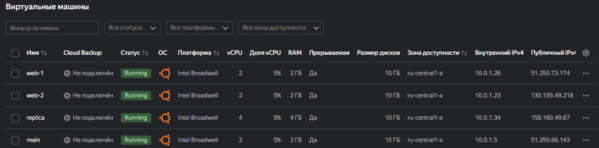

## Задание 1  

входящие правила «Группы безопасности» в ЛК Yandex Cloud:  


## Задание 2

Создал, описал, инициализировал проект, выполнил код  


## Задание 3

Создал диски

## Задание 4

Inventory ansible:  


## Задание 5  

terraform output:  


## Задание 6

1.
2. hosts.tftpl:

```hcl
[webservers]

%{~ for i in webservers ~}

${i["name"]}   ansible_host=${try(i["network_interface"][0]["nat_ip_address"]), i["network_interface"][0]["ip_address"]}
%{~ endfor ~}
```

## Задание 7

```hcl
{for k, v in local.vpc: k => v == "network_id" ? v : [for i, item in v: item if i != 2]}
```

## Задание 8

пробел не нужен в ["platform_**id "**]:

правильно так:

```hcl
[webservers]
%{~ for i in webservers ~}
${i["name"]} ansible_host=${i["network_interface"][0]["nat_ip_address"] platform_id=${i["platform_d"]}}
%{~ endfor ~}
```

## Задание 9

```hcl
1. [for item in range(1, 100): "rc${format("%02d", item)}"]
```

```hcl
2. [for item in range(1, 97) : "rc${format("%02d", item)}" if !contains([0,7,8,9], item % 10) || item == 19]
```
