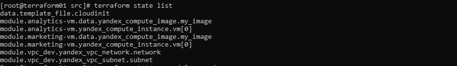
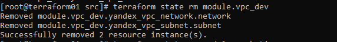
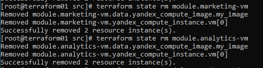
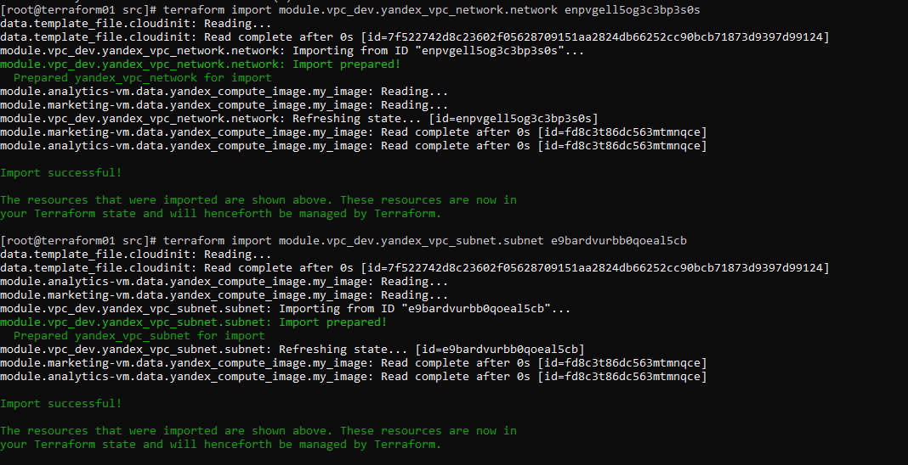
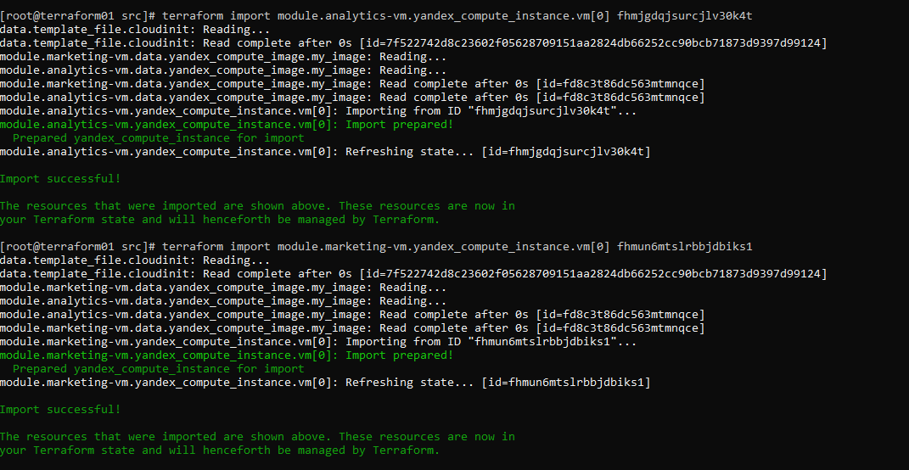
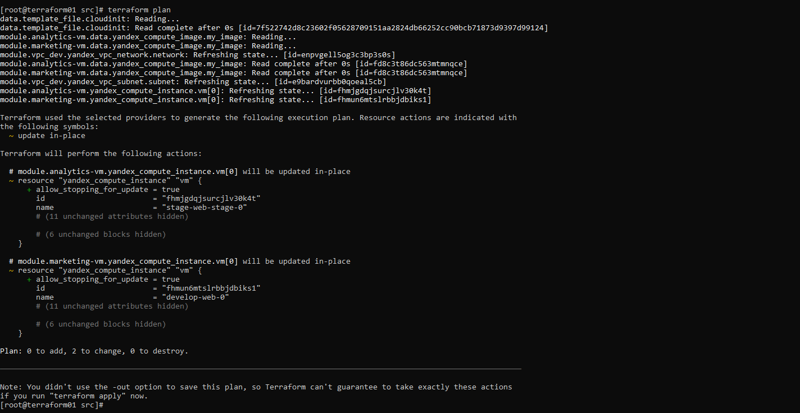

### Задание 1

Скриншот  ЯО с labels  ВМ.


Скриншотs  вывода модулей в ```terraform console```


Листниг  файлов с кодом и переменными

<details>
  <summary>cloud-init.yml</summary>

```yaml
users:
  - name: ubuntu
    groups: sudo
    shell: /bin/bash
    sudo: ['ALL=(ALL) NOPASSWD:ALL']
    ssh_authorized_keys:
      - ${public_key}
package_update: true
package_upgrade: false
packages:
 - vim
 - nginx
runcmd:
 - systemctl start nginx
 - systemctl enable nginx
```
</details>


<details>
  <summary>locals.tf</summary>

```bash
locals{
    ssh-keys  = "${file("~/.ssh/id_ed25519.pub")}"
  }
```
</details>


<details>
  <summary>locals.tf</summary>

```bash
locals{
    ssh-keys  = "${file("~/.ssh/id_ed25519.pub")}"
  }
```
</details>

<details>
  <summary>main.tf</summary>

```bash
resource "yandex_vpc_network" "develop" {
  name = var.vpc_name
}
resource "yandex_vpc_subnet" "develop" {
  name           = var.vpc_name
  zone           = var.default_zone
  network_id     = yandex_vpc_network.develop.id
  v4_cidr_blocks = var.default_cidr
}


module "marketing-vm" {
  source          = "git::https://github.com/udjin10/yandex_compute_instance.git?ref=main"
  env_name        = "develop"
  network_id      = yandex_vpc_network.develop.id
  subnet_zones    = [var.default_zone]
  subnet_ids      = [ yandex_vpc_subnet.develop.id ]
  instance_name   = "web"
  instance_count  = 1
  image_family    = var.image_family
  public_ip       = true
  labels          = {
    project = "marketing"
    }
  metadata = {
      user-data          = data.template_file.cloudinit.rendered
      serial-port-enable = 1
  }
}

module "analytics-vm" {
  source         = "git::https://github.com/udjin10/yandex_compute_instance.git?ref=main"
  env_name       = "stage"
  network_id     = yandex_vpc_network.develop.id
  subnet_zones   = [var.default_zone]
  subnet_ids     = [yandex_vpc_subnet.develop.id]
  instance_name  = "web-stage"
  instance_count = 1
  image_family   = var.image_family
  public_ip      = true
  labels          = {
    project = "analytics"
  }
  metadata = {
    user-data          = data.template_file.cloudinit.rendered
    serial-port-enable = 1
  }

}

data "template_file" "cloudinit" {
  template = file("./cloud-init.yml")
  vars     = {
    public_key = local.ssh-keys
  }
}
```
</details>


------

### Задание 2

Листинг файлов с кодом модуля ```vpc-dev```

<details>
  <summary>main.tf</summary>

```bash
terraform {
  required_providers {
    yandex = {
      source = "yandex-cloud/yandex"
    }
  }
  required_version = ">=0.13"
}


resource "yandex_vpc_network" "network" {
  name = var.env_name
}

resource "yandex_vpc_subnet" "subnet" {
  name = "${var.env_name}-${var.zone}"
  zone = var.zone
  network_id = yandex_vpc_network.network.id
  v4_cidr_blocks = var.cidr_block
}
```
</details>


<details>
  <summary>outputs.tf.tf</summary>

```bash
output "vpc_network"{
  value       = yandex_vpc_network.network
  description = "Yandex vpc network"
}
output "vpc_subnet"{
  value       = yandex_vpc_subnet.subnet
  description = "Yandex vpc subnet"
}
```
</details>

<details>
  <summary>variables.tf</summary>

```bash
variable "env_name" {
  type        = string
  description = "VPC network&subnet name"
}

variable "cidr_block"{
  type        = list(string)
  default     = ["10.0.1.0/24"]
}

variable "zone"{
  type        = string
  default     = ""
}
```
</details>

Сгенерированная документация  по написанному модулю   находится [здесь](./src/vpc_dev/Readme.md)

------

### Задание 3

Результат вывода всех  команд ```terraform state``` в консоли

<details>
  <summary>console output</summary>

```bash
[root@terraform01 src]# terraform state list
data.template_file.cloudinit
module.analytics-vm.data.yandex_compute_image.my_image
module.analytics-vm.yandex_compute_instance.vm[0]
module.marketing-vm.data.yandex_compute_image.my_image
module.marketing-vm.yandex_compute_instance.vm[0]
module.vpc_dev.yandex_vpc_network.network
module.vpc_dev.yandex_vpc_subnet.subnet
[root@terraform01 src]# terraform state rm module.vpc_dev
Removed module.vpc_dev.yandex_vpc_network.network
Removed module.vpc_dev.yandex_vpc_subnet.subnet
Successfully removed 2 resource instance(s).
[root@terraform01 src]# terraform state rm module.marketing-vm
Removed module.marketing-vm.data.yandex_compute_image.my_image
Removed module.marketing-vm.yandex_compute_instance.vm[0]
Successfully removed 2 resource instance(s).
[root@terraform01 src]# terraform state rm module.analytics-vm
Removed module.analytics-vm.data.yandex_compute_image.my_image
Removed module.analytics-vm.yandex_compute_instance.vm[0]
Successfully removed 2 resource instance(s).
[root@terraform01 src]# terraform import module.vpc_dev.yandex_vpc_network.network enpvgell5og3c3bp3s0s
data.template_file.cloudinit: Reading...
data.template_file.cloudinit: Read complete after 0s [id=7f522742d8c23602f05628709151aa2824db66252cc90bcb71873d9397d99124]
module.vpc_dev.yandex_vpc_network.network: Importing from ID "enpvgell5og3c3bp3s0s"...
module.vpc_dev.yandex_vpc_network.network: Import prepared!
  Prepared yandex_vpc_network for import
module.analytics-vm.data.yandex_compute_image.my_image: Reading...
module.marketing-vm.data.yandex_compute_image.my_image: Reading...
module.vpc_dev.yandex_vpc_network.network: Refreshing state... [id=enpvgell5og3c3bp3s0s]
module.marketing-vm.data.yandex_compute_image.my_image: Read complete after 0s [id=fd8c3t86dc563mtmnqce]
module.analytics-vm.data.yandex_compute_image.my_image: Read complete after 0s [id=fd8c3t86dc563mtmnqce]

Import successful!

The resources that were imported are shown above. These resources are now in
your Terraform state and will henceforth be managed by Terraform.

[root@terraform01 src]# terraform import module.vpc_dev.yandex_vpc_subnet.subnet e9bardvurbb0qoeal5cb
data.template_file.cloudinit: Reading...
data.template_file.cloudinit: Read complete after 0s [id=7f522742d8c23602f05628709151aa2824db66252cc90bcb71873d9397d99124]
module.analytics-vm.data.yandex_compute_image.my_image: Reading...
module.marketing-vm.data.yandex_compute_image.my_image: Reading...
module.vpc_dev.yandex_vpc_subnet.subnet: Importing from ID "e9bardvurbb0qoeal5cb"...
module.vpc_dev.yandex_vpc_subnet.subnet: Import prepared!
  Prepared yandex_vpc_subnet for import
module.vpc_dev.yandex_vpc_subnet.subnet: Refreshing state... [id=e9bardvurbb0qoeal5cb]
module.marketing-vm.data.yandex_compute_image.my_image: Read complete after 0s [id=fd8c3t86dc563mtmnqce]
module.analytics-vm.data.yandex_compute_image.my_image: Read complete after 0s [id=fd8c3t86dc563mtmnqce]

Import successful!

The resources that were imported are shown above. These resources are now in
your Terraform state and will henceforth be managed by Terraform.

[root@terraform01 src]# terraform import module.analytics-vm.yandex_compute_instance.vm[0] fhmjgdqjsurcjlv30k4t
data.template_file.cloudinit: Reading...
data.template_file.cloudinit: Read complete after 0s [id=7f522742d8c23602f05628709151aa2824db66252cc90bcb71873d9397d99124]
module.marketing-vm.data.yandex_compute_image.my_image: Reading...
module.analytics-vm.data.yandex_compute_image.my_image: Reading...
module.marketing-vm.data.yandex_compute_image.my_image: Read complete after 0s [id=fd8c3t86dc563mtmnqce]
module.analytics-vm.data.yandex_compute_image.my_image: Read complete after 0s [id=fd8c3t86dc563mtmnqce]
module.analytics-vm.yandex_compute_instance.vm[0]: Importing from ID "fhmjgdqjsurcjlv30k4t"...
module.analytics-vm.yandex_compute_instance.vm[0]: Import prepared!
  Prepared yandex_compute_instance for import
module.analytics-vm.yandex_compute_instance.vm[0]: Refreshing state... [id=fhmjgdqjsurcjlv30k4t]

Import successful!

The resources that were imported are shown above. These resources are now in
your Terraform state and will henceforth be managed by Terraform.

[root@terraform01 src]# terraform import module.marketing-vm.yandex_compute_instance.vm[0] fhmun6mtslrbbjdbiks1
data.template_file.cloudinit: Reading...
data.template_file.cloudinit: Read complete after 0s [id=7f522742d8c23602f05628709151aa2824db66252cc90bcb71873d9397d99124]
module.marketing-vm.data.yandex_compute_image.my_image: Reading...
module.analytics-vm.data.yandex_compute_image.my_image: Reading...
module.analytics-vm.data.yandex_compute_image.my_image: Read complete after 0s [id=fd8c3t86dc563mtmnqce]
module.marketing-vm.data.yandex_compute_image.my_image: Read complete after 0s [id=fd8c3t86dc563mtmnqce]
module.marketing-vm.yandex_compute_instance.vm[0]: Importing from ID "fhmun6mtslrbbjdbiks1"...
module.marketing-vm.yandex_compute_instance.vm[0]: Import prepared!
  Prepared yandex_compute_instance for import
module.marketing-vm.yandex_compute_instance.vm[0]: Refreshing state... [id=fhmun6mtslrbbjdbiks1]

Import successful!

The resources that were imported are shown above. These resources are now in
your Terraform state and will henceforth be managed by Terraform.

[root@terraform01 src]# terraform plan
data.template_file.cloudinit: Reading...
data.template_file.cloudinit: Read complete after 0s [id=7f522742d8c23602f05628709151aa2824db66252cc90bcb71873d9397d99124]
module.analytics-vm.data.yandex_compute_image.my_image: Reading...
module.marketing-vm.data.yandex_compute_image.my_image: Reading...
module.vpc_dev.yandex_vpc_network.network: Refreshing state... [id=enpvgell5og3c3bp3s0s]
module.analytics-vm.data.yandex_compute_image.my_image: Read complete after 0s [id=fd8c3t86dc563mtmnqce]
module.marketing-vm.data.yandex_compute_image.my_image: Read complete after 0s [id=fd8c3t86dc563mtmnqce]
module.vpc_dev.yandex_vpc_subnet.subnet: Refreshing state... [id=e9bardvurbb0qoeal5cb]
module.analytics-vm.yandex_compute_instance.vm[0]: Refreshing state... [id=fhmjgdqjsurcjlv30k4t]
module.marketing-vm.yandex_compute_instance.vm[0]: Refreshing state... [id=fhmun6mtslrbbjdbiks1]

Terraform used the selected providers to generate the following execution plan. Resource actions are indicated with
the following symbols:
  ~ update in-place

Terraform will perform the following actions:

  # module.analytics-vm.yandex_compute_instance.vm[0] will be updated in-place
  ~ resource "yandex_compute_instance" "vm" {
      + allow_stopping_for_update = true
        id                        = "fhmjgdqjsurcjlv30k4t"
        name                      = "stage-web-stage-0"
        # (11 unchanged attributes hidden)

        # (6 unchanged blocks hidden)
    }

  # module.marketing-vm.yandex_compute_instance.vm[0] will be updated in-place
  ~ resource "yandex_compute_instance" "vm" {
      + allow_stopping_for_update = true
        id                        = "fhmun6mtslrbbjdbiks1"
        name                      = "develop-web-0"
        # (11 unchanged attributes hidden)

        # (6 unchanged blocks hidden)
    }

Plan: 0 to add, 2 to change, 0 to destroy.

────────────────────────────────────────────────────────────────────────────────────────────────────────────────────
```
</details>


Скриншоты команд и результат их  вывода











