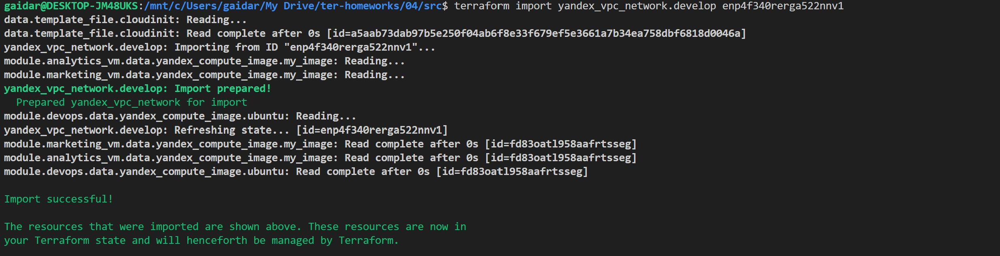

## Задание 1

## Задание 2

[Документация terraform-docs (ссылка на github repo)](https://github.com/gaidarvu/ter-homeworks/blob/terraform-04/04/src/spec.md)

## Задание 3

Смотрим модули, цепляем id модулей, которые будем удалять и удаляем

Импортируем обратно модули

Смотрим terraform plan

[Финальный код (ссылка на github repo)](https://github.com/gaidarvu/ter-homeworks/tree/terraform-04/04/src)
