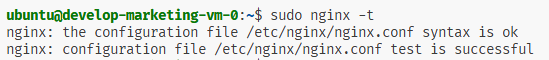

# Домашнее задание к занятию «Продвинутые методы работы с Terraform»

### Цели задания

1. Научиться использовать модули.
2. Отработать операции state.
3. Закрепить пройденный материал.


### Чек-лист готовности к домашнему заданию

1. Зарегистрирован аккаунт в Yandex Cloud. Использован промокод на грант.
2. Установлен инструмент Yandex CLI.
3. Исходный код для выполнения задания расположен в директории [**04/src**](https://github.com/netology-code/ter-homeworks/tree/main/04/src).
4. Любые ВМ, использованные при выполнении задания, должны быть прерываемыми, для экономии средств.

------
### Внимание!! Обязательно предоставляем на проверку получившийся код в виде ссылки на ваш github-репозиторий!
Убедитесь что ваша версия **Terraform** ~>1.8.4
Пишем красивый код, хардкод значения не допустимы!
------

### Задание 1

1. Возьмите из [демонстрации к лекции готовый код](https://github.com/netology-code/ter-homeworks/tree/main/04/demonstration1) для создания с помощью двух вызовов remote-модуля -> двух ВМ, относящихся к разным проектам(marketing и analytics) используйте labels для обозначения принадлежности.  В файле cloud-init.yml необходимо использовать переменную для ssh-ключа вместо хардкода. Передайте ssh-ключ в функцию template_file в блоке vars ={} .
Воспользуйтесь [**примером**](https://grantorchard.com/dynamic-cloudinit-content-with-terraform-file-templates/). Обратите внимание, что ssh-authorized-keys принимает в себя список, а не строку.
3. Добавьте в файл cloud-init.yml установку nginx.
4. Предоставьте скриншот подключения к консоли и вывод команды ```sudo nginx -t```, скриншот консоли ВМ yandex cloud с их метками. Откройте terraform console и предоставьте скриншот содержимого модуля. Пример: > module.marketing_vm
------
В случае использования MacOS вы получите ошибку "Incompatible provider version" . В этом случае скачайте remote модуль локально и поправьте в нем версию template провайдера на более старую.

#### Решение

1. Создаю переменную ```vms``` в файле ```variables.tf```

    ```c
    alekseykashin@MacBook-Pro-Aleksej src % cat variables.tf

    ...

    variable "vms" {
      type = map(object({
        env_name  = string
        instance_name = string
        instance_count = number
        image_family = string
        public_ip = bool
        serial-port-enable = number
      }))
      default = {
        "marketing" = {
          env_name = "marketing"
          instance_name = "web"
          instance_count = 1
          image_family = "ubuntu-2004-lts"
          public_ip = true
          serial-port-enable = 1
        },
        "analytic" = {
          env_name = "analytic"
          instance_name = "web"
          instance_count = 1
          image_family = "ubuntu-2004-lts"
          public_ip = true
          serial-port-enable = 1
        }
      }
    }

    ```

2. Создаем файл ```cloud-init.yml```, прописываем переменную подстановы ssh ключа

    ```c
    alekseykashin@MacBook-Pro-Aleksej src % cat cloud-init.yml 
    #cloud-config
    users:
      - name: ubuntu
        groups: sudo
        shell: /bin/bash
        sudo: ["ALL=(ALL) NOPASSWD:ALL"]
        ssh_authorized_keys:
          - ${ssh_public_key}
    package_update: true
    package_upgrade: false
    packages:
      - vim
    runcmd:
      - apt-get update
      - apt-get install -y nginx
      - systemctl enable --no-block nginx 
      - systemctl start --no-block nginx 
    alekseykashin@MacBook-Pro-Aleksej src % 
    ```

    Так как у меня мак, мне пришлось заиспользовать вместо ```data "template_file"```  функцию ```templatefile()```, я ее поместил в файл ```locals.tf```

    ```c
    alekseykashin@MacBook-Pro-Aleksej src % cat locals.tf      
    locals {
        ssh_pub_key = file("~/.ssh/id_ed25519.pub")
        cloudinit = templatefile("${path.module}/cloud-init.yml", {
            ssh_public_key = local.ssh_pub_key
        })
    }%                                                                                                                                   alekseykashin@MacBook-Pro-Aleksej src % 
    ```

3. Создаю файл ```vms.tf```, беру модуль из домонстрации и создаю две VM для разных "проектов" [marketing, analytics], параметры забираю из переменной ```vms```, метаданные ```user-data``` беру из  ```cloudinit```

    ```bash
    alekseykashin@MacBook-Pro-Aleksej src % cat vms.tf
    module "marketing_vm" {
      source         = "git::https://github.com/x0r1x/yandex_compute_instance.git?ref=main"
      env_name       = var.vms.marketing.env_name
      network_id     = yandex_vpc_network.develop.id
      subnet_zones   = [var.default_zone]
      subnet_ids     = [yandex_vpc_subnet.develop.id]
      instance_name  = var.vms.marketing.instance_name
      instance_count = var.vms.marketing.instance_count
      image_family   = var.vms.marketing.image_family
      public_ip      = var.vms.marketing.public_ip 

      labels = { 
        project = var.vms.marketing.env_name
      }

      metadata = {
        user-data          = local.cloudinit
      }

    }

    module "analytic_vm" {
      source         = "git::https://github.com/x0r1x/yandex_compute_instance.git?ref=main"
      env_name       = var.vms.analytic.env_name
      network_id     = yandex_vpc_network.develop.id
      subnet_zones   = [var.default_zone]
      subnet_ids     = [yandex_vpc_subnet.develop.id]
      instance_name  = var.vms.analytic.instance_name
      instance_count = var.vms.analytic.instance_count
      image_family   = var.vms.analytic.image_family
      public_ip      = var.vms.analytic.public_ip

      labels = { 
        project = var.vms.analytic.env_name
      }

      metadata = {
        user-data          = local.cloudinit
      }

    }
    ```

4. Применяю проект 

    ```bash
    alekseykashin@MacBook-Pro-Aleksej src % terraform apply                               
    data.yandex_compute_image.ubuntu-2004-lts: Reading...
    module.analytic_vm.data.yandex_compute_image.my_image: Reading...
    module.marketing_vm.data.yandex_compute_image.my_image: Reading...
    yandex_vpc_network.develop: Refreshing state... [id=enp8eap2to2lpkvrmrbn]
    module.marketing_vm.data.yandex_compute_image.my_image: Read complete after 1s [id=fd892vjp5gajiqr0g1b3]
    module.analytic_vm.data.yandex_compute_image.my_image: Read complete after 1s [id=fd892vjp5gajiqr0g1b3]
    data.yandex_compute_image.ubuntu-2004-lts: Read complete after 1s [id=fd892vjp5gajiqr0g1b3]
    yandex_vpc_subnet.develop: Refreshing state... [id=e9buduqh7kaq9kndaqpe]
    module.analytic_vm.yandex_compute_instance.vm[0]: Refreshing state... [id=fhmkrk3met8ndtdsjjit]
    module.marketing_vm.yandex_compute_instance.vm[0]: Refreshing state... [id=fhm5r1k8spcer4dr8gnh]

    Terraform used the selected providers to generate the following execution plan. Resource actions are indicated with the following symbols:
      + create

    Terraform will perform the following actions:

      # module.analytic_vm.yandex_compute_instance.vm[0] will be created
      + resource "yandex_compute_instance" "vm" {
          + allow_stopping_for_update = true
          + created_at                = (known after apply)
          + description               = "TODO: description; {{terraform managed}}"
          + folder_id                 = (known after apply)
          + fqdn                      = (known after apply)
          + gpu_cluster_id            = (known after apply)
          + hostname                  = "analytic-web-0"
          + id                        = (known after apply)
          + labels                    = {
              + "project" = "analytic"
            }
          + maintenance_grace_period  = (known after apply)
          + maintenance_policy        = (known after apply)
          + metadata                  = {
              + "user-data" = <<-EOT
                    #cloud-config
                    users:
                      - name: ubuntu
                        groups: sudo
                        shell: /bin/bash
                        sudo: ["ALL=(ALL) NOPASSWD:ALL"]
                        ssh_authorized_keys:
                          - ssh-ed25519 AAAAC3NzaC1lZDI1NTE5AAAAIAQw34uSQmX8BJUmGYwojbsanVHd8+BLc0/mzlpDr3tb alekseykashin@MacBook-Pro-Aleksej.local
                    
                    package_update: true
                    package_upgrade: false
                    packages:
                      - vim
                    runcmd:
                      - apt-get update
                      - apt-get install -y nginx
                      - systemctl enable --no-block nginx 
                      - systemctl start --no-block nginx
                EOT
            }
          + name                      = "analytic-web-0"
          + network_acceleration_type = "standard"
          + platform_id               = "standard-v1"
          + service_account_id        = (known after apply)
          + status                    = (known after apply)
          + zone                      = "ru-central1-a"

          + boot_disk {
              + auto_delete = true
              + device_name = (known after apply)
              + disk_id     = (known after apply)
              + mode        = (known after apply)

              + initialize_params {
                  + block_size  = (known after apply)
                  + description = (known after apply)
                  + image_id    = "fd892vjp5gajiqr0g1b3"
                  + name        = (known after apply)
                  + size        = 10
                  + snapshot_id = (known after apply)
                  + type        = "network-hdd"
                }
            }

          + metadata_options (known after apply)

          + network_interface {
              + index              = (known after apply)
              + ip_address         = (known after apply)
              + ipv4               = true
              + ipv6               = (known after apply)
              + ipv6_address       = (known after apply)
              + mac_address        = (known after apply)
              + nat                = true
              + nat_ip_address     = (known after apply)
              + nat_ip_version     = (known after apply)
              + security_group_ids = (known after apply)
              + subnet_id          = "e9buduqh7kaq9kndaqpe"
            }

          + placement_policy (known after apply)

          + resources {
              + core_fraction = 5
              + cores         = 2
              + memory        = 1
            }

          + scheduling_policy {
              + preemptible = true
            }
        }

      # module.marketing_vm.yandex_compute_instance.vm[0] will be created
      + resource "yandex_compute_instance" "vm" {
          + allow_stopping_for_update = true
          + created_at                = (known after apply)
          + description               = "TODO: description; {{terraform managed}}"
          + folder_id                 = (known after apply)
          + fqdn                      = (known after apply)
          + gpu_cluster_id            = (known after apply)
          + hostname                  = "marketing-web-0"
          + id                        = (known after apply)
          + labels                    = {
              + "project" = "marketing"
            }
          + maintenance_grace_period  = (known after apply)
          + maintenance_policy        = (known after apply)
          + metadata                  = {
              + "user-data" = <<-EOT
                    #cloud-config
                    users:
                      - name: ubuntu
                        groups: sudo
                        shell: /bin/bash
                        sudo: ["ALL=(ALL) NOPASSWD:ALL"]
                        ssh_authorized_keys:
                          - ssh-ed25519 AAAAC3NzaC1lZDI1NTE5AAAAIAQw34uSQmX8BJUmGYwojbsanVHd8+BLc0/mzlpDr3tb alekseykashin@MacBook-Pro-Aleksej.local
                    
                    package_update: true
                    package_upgrade: false
                    packages:
                      - vim
                    runcmd:
                      - apt-get update
                      - apt-get install -y nginx
                      - systemctl enable --no-block nginx 
                      - systemctl start --no-block nginx
                EOT
            }
          + name                      = "marketing-web-0"
          + network_acceleration_type = "standard"
          + platform_id               = "standard-v1"
          + service_account_id        = (known after apply)
          + status                    = (known after apply)
          + zone                      = "ru-central1-a"

          + boot_disk {
              + auto_delete = true
              + device_name = (known after apply)
              + disk_id     = (known after apply)
              + mode        = (known after apply)

              + initialize_params {
                  + block_size  = (known after apply)
                  + description = (known after apply)
                  + image_id    = "fd892vjp5gajiqr0g1b3"
                  + name        = (known after apply)
                  + size        = 10
                  + snapshot_id = (known after apply)
                  + type        = "network-hdd"
                }
            }

          + metadata_options (known after apply)

          + network_interface {
              + index              = (known after apply)
              + ip_address         = (known after apply)
              + ipv4               = true
              + ipv6               = (known after apply)
              + ipv6_address       = (known after apply)
              + mac_address        = (known after apply)
              + nat                = true
              + nat_ip_address     = (known after apply)
              + nat_ip_version     = (known after apply)
              + security_group_ids = (known after apply)
              + subnet_id          = "e9buduqh7kaq9kndaqpe"
            }

          + placement_policy (known after apply)

          + resources {
              + core_fraction = 5
              + cores         = 2
              + memory        = 1
            }

          + scheduling_policy {
              + preemptible = true
            }
        }

    Plan: 2 to add, 0 to change, 0 to destroy.

    Do you want to perform these actions?
      Terraform will perform the actions described above.
      Only 'yes' will be accepted to approve.

      Enter a value: yes

    module.analytic_vm.yandex_compute_instance.vm[0]: Creating...
    module.marketing_vm.yandex_compute_instance.vm[0]: Creating...
    module.marketing_vm.yandex_compute_instance.vm[0]: Still creating... [10s elapsed]
    module.analytic_vm.yandex_compute_instance.vm[0]: Still creating... [10s elapsed]
    module.analytic_vm.yandex_compute_instance.vm[0]: Still creating... [20s elapsed]
    module.marketing_vm.yandex_compute_instance.vm[0]: Still creating... [20s elapsed]
    module.marketing_vm.yandex_compute_instance.vm[0]: Still creating... [30s elapsed]
    module.analytic_vm.yandex_compute_instance.vm[0]: Still creating... [30s elapsed]
    module.analytic_vm.yandex_compute_instance.vm[0]: Still creating... [40s elapsed]
    module.marketing_vm.yandex_compute_instance.vm[0]: Still creating... [40s elapsed]
    module.analytic_vm.yandex_compute_instance.vm[0]: Creation complete after 41s [id=fhm410q36l3sb90s6c6d]
    module.marketing_vm.yandex_compute_instance.vm[0]: Creation complete after 42s [id=fhm4sn5q457sv63farus]

    Apply complete! Resources: 2 added, 0 changed, 0 destroyed.
    alekseykashin@MacBook-Pro-Aleksej src % 
    ```

5. проверяем на vm ```analytic-web-0``` что установлен nginx

    ```tex
    alekseykashin@MacBook-Pro-Aleksej src % ssh ubuntu@51.250.79.207
    The authenticity of host '51.250.79.207 (51.250.79.207)' can't be established.
    ED25519 key fingerprint is SHA256:COcX9EywtrMCGdn/5rI+CkTsbVf1dWshBVit5S4DyyY.
    This key is not known by any other names.
    Are you sure you want to continue connecting (yes/no/[fingerprint])? yes
    Warning: Permanently added '51.250.79.207' (ED25519) to the list of known hosts.
    Welcome to Ubuntu 20.04.6 LTS (GNU/Linux 5.4.0-195-generic x86_64)

    * Documentation:  https://help.ubuntu.com
    * Management:     https://landscape.canonical.com
    * Support:        https://ubuntu.com/pro

    The programs included with the Ubuntu system are free software;
    the exact distribution terms for each program are described in the
    individual files in /usr/share/doc/*/copyright.

    Ubuntu comes with ABSOLUTELY NO WARRANTY, to the extent permitted by
    applicable law.

    To run a command as administrator (user "root"), use "sudo <command>".
    See "man sudo_root" for details.

    ubuntu@analytic-web-0:~$ sudo nginx -t
    nginx: the configuration file /etc/nginx/nginx.conf syntax is ok
    nginx: configuration file /etc/nginx/nginx.conf test is successful
    ubuntu@analytic-web-0:~$ exit
    ```

    проверяем на vm ```marketing-web-0``` что установлен nginx

      ```tex
      alekseykashin@MacBook-Pro-Aleksej src % ssh ubuntu@89.169.146.4
      The authenticity of host '89.169.146.4 (89.169.146.4)' can't be established.
      ED25519 key fingerprint is SHA256:oV5BZYUYC6JF6Jho18vJ9DyxXb/H3wvhvlStCTGVfpo.
      This key is not known by any other names.
      Are you sure you want to continue connecting (yes/no/[fingerprint])? yes
      Warning: Permanently added '89.169.146.4' (ED25519) to the list of known hosts.
      Welcome to Ubuntu 20.04.6 LTS (GNU/Linux 5.4.0-195-generic x86_64)

      * Documentation:  https://help.ubuntu.com
      * Management:     https://landscape.canonical.com
      * Support:        https://ubuntu.com/pro

      The programs included with the Ubuntu system are free software;
      the exact distribution terms for each program are described in the
      individual files in /usr/share/doc/*/copyright.

      Ubuntu comes with ABSOLUTELY NO WARRANTY, to the extent permitted by
      applicable law.

      To run a command as administrator (user "root"), use "sudo <command>".
      See "man sudo_root" for details.

      ubuntu@marketing-web-0:~$ sudo nginx -t
      nginx: the configuration file /etc/nginx/nginx.conf syntax is ok
      nginx: configuration file /etc/nginx/nginx.conf test is successful
      ubuntu@marketing-web-0:~$ 
        ```

6. Проверяем модуль ```marketing_vm``` через консоль

    ```c
    alekseykashin@MacBook-Pro-Aleksej src % terraform console
    > module.marketing_vm
    {
      "external_ip_address" = [
        "89.169.146.4",
      ]
      "fqdn" = [
        "marketing-web-0.ru-central1.internal",
      ]
      "internal_ip_address" = [
        "10.0.1.30",
      ]
      "labels" = [
        tomap({
          "project" = "marketing"
        }),
      ]
      "network_interface" = [
        tolist([
          {
            "dns_record" = tolist([])
            "index" = 0
            "ip_address" = "10.0.1.30"
            "ipv4" = true
            "ipv6" = false
            "ipv6_address" = ""
            "ipv6_dns_record" = tolist([])
            "mac_address" = "d0:0d:4e:5c:ba:21"
            "nat" = true
            "nat_dns_record" = tolist([])
            "nat_ip_address" = "89.169.146.4"
            "nat_ip_version" = "IPV4"
            "security_group_ids" = toset([])
            "subnet_id" = "e9buduqh7kaq9kndaqpe"
          },
        ]),
      ]
    }
    >  
    ```

------

### Задание 2

1. Напишите локальный модуль vpc, который будет создавать 2 ресурса: **одну** сеть и **одну** подсеть в зоне, объявленной при вызове модуля, например: ```ru-central1-a```.
2. Вы должны передать в модуль переменные с названием сети, zone и v4_cidr_blocks.
3. Модуль должен возвращать в root module с помощью output информацию о yandex_vpc_subnet. Пришлите скриншот информации из terraform console о своем модуле. Пример: > module.vpc_dev  
4. Замените ресурсы yandex_vpc_network и yandex_vpc_subnet созданным модулем. Не забудьте передать необходимые параметры сети из модуля vpc в модуль с виртуальной машиной.
5. Сгенерируйте документацию к модулю с помощью terraform-docs.

Пример вызова

```
module "vpc_dev" {
  source       = "./vpc"
  env_name     = "develop"
  zone = "ru-central1-a"
  cidr = "10.0.1.0/24"
}
```

#### Решение

1. Создаем модуль ```vpc```,  структруа проекта: 

    ```bash
    alekseykashin@MacBook-Pro-Aleksej vpc % tree
    .
    ├── README.md -- описание модуля
    ├── main.tf -- провайдер
    ├── outputs.tf -- вывод для возврата переменных
    ├── variables.tf -- переменые
    └── vpc.tf -- модули сети
    ```

    - файл с провайдером ```main.tf```

    ```bash
    alekseykashin@MacBook-Pro-Aleksej vpc % cat main.tf
    terraform {
      required_providers {
        yandex = {
          source = "yandex-cloud/yandex"
        }
      }
      required_version = "~>1.9.5"
    }%                                                                                                                               alekseykashin@MacBook-Pro-Aleksej vpc % 
    ```

    - файл с переменными ```variables.tf```

    ```bash
    alekseykashin@MacBook-Pro-Aleksej vpc % cat variables.tf
    variable "zone" {
      type        = string
      default     = "ru-central1-a"
      description = "https://cloud.yandex.ru/docs/overview/concepts/geo-scope"
    }
    variable "cidr" {
      type        = list(string)
      default     = ["10.0.1.0/24"]
      description = "https://cloud.yandex.ru/docs/vpc/operations/subnet-create"
    }
    variable "env_name" {
      type        = string
      default     = "develop"
      description = "VPC network&subnet name"
    }
    alekseykashin@MacBook-Pro-Aleksej vpc % 
    ```

    - файл с ресурсами ```vpc.tf```

    ```bash
    alekseykashin@MacBook-Pro-Aleksej vpc % cat vpc.tf
    resource "yandex_vpc_network" "develop" {
      name = var.env_name
    }
    resource "yandex_vpc_subnet" "develop" {
      name           = var.env_name
      zone           = var.zone
      network_id     = yandex_vpc_network.develop.id
      v4_cidr_blocks = var.cidr
    }%                                                                                                                               alekseykashin@MacBook-Pro-Aleksej vpc % 
    ```

    - файл с выходными переменными ```outputs.tf```

    ```bash
    alekseykashin@MacBook-Pro-Aleksej vpc % cat outputs.tf
    output "vpc_network_id" {
        value = yandex_vpc_network.develop.id
    }
    output "vpc_netwrok_subnet_id" {
        value = yandex_vpc_subnet.develop.id
        depends_on = [ yandex_vpc_network.develop ]
    }
    alekseykashin@MacBook-Pro-Aleksej vpc % 
    ```

2. Инициализируем модуль ```vpc```

    ```bash
    alekseykashin@MacBook-Pro-Aleksej vpc % terraform init
    Initializing the backend...
    Initializing provider plugins...
    - Reusing previous version of yandex-cloud/yandex from the dependency lock file
    - Using previously-installed yandex-cloud/yandex v0.129.0

    Terraform has been successfully initialized!

    You may now begin working with Terraform. Try running "terraform plan" to see
    any changes that are required for your infrastructure. All Terraform commands
    should now work.

    If you ever set or change modules or backend configuration for Terraform,
    rerun this command to reinitialize your working directory. If you forget, other
    commands will detect it and remind you to do so if necessary.
    alekseykashin@MacBook-Pro-Aleksej vpc % 
    ```

3. Добавляем модуль ```vpc``` в проект, так же добавляем параметры из основного проекта

    ```bash
    alekseykashin@MacBook-Pro-Aleksej src % cat main.tf
    module "vpc" {
      source     = "./vpc"
      env_name   = var.vpc_name
      zone       = var.default_zone
      cidr       = var.default_cidr
    }
    alekseykashin@MacBook-Pro-Aleksej src % 
    ```

4. Меняем параметры ```network_id``` и ```subnet_ids``` на выходные параметры модуля ```vpc```:

    - module.vpc.vpc_network_id
    - module.vpc.vpc_netwrok_subnet_id

    ```bash
    alekseykashin@MacBook-Pro-Aleksej src % cat vms.tf
    module "marketing_vm" {
      source         = "git::https://github.com/x0r1x/yandex_compute_instance.git?ref=main"
      env_name       = var.vms.marketing.env_name
      network_id     = module.vpc.vpc_network_id
      subnet_zones   = [var.default_zone]
      subnet_ids     = [module.vpc.vpc_netwrok_subnet_id]
      instance_name  = var.vms.marketing.instance_name
      instance_count = var.vms.marketing.instance_count
      image_family   = var.vms.marketing.image_family
      public_ip      = var.vms.marketing.public_ip 

      labels = { 
        project = var.vms.marketing.env_name
      }

      metadata = { 
        user-data          = local.cloudinit
      }

    }

    module "analytic_vm" {
      source         = "git::https://github.com/x0r1x/yandex_compute_instance.git?ref=main"
      env_name       = var.vms.analytic.env_name
      network_id     = module.vpc.vpc_network_id
      subnet_zones   = [var.default_zone]
      subnet_ids     = [module.vpc.vpc_netwrok_subnet_id]
      instance_name  = var.vms.analytic.instance_name
      instance_count = var.vms.analytic.instance_count
      image_family   = var.vms.analytic.image_family
      public_ip      = var.vms.analytic.public_ip

      labels = { 
        project = var.vms.analytic.env_name
      }

      metadata = {
        user-data          = local.cloudinit
      }

    }                                                                                                                                   alekseykashin@MacBook-Pro-Aleksej src % 
    ```

5. Генерим доку для модуля ```vpc```

    ```bash
    alekseykashin@MacBook-Pro-Aleksej src % terraform-docs markdown table --output-file README.md --output-mode inject ~/nettology/ter-homeworks/04/src/vpc
    /Users/alekseykashin/nettology/ter-homeworks/04/src/vpc/README.md updated successfully
    alekseykashin@MacBook-Pro-Aleksej src % 
    alekseykashin@MacBook-Pro-Aleksej vpc % cat README.md
    <!-- BEGIN_TF_DOCS -->
    ## Requirements

    | Name | Version |
    |------|---------|
    | <a name="requirement_terraform"></a> [terraform](#requirement\_terraform) | ~>1.9.5 |

    ## Providers

    | Name | Version |
    |------|---------|
    | <a name="provider_yandex"></a> [yandex](#provider\_yandex) | 0.129.0 |

    ## Modules

    No modules.

    ## Resources

    | Name | Type |
    |------|------|
    | [yandex_vpc_network.develop](https://registry.terraform.io/providers/yandex-cloud/yandex/latest/docs/resources/vpc_network) | resource |
    | [yandex_vpc_subnet.develop](https://registry.terraform.io/providers/yandex-cloud/yandex/latest/docs/resources/vpc_subnet) | resource |

    ## Inputs

    | Name | Description | Type | Default | Required |
    |------|-------------|------|---------|:--------:|
    | <a name="input_cidr"></a> [cidr](#input\_cidr) | https://cloud.yandex.ru/docs/vpc/operations/subnet-create | `list(string)` | <pre>[<br>  "10.0.1.0/24"<br>]</pre> | no |
    | <a name="input_env_name"></a> [env\_name](#input\_env\_name) | VPC network&subnet name | `string` | `"develop"` | no |
    | <a name="input_zone"></a> [zone](#input\_zone) | https://cloud.yandex.ru/docs/overview/concepts/geo-scope | `string` | `"ru-central1-a"` | no |

    ## Outputs

    | Name | Description |
    |------|-------------|
    | <a name="output_vpc_network_id"></a> [vpc\_network\_id](#output\_vpc\_network\_id) | n/a |
    | <a name="output_vpc_netwrok_subnet_id"></a> [vpc\_netwrok\_subnet\_id](#output\_vpc\_netwrok\_subnet\_id) | n/a |
    <!-- END_TF_DOCS -->%                                                                                                                           alekseykashin@MacBook-Pro-Aleksej vpc % 
    ```

6. Проверяем что проект собирается

      ```bash
      alekseykashin@MacBook-Pro-Aleksej src % terraform apply
      module.analytic_vm.data.yandex_compute_image.my_image: Reading...
      module.marketing_vm.data.yandex_compute_image.my_image: Reading...
      yandex_vpc_subnet.develop: Refreshing state... [id=e9buduqh7kaq9kndaqpe]
      yandex_vpc_network.develop: Refreshing state... [id=enp8eap2to2lpkvrmrbn]
      module.marketing_vm.data.yandex_compute_image.my_image: Read complete after 1s [id=fd892vjp5gajiqr0g1b3]
      module.analytic_vm.data.yandex_compute_image.my_image: Read complete after 1s [id=fd892vjp5gajiqr0g1b3]
      module.marketing_vm.yandex_compute_instance.vm[0]: Refreshing state... [id=fhm4sn5q457sv63farus]
      module.analytic_vm.yandex_compute_instance.vm[0]: Refreshing state... [id=fhm410q36l3sb90s6c6d]

      Terraform used the selected providers to generate the following execution plan. Resource actions are indicated with the following symbols:
        + create

      Terraform will perform the following actions:

        # module.analytic_vm.yandex_compute_instance.vm[0] will be created
        + resource "yandex_compute_instance" "vm" {
            + allow_stopping_for_update = true
            + created_at                = (known after apply)
            + description               = "TODO: description; {{terraform managed}}"
            + folder_id                 = (known after apply)
            + fqdn                      = (known after apply)
            + gpu_cluster_id            = (known after apply)
            + hostname                  = "analytic-web-0"
            + id                        = (known after apply)
            + labels                    = {
                + "project" = "analytic"
              }
            + maintenance_grace_period  = (known after apply)
            + maintenance_policy        = (known after apply)
            + metadata                  = {
                + "user-data" = <<-EOT
                      #cloud-config
                      users:
                        - name: ubuntu
                          groups: sudo
                          shell: /bin/bash
                          sudo: ["ALL=(ALL) NOPASSWD:ALL"]
                          ssh_authorized_keys:
                            - ssh-ed25519 AAAAC3NzaC1lZDI1NTE5AAAAIAQw34uSQmX8BJUmGYwojbsanVHd8+BLc0/mzlpDr3tb alekseykashin@MacBook-Pro-Aleksej.local
                      
                      package_update: true
                      package_upgrade: false
                      packages:
                        - vim
                      runcmd:
                        - apt-get update
                        - apt-get install -y nginx
                        - systemctl enable --no-block nginx 
                        - systemctl start --no-block nginx
                  EOT
              }
            + name                      = "analytic-web-0"
            + network_acceleration_type = "standard"
            + platform_id               = "standard-v1"
            + service_account_id        = (known after apply)
            + status                    = (known after apply)
            + zone                      = "ru-central1-a"

            + boot_disk {
                + auto_delete = true
                + device_name = (known after apply)
                + disk_id     = (known after apply)
                + mode        = (known after apply)

                + initialize_params {
                    + block_size  = (known after apply)
                    + description = (known after apply)
                    + image_id    = "fd892vjp5gajiqr0g1b3"
                    + name        = (known after apply)
                    + size        = 10
                    + snapshot_id = (known after apply)
                    + type        = "network-hdd"
                  }
              }

            + metadata_options (known after apply)

            + network_interface {
                + index              = (known after apply)
                + ip_address         = (known after apply)
                + ipv4               = true
                + ipv6               = (known after apply)
                + ipv6_address       = (known after apply)
                + mac_address        = (known after apply)
                + nat                = true
                + nat_ip_address     = (known after apply)
                + nat_ip_version     = (known after apply)
                + security_group_ids = (known after apply)
                + subnet_id          = (known after apply)
              }

            + placement_policy (known after apply)

            + resources {
                + core_fraction = 5
                + cores         = 2
                + memory        = 1
              }

            + scheduling_policy {
                + preemptible = true
              }
          }

        # module.marketing_vm.yandex_compute_instance.vm[0] will be created
        + resource "yandex_compute_instance" "vm" {
            + allow_stopping_for_update = true
            + created_at                = (known after apply)
            + description               = "TODO: description; {{terraform managed}}"
            + folder_id                 = (known after apply)
            + fqdn                      = (known after apply)
            + gpu_cluster_id            = (known after apply)
            + hostname                  = "marketing-web-0"
            + id                        = (known after apply)
            + labels                    = {
                + "project" = "marketing"
              }
            + maintenance_grace_period  = (known after apply)
            + maintenance_policy        = (known after apply)
            + metadata                  = {
                + "user-data" = <<-EOT
                      #cloud-config
                      users:
                        - name: ubuntu
                          groups: sudo
                          shell: /bin/bash
                          sudo: ["ALL=(ALL) NOPASSWD:ALL"]
                          ssh_authorized_keys:
                            - ssh-ed25519 AAAAC3NzaC1lZDI1NTE5AAAAIAQw34uSQmX8BJUmGYwojbsanVHd8+BLc0/mzlpDr3tb alekseykashin@MacBook-Pro-Aleksej.local
                      
                      package_update: true
                      package_upgrade: false
                      packages:
                        - vim
                      runcmd:
                        - apt-get update
                        - apt-get install -y nginx
                        - systemctl enable --no-block nginx 
                        - systemctl start --no-block nginx
                  EOT
              }
            + name                      = "marketing-web-0"
            + network_acceleration_type = "standard"
            + platform_id               = "standard-v1"
            + service_account_id        = (known after apply)
            + status                    = (known after apply)
            + zone                      = "ru-central1-a"

            + boot_disk {
                + auto_delete = true
                + device_name = (known after apply)
                + disk_id     = (known after apply)
                + mode        = (known after apply)

                + initialize_params {
                    + block_size  = (known after apply)
                    + description = (known after apply)
                    + image_id    = "fd892vjp5gajiqr0g1b3"
                    + name        = (known after apply)
                    + size        = 10
                    + snapshot_id = (known after apply)
                    + type        = "network-hdd"
                  }
              }

            + metadata_options (known after apply)

            + network_interface {
                + index              = (known after apply)
                + ip_address         = (known after apply)
                + ipv4               = true
                + ipv6               = (known after apply)
                + ipv6_address       = (known after apply)
                + mac_address        = (known after apply)
                + nat                = true
                + nat_ip_address     = (known after apply)
                + nat_ip_version     = (known after apply)
                + security_group_ids = (known after apply)
                + subnet_id          = (known after apply)
              }

            + placement_policy (known after apply)

            + resources {
                + core_fraction = 5
                + cores         = 2
                + memory        = 1
              }

            + scheduling_policy {
                + preemptible = true
              }
          }

        # module.vpc.yandex_vpc_network.develop will be created
        + resource "yandex_vpc_network" "develop" {
            + created_at                = (known after apply)
            + default_security_group_id = (known after apply)
            + folder_id                 = (known after apply)
            + id                        = (known after apply)
            + labels                    = (known after apply)
            + name                      = "develop"
            + subnet_ids                = (known after apply)
          }

        # module.vpc.yandex_vpc_subnet.develop will be created
        + resource "yandex_vpc_subnet" "develop" {
            + created_at     = (known after apply)
            + folder_id      = (known after apply)
            + id             = (known after apply)
            + labels         = (known after apply)
            + name           = "develop"
            + network_id     = (known after apply)
            + v4_cidr_blocks = [
                + "10.0.1.0/24",
              ]
            + v6_cidr_blocks = (known after apply)
            + zone           = "ru-central1-a"
          }

      Plan: 4 to add, 0 to change, 0 to destroy.

      Do you want to perform these actions?
        Terraform will perform the actions described above.
        Only 'yes' will be accepted to approve.

        Enter a value: yes

      module.vpc.yandex_vpc_network.develop: Creating...
      module.vpc.yandex_vpc_network.develop: Creation complete after 2s [id=enpgte8mklmai7od2lqh]
      module.vpc.yandex_vpc_subnet.develop: Creating...
      module.vpc.yandex_vpc_subnet.develop: Creation complete after 1s [id=e9bqa790mtpbmfua13u0]
      module.marketing_vm.yandex_compute_instance.vm[0]: Creating...
      module.analytic_vm.yandex_compute_instance.vm[0]: Creating...
      module.marketing_vm.yandex_compute_instance.vm[0]: Still creating... [10s elapsed]
      module.analytic_vm.yandex_compute_instance.vm[0]: Still creating... [10s elapsed]
      module.analytic_vm.yandex_compute_instance.vm[0]: Still creating... [20s elapsed]
      module.marketing_vm.yandex_compute_instance.vm[0]: Still creating... [20s elapsed]
      module.marketing_vm.yandex_compute_instance.vm[0]: Still creating... [30s elapsed]
      module.analytic_vm.yandex_compute_instance.vm[0]: Still creating... [30s elapsed]
      module.marketing_vm.yandex_compute_instance.vm[0]: Still creating... [40s elapsed]
      module.analytic_vm.yandex_compute_instance.vm[0]: Still creating... [40s elapsed]
      module.analytic_vm.yandex_compute_instance.vm[0]: Creation complete after 41s [id=fhmgrgr818fk5a6f7utp]
      module.marketing_vm.yandex_compute_instance.vm[0]: Creation complete after 44s [id=fhmi9nkijmkfufk3knnj]

      Apply complete! Resources: 4 added, 0 changed, 0 destroyed.
      alekseykashin@MacBook-Pro-Aleksej src % 
      ```

------

### Задание 3

1. Выведите список ресурсов в стейте.
2. Полностью удалите из стейта модуль vpc.
3. Полностью удалите из стейта модуль vm.
4. Импортируйте всё обратно. Проверьте terraform plan. Значимых(!!) изменений быть не должно.
Приложите список выполненных команд и скриншоты процессы.

#### Решение

1. Выводим список всех ресурсов

    ```bash
    alekseykashin@MacBook-Pro-Aleksej src % terraform state list
    module.analytic_vm.data.yandex_compute_image.my_image
    module.analytic_vm.yandex_compute_instance.vm[0]
    module.marketing_vm.data.yandex_compute_image.my_image
    module.marketing_vm.yandex_compute_instance.vm[0]
    module.vpc.yandex_vpc_network.develop
    module.vpc.yandex_vpc_subnet.develop
    alekseykashin@MacBook-Pro-Aleksej src % 
    ```

2. Удаляем из состояния модуль ```vpc```

    ```bash
    alekseykashin@MacBook-Pro-Aleksej src % terraform state rm 'module.vpc.yandex_vpc_subnet.develop'
    Removed module.vpc.yandex_vpc_subnet.develop
    Successfully removed 1 resource instance(s).
    alekseykashin@MacBook-Pro-Aleksej src % terraform state rm 'module.vpc.yandex_vpc_network.develop'
    Removed module.vpc.yandex_vpc_network.develop
    Successfully removed 1 resource instance(s).
    ```

3. Удаляем из состояния модуль ```vm``

    ```bash
    alekseykashin@MacBook-Pro-Aleksej src % terraform state rm 'module.marketing_vm.yandex_compute_instance.vm[0]'
    Removed module.marketing_vm.yandex_compute_instance.vm[0]
    Successfully removed 1 resource instance(s).
    alekseykashin@MacBook-Pro-Aleksej src % terraform state rm 'module.analytic_vm.yandex_compute_instance.vm[0]' 
    Removed module.analytic_vm.yandex_compute_instance.vm[0]
    Successfully removed 1 resource instance(s).
    ```

4. Импортим состояние ```vpc``` и ```vm```

    ```bash
    alekseykashin@MacBook-Pro-Aleksej src % terraform import 'module.vpc.yandex_vpc_subnet.develop' e9bqa790mtpbmfua13u0
    module.vpc.yandex_vpc_subnet.develop: Importing from ID "e9bqa790mtpbmfua13u0"...
    module.marketing_vm.data.yandex_compute_image.my_image: Reading...
    module.analytic_vm.data.yandex_compute_image.my_image: Reading...
    module.vpc.yandex_vpc_subnet.develop: Import prepared!
      Prepared yandex_vpc_subnet for import
    module.vpc.yandex_vpc_subnet.develop: Refreshing state... [id=e9bqa790mtpbmfua13u0]
    module.analytic_vm.data.yandex_compute_image.my_image: Read complete after 1s [id=fd892vjp5gajiqr0g1b3]
    module.marketing_vm.data.yandex_compute_image.my_image: Read complete after 1s [id=fd892vjp5gajiqr0g1b3]

    Import successful!

    The resources that were imported are shown above. These resources are now in
    your Terraform state and will henceforth be managed by Terraform.

    alekseykashin@MacBook-Pro-Aleksej src % terraform import 'module.vpc.yandex_vpc_network.develop' enpgte8mklmai7od2lqh
    module.vpc.yandex_vpc_network.develop: Importing from ID "enpgte8mklmai7od2lqh"...
    module.analytic_vm.data.yandex_compute_image.my_image: Reading...
    module.marketing_vm.data.yandex_compute_image.my_image: Reading...
    module.vpc.yandex_vpc_network.develop: Import prepared!
      Prepared yandex_vpc_network for import
    module.vpc.yandex_vpc_network.develop: Refreshing state... [id=enpgte8mklmai7od2lqh]
    module.marketing_vm.data.yandex_compute_image.my_image: Read complete after 1s [id=fd892vjp5gajiqr0g1b3]
    module.analytic_vm.data.yandex_compute_image.my_image: Read complete after 1s [id=fd892vjp5gajiqr0g1b3]

    Import successful!

    The resources that were imported are shown above. These resources are now in
    your Terraform state and will henceforth be managed by Terraform.

    alekseykashin@MacBook-Pro-Aleksej src % terraform import 'module.marketing_vm.yandex_compute_instance.vm[0]' fhmi9nkijmkfufk3knnj 
    module.marketing_vm.data.yandex_compute_image.my_image: Reading...
    module.analytic_vm.data.yandex_compute_image.my_image: Reading...
    module.analytic_vm.data.yandex_compute_image.my_image: Read complete after 1s [id=fd892vjp5gajiqr0g1b3]
    module.marketing_vm.data.yandex_compute_image.my_image: Read complete after 1s [id=fd892vjp5gajiqr0g1b3]
    module.marketing_vm.yandex_compute_instance.vm[0]: Importing from ID "fhmi9nkijmkfufk3knnj"...
    module.marketing_vm.yandex_compute_instance.vm[0]: Import prepared!
      Prepared yandex_compute_instance for import
    module.marketing_vm.yandex_compute_instance.vm[0]: Refreshing state... [id=fhmi9nkijmkfufk3knnj]

    Import successful!

    The resources that were imported are shown above. These resources are now in
    your Terraform state and will henceforth be managed by Terraform.

    alekseykashin@MacBook-Pro-Aleksej src % terraform import 'module.analytic_vm.yandex_compute_instance.vm[0]' fhmgrgr818fk5a6f7utp  
    module.analytic_vm.data.yandex_compute_image.my_image: Reading...
    module.marketing_vm.data.yandex_compute_image.my_image: Reading...
    module.analytic_vm.data.yandex_compute_image.my_image: Read complete after 1s [id=fd892vjp5gajiqr0g1b3]
    module.analytic_vm.yandex_compute_instance.vm[0]: Importing from ID "fhmgrgr818fk5a6f7utp"...
    module.analytic_vm.yandex_compute_instance.vm[0]: Import prepared!
      Prepared yandex_compute_instance for import
    module.analytic_vm.yandex_compute_instance.vm[0]: Refreshing state... [id=fhmgrgr818fk5a6f7utp]
    module.marketing_vm.data.yandex_compute_image.my_image: Read complete after 1s [id=fd892vjp5gajiqr0g1b3]

    Import successful!

    The resources that were imported are shown above. These resources are now in
    your Terraform state and will henceforth be managed by Terraform.
    ```

5. Проверяем изменения после импорта

    ```bash
    alekseykashin@MacBook-Pro-Aleksej src % terraform plan                                                                           
    module.marketing_vm.data.yandex_compute_image.my_image: Reading...
    module.analytic_vm.data.yandex_compute_image.my_image: Reading...
    module.vpc.yandex_vpc_network.develop: Refreshing state... [id=enpgte8mklmai7od2lqh]
    module.marketing_vm.data.yandex_compute_image.my_image: Read complete after 1s [id=fd892vjp5gajiqr0g1b3]
    module.analytic_vm.data.yandex_compute_image.my_image: Read complete after 1s [id=fd892vjp5gajiqr0g1b3]
    module.vpc.yandex_vpc_subnet.develop: Refreshing state... [id=e9bqa790mtpbmfua13u0]
    module.analytic_vm.yandex_compute_instance.vm[0]: Refreshing state... [id=fhmgrgr818fk5a6f7utp]
    module.marketing_vm.yandex_compute_instance.vm[0]: Refreshing state... [id=fhmi9nkijmkfufk3knnj]

    Terraform used the selected providers to generate the following execution plan. Resource actions are indicated with the following symbols:
      ~ update in-place

    Terraform will perform the following actions:

      # module.analytic_vm.yandex_compute_instance.vm[0] will be updated in-place
      ~ resource "yandex_compute_instance" "vm" {
          + allow_stopping_for_update = true
            id                        = "fhmgrgr818fk5a6f7utp"
            name                      = "analytic-web-0"
            # (14 unchanged attributes hidden)

            # (6 unchanged blocks hidden)
        }

      # module.marketing_vm.yandex_compute_instance.vm[0] will be updated in-place
      ~ resource "yandex_compute_instance" "vm" {
          + allow_stopping_for_update = true
            id                        = "fhmi9nkijmkfufk3knnj"
            name                      = "marketing-web-0"
            # (14 unchanged attributes hidden)

            # (6 unchanged blocks hidden)
        }

    Plan: 0 to add, 2 to change, 0 to destroy.

    ─────────────────────────────────────────────────────────────────────────────────────────────────────────────────────────────────────────────────────────────────

    Note: You didn't use the -out option to save this plan, so Terraform can't guarantee to take exactly these actions if you run "terraform apply" now.
    alekseykashin@MacBook-Pro-Aleksej src % 
    ```

------

## Дополнительные задания (со звёздочкой*)

**Настоятельно рекомендуем выполнять все задания со звёздочкой.**   Они помогут глубже разобраться в материале.
Задания со звёздочкой дополнительные, не обязательные к выполнению и никак не повлияют на получение вами зачёта по этому домашнему заданию.

### Задание 4*

1. Измените модуль vpc так, чтобы он мог создать подсети во всех зонах доступности, переданных в переменной типа list(object) при вызове модуля.  
  
Пример вызова
```
module "vpc_prod" {
  source       = "./vpc"
  env_name     = "production"
  subnets = [
    { zone = "ru-central1-a", cidr = "10.0.1.0/24" },
    { zone = "ru-central1-b", cidr = "10.0.2.0/24" },
    { zone = "ru-central1-c", cidr = "10.0.3.0/24" },
  ]
}

module "vpc_dev" {
  source       = "./vpc"
  env_name     = "develop"
  subnets = [
    { zone = "ru-central1-a", cidr = "10.0.1.0/24" },
  ]
}
```

#### Решение 

1. Редактируем ```variables.tf``` добавляем переменну ```subnets``` которую будет содержать list(object)

    ```bash
    alekseykashin@MacBook-Pro-Aleksej vpc % cat variables.tf
    variable "env_name" {
      type        = string
      default     = "develop"
      description = "VPC network&subnet name"
    }
    variable "subnets" {
      type = list(object({
        zone = string
        cidr = string
      }))
      default = [ {
        zone = "ru-central1-a"
        cidr = "10.0.1.0/24"
      } ]
    }%                                                                                                                              alekseykashin@MacBook-Pro-Aleksej vpc % 
    ```

2. Редактируем ресурсы подсети в ```vpc.tf```, через метааргумент count мы обращаемся к листу ```subnets```

    ```bash
    alekseykashin@MacBook-Pro-Aleksej vpc % cat vpc.tf      
    resource "yandex_vpc_network" "develop" {
      name = var.env_name
    }
    resource "yandex_vpc_subnet" "develop" {
      count = length(var.subnets)

      name           = "${var.env_name}-${count.index}" #var.env_name 
      zone           = var.subnets[count.index].zone #var.zone
      network_id     = yandex_vpc_network.develop.id
      v4_cidr_blocks = [var.subnets[count.index].cidr] #var.cidr
    }%                                                                                                                              alekseykashin@MacBook-Pro-Aleksej vpc % 
    ```

3. Создаем переменную вывода ```vpc_netwrok_subnets_id```

    ```bash
    alekseykashin@MacBook-Pro-Aleksej vpc % cat outputs.tf
    output "vpc_network_id" {
        value = yandex_vpc_network.develop.id
    }
    output "vpc_netwrok_subnets_id" {
        value = [for i in yandex_vpc_subnet.develop: i.id]
        depends_on = [ yandex_vpc_network.develop ]
    }%                                                                                                                              alekseykashin@MacBook-Pro-Aleksej vpc % 
    ```

4. Создаем в ```maint.tf``` 2 модуля для сети [```production```, ```develop```]

    ```bash
    alekseykashin@MacBook-Pro-Aleksej src % cat main.tf 
    module "vpc_prod" {
      source       = "./vpc"
      env_name     = "production"
      subnets = [
        { zone = "ru-central1-a", cidr = "10.0.1.0/24" },
        { zone = "ru-central1-b", cidr = "10.0.2.0/24" },
        #{ zone = "ru-central1-c", cidr = "10.0.3.0/24" }, # Не доступна
        { zone = "ru-central1-d", cidr = "10.0.3.0/24" },
      ]
    }

    module "vpc_dev" {
      source       = "./vpc"
      env_name     = "develop"
      subnets = [
        { zone = "ru-central1-a", cidr = "10.0.1.0/24" },
      ]
    }
    alekseykashin@MacBook-Pro-Aleksej src % 
    ```
  
5. Назначаем vm машинам подсеть из модуля ```develop```

    ```bash
    alekseykashin@MacBook-Pro-Aleksej src % cat vms.tf
    module "marketing_vm" {
      source         = "git::https://github.com/x0r1x/yandex_compute_instance.git?ref=main"
      env_name       = var.vms.marketing.env_name
      network_id     = module.vpc_dev.vpc_network_id
      subnet_zones   = [var.default_zone]
      #subnet_ids     = #[module.vpc.vpc_netwrok_subnet_id]
      subnet_ids     = module.vpc_dev.vpc_netwrok_subnets_id
      instance_name  = var.vms.marketing.instance_name
      instance_count = var.vms.marketing.instance_count
      image_family   = var.vms.marketing.image_family
      public_ip      = var.vms.marketing.public_ip 

      labels = { 
        project = var.vms.marketing.env_name
      }

      metadata = {
        user-data          = local.cloudinit
      }

    }

    module "analytic_vm" {
      source         = "git::https://github.com/x0r1x/yandex_compute_instance.git?ref=main"
      env_name       = var.vms.analytic.env_name
      network_id     = module.vpc_dev.vpc_network_id
      subnet_zones   = [var.default_zone]
      #subnet_ids     = [module.vpc.vpc_netwrok_subnet_id]
      subnet_ids     = module.vpc_dev.vpc_netwrok_subnets_id
      instance_name  = var.vms.analytic.instance_name
      instance_count = var.vms.analytic.instance_count
      image_family   = var.vms.analytic.image_family
      public_ip      = var.vms.analytic.public_ip

      labels = { 
        project = var.vms.analytic.env_name
      }

      metadata = {
        user-data          = local.cloudinit
      }

    }
    %                                                                                                                              alekseykashin@MacBook-Pro-Aleksej src % 
    ```

5. Собираем проект 

    ```bash
    alekseykashin@MacBook-Pro-Aleksej src % terraform apply
    module.marketing_vm.data.yandex_compute_image.my_image: Reading...
    module.analytic_vm.data.yandex_compute_image.my_image: Reading...
    module.vpc_prod.yandex_vpc_network.develop: Refreshing state... [id=enpcqna8qtumlstdm5ln]
    module.vpc_dev.yandex_vpc_network.develop: Refreshing state... [id=enp2lnj479471lbgk7vh]
    module.vpc_prod.yandex_vpc_subnet.develop[0]: Refreshing state... [id=e9bg52kfjtgq9duck2f2]
    module.vpc_prod.yandex_vpc_subnet.develop[1]: Refreshing state... [id=e2l8ltavd3cfb9t3t9gm]
    module.vpc_dev.yandex_vpc_subnet.develop[0]: Refreshing state... [id=e9bi53dph1cboqt4ta02]
    module.analytic_vm.data.yandex_compute_image.my_image: Read complete after 1s [id=fd892vjp5gajiqr0g1b3]
    module.marketing_vm.data.yandex_compute_image.my_image: Read complete after 1s [id=fd892vjp5gajiqr0g1b3]
    module.marketing_vm.yandex_compute_instance.vm[0]: Refreshing state... [id=fhmrqlt1fm5b3vpdk62v]
    module.analytic_vm.yandex_compute_instance.vm[0]: Refreshing state... [id=fhmvs9j3idu1oa3f807h]

    Terraform used the selected providers to generate the following execution plan. Resource actions are indicated with the following symbols:
      + create

    Terraform will perform the following actions:

      # module.analytic_vm.yandex_compute_instance.vm[0] will be created
      + resource "yandex_compute_instance" "vm" {
          + allow_stopping_for_update = true
          + created_at                = (known after apply)
          + description               = "TODO: description; {{terraform managed}}"
          + folder_id                 = (known after apply)
          + fqdn                      = (known after apply)
          + gpu_cluster_id            = (known after apply)
          + hostname                  = "analytic-web-0"
          + id                        = (known after apply)
          + labels                    = {
              + "project" = "analytic"
            }
          + maintenance_grace_period  = (known after apply)
          + maintenance_policy        = (known after apply)
          + metadata                  = {
              + "user-data" = <<-EOT
                    #cloud-config
                    users:
                      - name: ubuntu
                        groups: sudo
                        shell: /bin/bash
                        sudo: ["ALL=(ALL) NOPASSWD:ALL"]
                        ssh_authorized_keys:
                          - ssh-ed25519 AAAAC3NzaC1lZDI1NTE5AAAAIAQw34uSQmX8BJUmGYwojbsanVHd8+BLc0/mzlpDr3tb alekseykashin@MacBook-Pro-Aleksej.local
                    
                    package_update: true
                    package_upgrade: false
                    packages:
                      - vim
                    runcmd:
                      - apt-get update
                      - apt-get install -y nginx
                      - systemctl enable --no-block nginx 
                      - systemctl start --no-block nginx
                EOT
            }
          + name                      = "analytic-web-0"
          + network_acceleration_type = "standard"
          + platform_id               = "standard-v1"
          + service_account_id        = (known after apply)
          + status                    = (known after apply)
          + zone                      = "ru-central1-a"

          + boot_disk {
              + auto_delete = true
              + device_name = (known after apply)
              + disk_id     = (known after apply)
              + mode        = (known after apply)

              + initialize_params {
                  + block_size  = (known after apply)
                  + description = (known after apply)
                  + image_id    = "fd892vjp5gajiqr0g1b3"
                  + name        = (known after apply)
                  + size        = 10
                  + snapshot_id = (known after apply)
                  + type        = "network-hdd"
                }
            }

          + metadata_options (known after apply)

          + network_interface {
              + index              = (known after apply)
              + ip_address         = (known after apply)
              + ipv4               = true
              + ipv6               = (known after apply)
              + ipv6_address       = (known after apply)
              + mac_address        = (known after apply)
              + nat                = true
              + nat_ip_address     = (known after apply)
              + nat_ip_version     = (known after apply)
              + security_group_ids = (known after apply)
              + subnet_id          = (known after apply)
            }

          + placement_policy (known after apply)

          + resources {
              + core_fraction = 5
              + cores         = 2
              + memory        = 1
            }

          + scheduling_policy {
              + preemptible = true
            }
        }

      # module.marketing_vm.yandex_compute_instance.vm[0] will be created
      + resource "yandex_compute_instance" "vm" {
          + allow_stopping_for_update = true
          + created_at                = (known after apply)
          + description               = "TODO: description; {{terraform managed}}"
          + folder_id                 = (known after apply)
          + fqdn                      = (known after apply)
          + gpu_cluster_id            = (known after apply)
          + hostname                  = "marketing-web-0"
          + id                        = (known after apply)
          + labels                    = {
              + "project" = "marketing"
            }
          + maintenance_grace_period  = (known after apply)
          + maintenance_policy        = (known after apply)
          + metadata                  = {
              + "user-data" = <<-EOT
                    #cloud-config
                    users:
                      - name: ubuntu
                        groups: sudo
                        shell: /bin/bash
                        sudo: ["ALL=(ALL) NOPASSWD:ALL"]
                        ssh_authorized_keys:
                          - ssh-ed25519 AAAAC3NzaC1lZDI1NTE5AAAAIAQw34uSQmX8BJUmGYwojbsanVHd8+BLc0/mzlpDr3tb alekseykashin@MacBook-Pro-Aleksej.local
                    
                    package_update: true
                    package_upgrade: false
                    packages:
                      - vim
                    runcmd:
                      - apt-get update
                      - apt-get install -y nginx
                      - systemctl enable --no-block nginx 
                      - systemctl start --no-block nginx
                EOT
            }
          + name                      = "marketing-web-0"
          + network_acceleration_type = "standard"
          + platform_id               = "standard-v1"
          + service_account_id        = (known after apply)
          + status                    = (known after apply)
          + zone                      = "ru-central1-a"

          + boot_disk {
              + auto_delete = true
              + device_name = (known after apply)
              + disk_id     = (known after apply)
              + mode        = (known after apply)

              + initialize_params {
                  + block_size  = (known after apply)
                  + description = (known after apply)
                  + image_id    = "fd892vjp5gajiqr0g1b3"
                  + name        = (known after apply)
                  + size        = 10
                  + snapshot_id = (known after apply)
                  + type        = "network-hdd"
                }
            }

          + metadata_options (known after apply)

          + network_interface {
              + index              = (known after apply)
              + ip_address         = (known after apply)
              + ipv4               = true
              + ipv6               = (known after apply)
              + ipv6_address       = (known after apply)
              + mac_address        = (known after apply)
              + nat                = true
              + nat_ip_address     = (known after apply)
              + nat_ip_version     = (known after apply)
              + security_group_ids = (known after apply)
              + subnet_id          = (known after apply)
            }

          + placement_policy (known after apply)

          + resources {
              + core_fraction = 5
              + cores         = 2
              + memory        = 1
            }

          + scheduling_policy {
              + preemptible = true
            }
        }

      # module.vpc_dev.yandex_vpc_network.develop will be created
      + resource "yandex_vpc_network" "develop" {
          + created_at                = (known after apply)
          + default_security_group_id = (known after apply)
          + folder_id                 = (known after apply)
          + id                        = (known after apply)
          + labels                    = (known after apply)
          + name                      = "develop"
          + subnet_ids                = (known after apply)
        }

      # module.vpc_dev.yandex_vpc_subnet.develop[0] will be created
      + resource "yandex_vpc_subnet" "develop" {
          + created_at     = (known after apply)
          + folder_id      = (known after apply)
          + id             = (known after apply)
          + labels         = (known after apply)
          + name           = "develop-0"
          + network_id     = (known after apply)
          + v4_cidr_blocks = [
              + "10.0.1.0/24",
            ]
          + v6_cidr_blocks = (known after apply)
          + zone           = "ru-central1-a"
        }

      # module.vpc_prod.yandex_vpc_network.develop will be created
      + resource "yandex_vpc_network" "develop" {
          + created_at                = (known after apply)
          + default_security_group_id = (known after apply)
          + folder_id                 = (known after apply)
          + id                        = (known after apply)
          + labels                    = (known after apply)
          + name                      = "production"
          + subnet_ids                = (known after apply)
        }

      # module.vpc_prod.yandex_vpc_subnet.develop[0] will be created
      + resource "yandex_vpc_subnet" "develop" {
          + created_at     = (known after apply)
          + folder_id      = (known after apply)
          + id             = (known after apply)
          + labels         = (known after apply)
          + name           = "production-0"
          + network_id     = (known after apply)
          + v4_cidr_blocks = [
              + "10.0.1.0/24",
            ]
          + v6_cidr_blocks = (known after apply)
          + zone           = "ru-central1-a"
        }

      # module.vpc_prod.yandex_vpc_subnet.develop[1] will be created
      + resource "yandex_vpc_subnet" "develop" {
          + created_at     = (known after apply)
          + folder_id      = (known after apply)
          + id             = (known after apply)
          + labels         = (known after apply)
          + name           = "production-1"
          + network_id     = (known after apply)
          + v4_cidr_blocks = [
              + "10.0.2.0/24",
            ]
          + v6_cidr_blocks = (known after apply)
          + zone           = "ru-central1-b"
        }

      # module.vpc_prod.yandex_vpc_subnet.develop[2] will be created
      + resource "yandex_vpc_subnet" "develop" {
          + created_at     = (known after apply)
          + folder_id      = (known after apply)
          + id             = (known after apply)
          + labels         = (known after apply)
          + name           = "production-2"
          + network_id     = (known after apply)
          + v4_cidr_blocks = [
              + "10.0.3.0/24",
            ]
          + v6_cidr_blocks = (known after apply)
          + zone           = "ru-central1-d"
        }

    Plan: 8 to add, 0 to change, 0 to destroy.

    Do you want to perform these actions?
      Terraform will perform the actions described above.
      Only 'yes' will be accepted to approve.

      Enter a value: yes

    module.vpc_dev.yandex_vpc_network.develop: Creating...
    module.vpc_prod.yandex_vpc_network.develop: Creating...
    module.vpc_prod.yandex_vpc_network.develop: Creation complete after 3s [id=enpa7dmcit6agin35b2u]
    module.vpc_prod.yandex_vpc_subnet.develop[1]: Creating...
    module.vpc_prod.yandex_vpc_subnet.develop[0]: Creating...
    module.vpc_prod.yandex_vpc_subnet.develop[2]: Creating...
    module.vpc_prod.yandex_vpc_subnet.develop[2]: Creation complete after 0s [id=fl83ph3hhs99c5dn5mdd]
    module.vpc_prod.yandex_vpc_subnet.develop[1]: Creation complete after 1s [id=e2l3gh7b9lq6r92c8m4s]
    module.vpc_prod.yandex_vpc_subnet.develop[0]: Creation complete after 2s [id=e9bd093so45d84d7dgsm]
    module.vpc_dev.yandex_vpc_network.develop: Creation complete after 5s [id=enppf0klldvkuqtagfg9]
    module.vpc_dev.yandex_vpc_subnet.develop[0]: Creating...
    module.vpc_dev.yandex_vpc_subnet.develop[0]: Creation complete after 1s [id=e9bvmeu0or4ur96ppit4]
    module.analytic_vm.yandex_compute_instance.vm[0]: Creating...
    module.marketing_vm.yandex_compute_instance.vm[0]: Creating...
    module.analytic_vm.yandex_compute_instance.vm[0]: Still creating... [10s elapsed]
    module.marketing_vm.yandex_compute_instance.vm[0]: Still creating... [10s elapsed]
    module.marketing_vm.yandex_compute_instance.vm[0]: Still creating... [20s elapsed]
    module.analytic_vm.yandex_compute_instance.vm[0]: Still creating... [20s elapsed]
    module.analytic_vm.yandex_compute_instance.vm[0]: Still creating... [30s elapsed]
    module.marketing_vm.yandex_compute_instance.vm[0]: Still creating... [30s elapsed]
    module.analytic_vm.yandex_compute_instance.vm[0]: Still creating... [40s elapsed]
    module.marketing_vm.yandex_compute_instance.vm[0]: Still creating... [40s elapsed]
    module.marketing_vm.yandex_compute_instance.vm[0]: Creation complete after 43s [id=fhmo11jmhthg0nd7v0bt]
    module.analytic_vm.yandex_compute_instance.vm[0]: Creation complete after 49s [id=fhmjbd3lh8j2902uusvm]

    Apply complete! Resources: 8 added, 0 changed, 0 destroyed.
    alekseykashin@MacBook-Pro-Aleksej src % 
    ```

------

Предоставьте код, план выполнения, результат из консоли YC.

### Задание 5*

1. Напишите модуль для создания кластера managed БД Mysql в Yandex Cloud с одним или несколькими(2 по умолчанию) хостами в зависимости от переменной HA=true или HA=false. Используйте ресурс yandex_mdb_mysql_cluster: передайте имя кластера и id сети.
2. Напишите модуль для создания базы данных и пользователя в уже существующем кластере managed БД Mysql. Используйте ресурсы yandex_mdb_mysql_database и yandex_mdb_mysql_user: передайте имя базы данных, имя пользователя и id кластера при вызове модуля.
3. Используя оба модуля, создайте кластер example из одного хоста, а затем добавьте в него БД test и пользователя app. Затем измените переменную и превратите сингл хост в кластер из 2-х серверов.
4. Предоставьте план выполнения и по возможности результат. Сразу же удаляйте созданные ресурсы, так как кластер может стоить очень дорого. Используйте минимальную конфигурацию.

### Задание 6*
1. Используя готовый yandex cloud terraform module и пример его вызова(examples/simple-bucket): https://github.com/terraform-yc-modules/terraform-yc-s3 .
Создайте и не удаляйте для себя s3 бакет размером 1 ГБ(это бесплатно), он пригодится вам в ДЗ к 5 лекции.

#### Решение

1. В файле ```providers.tf```, добавляем новый провайдер ```aws```, мокаем ```region, access_key, secret_key```, без провайдера не работает.

    ```bash
    lekseykashin@MacBook-Pro-Aleksej src % cat providers.tf
    
    ...

    provider "aws" {
      region                      = "us-east-1"
      skip_credentials_validation = true
      skip_requesting_account_id  = true
      skip_metadata_api_check     = true
      access_key                  = "mock_access_key"
      secret_key                  = "mock_secret_key"
    }%                                                                                                                              alekseykashin@MacBook-Pro-Aleksej src % 
    ```

2. Создаем переменную в ```variables.tf```, для бакета в ```object storage```

    ```bash
    alekseykashin@MacBook-Pro-Aleksej src % cat variables.tf

    ...

    variable "s3_dev_mod" {
      type = object({
        bucket_name = string
        max_size = number
      })
      default = {
        bucket_name = "bender-dev-bucket"
        max_size = 1024 * 1024 * 1024 # 1GB 
      }
    }
    alekseykashin@MacBook-Pro-Aleksej src % 
    ```

3. Создаем файл ```os.tf```, добавляем модуль создания бакета в ```object storage```

    ```bash
    alekseykashin@MacBook-Pro-Aleksej src % cat os.tf
    module "object_storage_develop" {
      source         = "git::https://github.com/terraform-yc-modules/terraform-yc-s3.git"
      
      bucket_name    = var.s3_dev_mod.bucket_name
      max_size       = var.s3_dev_mod.max_size
    }%                                                                                                                                  alekseykashin@MacBook-Pro-Aleksej src % 
    ```

4. Применяем инфастрктуру, бакет ```bender-dev-bucket``` создался 

    

    ```bash
    alekseykashin@MacBook-Pro-Aleksej src % terraform apply
    module.analytic_vm.data.yandex_compute_image.my_image: Reading...
    module.object_storage_develop.data.yandex_client_config.client: Reading...
    module.marketing_vm.data.yandex_compute_image.my_image: Reading...
    module.vpc_dev.yandex_vpc_network.develop: Refreshing state... [id=enplhm1iidl98qnek42t]
    module.vpc_prod.yandex_vpc_network.develop: Refreshing state... [id=enp0s89o1vj9f4pi1unp]
    module.object_storage_develop.data.yandex_client_config.client: Read complete after 0s [id=1794193224]
    module.analytic_vm.data.yandex_compute_image.my_image: Read complete after 0s [id=fd892vjp5gajiqr0g1b3]
    module.marketing_vm.data.yandex_compute_image.my_image: Read complete after 0s [id=fd892vjp5gajiqr0g1b3]
    module.vpc_dev.yandex_vpc_subnet.develop[0]: Refreshing state... [id=e9bolfrficphthlsoktm]
    module.vpc_prod.yandex_vpc_subnet.develop[1]: Refreshing state... [id=e2lshb3l3dto2ta7aol8]
    module.vpc_prod.yandex_vpc_subnet.develop[0]: Refreshing state... [id=e9bs17dcpvb74otr52gh]
    module.vpc_prod.yandex_vpc_subnet.develop[2]: Refreshing state... [id=fl8gp2170kvisnrk9p6r]
    module.analytic_vm.yandex_compute_instance.vm[0]: Refreshing state... [id=fhmrmc4sjq26aj2oe1i6]
    module.marketing_vm.yandex_compute_instance.vm[0]: Refreshing state... [id=fhm485nvkkapcs2nvmph]

    Terraform used the selected providers to generate the following execution plan. Resource actions are indicated with the following symbols:
      + create

    Terraform will perform the following actions:

      # module.object_storage_develop.random_string.unique_id will be created
      + resource "random_string" "unique_id" {
          + id          = (known after apply)
          + length      = 8
          + lower       = true
          + min_lower   = 0
          + min_numeric = 0
          + min_special = 0
          + min_upper   = 0
          + number      = true
          + numeric     = true
          + result      = (known after apply)
          + special     = false
          + upper       = false
        }

      # module.object_storage_develop.yandex_iam_service_account.storage_admin[0] will be created
      + resource "yandex_iam_service_account" "storage_admin" {
          + created_at  = (known after apply)
          + description = "Service account for Object storage admin."
          + folder_id   = "b1gvqnla1h39vg6o82d0"
          + id          = (known after apply)
          + name        = (known after apply)
        }

      # module.object_storage_develop.yandex_iam_service_account_static_access_key.storage_admin[0] will be created
      + resource "yandex_iam_service_account_static_access_key" "storage_admin" {
          + access_key                   = (known after apply)
          + created_at                   = (known after apply)
          + description                  = "Static access key for Object storage admin service account."
          + encrypted_secret_key         = (known after apply)
          + id                           = (known after apply)
          + key_fingerprint              = (known after apply)
          + output_to_lockbox_version_id = (known after apply)
          + secret_key                   = (sensitive value)
          + service_account_id           = (known after apply)
        }

      # module.object_storage_develop.yandex_resourcemanager_folder_iam_member.storage_admin[0] will be created
      + resource "yandex_resourcemanager_folder_iam_member" "storage_admin" {
          + folder_id = "b1gvqnla1h39vg6o82d0"
          + id        = (known after apply)
          + member    = (known after apply)
          + role      = "storage.admin"
        }

      # module.object_storage_develop.yandex_storage_bucket.this will be created
      + resource "yandex_storage_bucket" "this" {
          + access_key            = (known after apply)
          + bucket                = "bender-dev-bucket"
          + bucket_domain_name    = (known after apply)
          + default_storage_class = "STANDARD"
          + folder_id             = "b1gvqnla1h39vg6o82d0"
          + force_destroy         = false
          + id                    = (known after apply)
          + max_size              = 1073741824
          + secret_key            = (sensitive value)
          + website_domain        = (known after apply)
          + website_endpoint      = (known after apply)

          + anonymous_access_flags (known after apply)

          + versioning (known after apply)
        }

    Plan: 5 to add, 0 to change, 0 to destroy.
    ╷
    │ Warning: AWS account ID not found for provider
    │ 
    │   with provider["registry.terraform.io/hashicorp/aws"],
    │   on providers.tf line 18, in provider "aws":
    │   18: provider "aws" {
    │ 
    │ See https://registry.terraform.io/providers/hashicorp/aws/latest/docs#skip_requesting_account_id for implications.
    ╵

    Do you want to perform these actions?
      Terraform will perform the actions described above.
      Only 'yes' will be accepted to approve.

      Enter a value: yes

    module.object_storage_develop.random_string.unique_id: Creating...
    module.object_storage_develop.random_string.unique_id: Creation complete after 0s [id=sz1b9m5h]
    module.object_storage_develop.yandex_iam_service_account.storage_admin[0]: Creating...
    module.object_storage_develop.yandex_iam_service_account.storage_admin[0]: Creation complete after 4s [id=ajeiss9gcmmriqjh83k5]
    module.object_storage_develop.yandex_iam_service_account_static_access_key.storage_admin[0]: Creating...
    module.object_storage_develop.yandex_iam_service_account_static_access_key.storage_admin[0]: Creation complete after 2s [id=aje0dp2hujo8ng85dpvi]
    module.object_storage_develop.yandex_resourcemanager_folder_iam_member.storage_admin[0]: Creating...
    module.object_storage_develop.yandex_resourcemanager_folder_iam_member.storage_admin[0]: Creation complete after 3s [id=b1gvqnla1h39vg6o82d0/storage.admin/serviceAccount:ajeiss9gcmmriqjh83k5]
    module.object_storage_develop.yandex_storage_bucket.this: Creating...
    module.object_storage_develop.yandex_storage_bucket.this: Creation complete after 4s [id=bender-dev-bucket]
    ╷
    │ Warning: AWS account ID not found for provider
    │ 
    │   with provider["registry.terraform.io/hashicorp/aws"],
    │   on providers.tf line 18, in provider "aws":
    │   18: provider "aws" {
    │ 
    │ See https://registry.terraform.io/providers/hashicorp/aws/latest/docs#skip_requesting_account_id for implications.
    ╵

    Apply complete! Resources: 5 added, 0 changed, 0 destroyed.
    alekseykashin@MacBook-Pro-Aleksej src %
    ```


------

### Задание 7*

1. Разверните у себя локально vault, используя docker-compose.yml в проекте.
2. Для входа в web-интерфейс и авторизации terraform в vault используйте токен "education".
3. Создайте новый секрет по пути http://127.0.0.1:8200/ui/vault/secrets/secret/create
Path: example   
secret data key: test 
secret data value: congrats!  
4. Считайте этот секрет с помощью terraform и выведите его в output по примеру:
```
provider "vault" {
 address = "http://<IP_ADDRESS>:<PORT_NUMBER>"
 skip_tls_verify = true
 token = "education"
}
data "vault_generic_secret" "vault_example"{
 path = "secret/example"
}

output "vault_example" {
 value = "${nonsensitive(data.vault_generic_secret.vault_example.data)}"
} 

Можно обратиться не к словарю, а конкретному ключу:
terraform console: >nonsensitive(data.vault_generic_secret.vault_example.data.<имя ключа в секрете>)
```
5. Попробуйте самостоятельно разобраться в документации и записать новый секрет в vault с помощью terraform. 

#### Решение 

1. Копируем сеюе в прроект ```docker-compose.yml``` и запускаем

    ```bash
    alekseykashin@MacBook-Pro-Aleksej src % docker compose up -d   
    [+] Running 6/6
    ✔ vault Pulled                                                                                                                                            156.4s 
      ✔ c6b39de5b339 Pull complete                                                                                                                             13.8s 
      ✔ 6d421e8c09e1 Pull complete                                                                                                                             13.8s 
      ✔ 9383f2710189 Pull complete                                                                                                                            116.3s 
      ✔ 76257ff1c0fa Pull complete                                                                                                                            116.3s 
      ✔ 17ef69ee2b64 Pull complete                                                                                                                            116.3s 
    [+] Running 2/2
    ✔ Network src_default    Created                                                                                                                            0.0s 
    ✔ Container src-vault-1  Started                                                                                                                            0.3s 
    alekseykashin@MacBook-Pro-Aleksej src % 
    ```

2. Создаем секрет по пути http://127.0.0.1:8200/ui/vault/secrets/secret/create

    Path: example   
    secret data key: test 
    secret data value: congrats!  

    

3. Добавляем волт провайдер ```providers.tf```

    ```bash
    alekseykashin@MacBook-Pro-Aleksej src % cat providers.tf
    
    ...

    provider "vault" {
      address         = "http://127.0.0.1:8200"
      skip_tls_verify = true
      token           = "education"
    }%                                                                                                                              alekseykashin@MacBook-Pro-Aleksej src % 
    ```

4. Создаем ```vault.ft`` для данных из секретницы

    ```bash
    alekseykashin@MacBook-Pro-Aleksej src % cat vault.tf
    data "vault_generic_secret" "vault_example"{
    path = "secret/example"
    }%                                                                                                                              alekseykashin@MacBook-Pro-Aleksej src % 
    ```

5. Добавляем в ```outputs.tf``` выходныю перменную ```vault_example```

    ```bash
    alekseykashin@MacBook-Pro-Aleksej src % cat outputs.tf
    output "vault_example" {
    value = "${nonsensitive(data.vault_generic_secret.vault_example.data)}"
    } %                                                                                                                              alekseykashin@MacBook-Pro-Aleksej src % 
    ```

6. Обновляем проект через ```terraform init -upgrade``` и запускаем сборку 

    ```bash
    alekseykashin@MacBook-Pro-Aleksej src % terraform apply
    data.vault_generic_secret.vault_example: Reading...
    module.object_storage_develop.random_string.unique_id: Refreshing state... [id=sz1b9m5h]
    module.marketing_vm.data.yandex_compute_image.my_image: Reading...
    module.object_storage_develop.data.yandex_client_config.client: Reading...
    module.analytic_vm.data.yandex_compute_image.my_image: Reading...
    module.vpc_dev.yandex_vpc_network.develop: Refreshing state... [id=enplhm1iidl98qnek42t]
    module.vpc_prod.yandex_vpc_network.develop: Refreshing state... [id=enp0s89o1vj9f4pi1unp]
    data.vault_generic_secret.vault_example: Read complete after 0s [id=secret/example]
    module.object_storage_develop.data.yandex_client_config.client: Read complete after 1s [id=2097883767]
    module.object_storage_develop.yandex_iam_service_account.storage_admin[0]: Refreshing state... [id=ajeiss9gcmmriqjh83k5]
    module.object_storage_develop.yandex_iam_service_account_static_access_key.storage_admin[0]: Refreshing state... [id=aje0dp2hujo8ng85dpvi]
    module.analytic_vm.data.yandex_compute_image.my_image: Read complete after 1s [id=fd892vjp5gajiqr0g1b3]
    module.marketing_vm.data.yandex_compute_image.my_image: Read complete after 1s [id=fd892vjp5gajiqr0g1b3]
    module.vpc_prod.yandex_vpc_subnet.develop[0]: Refreshing state... [id=e9bs17dcpvb74otr52gh]
    module.vpc_prod.yandex_vpc_subnet.develop[1]: Refreshing state... [id=e2lshb3l3dto2ta7aol8]
    module.object_storage_develop.yandex_resourcemanager_folder_iam_member.storage_admin[0]: Refreshing state... [id=b1gvqnla1h39vg6o82d0/storage.admin/serviceAccount:ajeiss9gcmmriqjh83k5]
    module.vpc_prod.yandex_vpc_subnet.develop[2]: Refreshing state... [id=fl8gp2170kvisnrk9p6r]
    module.vpc_dev.yandex_vpc_subnet.develop[0]: Refreshing state... [id=e9bolfrficphthlsoktm]
    module.analytic_vm.yandex_compute_instance.vm[0]: Refreshing state... [id=fhmrmc4sjq26aj2oe1i6]
    module.marketing_vm.yandex_compute_instance.vm[0]: Refreshing state... [id=fhm485nvkkapcs2nvmph]
    module.object_storage_develop.yandex_storage_bucket.this: Refreshing state... [id=bender-dev-bucket]

    Changes to Outputs:
      + vault_example = {
          + test = "congrats!"
        }

    You can apply this plan to save these new output values to the Terraform state, without changing any real infrastructure.
    ╷
    │ Warning: AWS account ID not found for provider
    │ 
    │   with provider["registry.terraform.io/hashicorp/aws"],
    │   on providers.tf line 18, in provider "aws":
    │   18: provider "aws" {
    │ 
    │ See https://registry.terraform.io/providers/hashicorp/aws/latest/docs#skip_requesting_account_id for implications.
    ╵

    Do you want to perform these actions?
      Terraform will perform the actions described above.
      Only 'yes' will be accepted to approve.

      Enter a value: yes

    ╷
    │ Warning: AWS account ID not found for provider
    │ 
    │   with provider["registry.terraform.io/hashicorp/aws"],
    │   on providers.tf line 18, in provider "aws":
    │   18: provider "aws" {
    │ 
    │ See https://registry.terraform.io/providers/hashicorp/aws/latest/docs#skip_requesting_account_id for implications.
    ╵

    Apply complete! Resources: 0 added, 0 changed, 0 destroyed.

    Outputs:

    vault_example = tomap({
      "test" = "congrats!"
    })
    alekseykashin@MacBook-Pro-Aleksej src % 
    ```

7. Хоть и все прекрасно видно через ```apply```, мы посмотрим через команду ```output```

    ```bash
    alekseykashin@MacBook-Pro-Aleksej src % terraform output
    vault_example = tomap({
      "test" = "congrats!"
    })
    alekseykashin@MacBook-Pro-Aleksej src % 
    ```

8. Создаем ресурс ```vault_generic_secret``` c алиасом ```s3_sec``` (позволяет записывать секреты в ключницу), передадим в него параметр создания s3 бакета ```var.s3_dev_mod``` предварительно конвертнем его в json формат.

    ```bash
    alekseykashin@MacBook-Pro-Aleksej src % cat vault.tf   
    
    ...

    resource "vault_generic_secret" "s3_sec" {
      path = "secret/s3_sec"

      data_json = jsonencode(var.s3_dev_mod)
    }%                                                                                                                              alekseykashin@MacBook-Pro-Aleksej src % 
    ```

9. Запускаем сборку, убеждаемся что секрет добавлися в ключницу 

    ```bash
    alekseykashin@MacBook-Pro-Aleksej src % terraform apply
    data.vault_generic_secret.vault_example: Reading...
    vault_generic_secret.example: Refreshing state... [id=secret/foo]
    module.object_storage_develop.random_string.unique_id: Refreshing state... [id=sz1b9m5h]
    module.object_storage_develop.data.yandex_client_config.client: Reading...
    module.analytic_vm.data.yandex_compute_image.my_image: Reading...
    module.marketing_vm.data.yandex_compute_image.my_image: Reading...
    module.vpc_dev.yandex_vpc_network.develop: Refreshing state... [id=enplhm1iidl98qnek42t]
    module.vpc_prod.yandex_vpc_network.develop: Refreshing state... [id=enp0s89o1vj9f4pi1unp]
    data.vault_generic_secret.vault_example: Read complete after 0s [id=secret/example]
    module.object_storage_develop.data.yandex_client_config.client: Read complete after 1s [id=2655861817]
    module.object_storage_develop.yandex_iam_service_account.storage_admin[0]: Refreshing state... [id=ajeiss9gcmmriqjh83k5]
    module.marketing_vm.data.yandex_compute_image.my_image: Read complete after 1s [id=fd892vjp5gajiqr0g1b3]
    module.analytic_vm.data.yandex_compute_image.my_image: Read complete after 1s [id=fd892vjp5gajiqr0g1b3]
    module.object_storage_develop.yandex_iam_service_account_static_access_key.storage_admin[0]: Refreshing state... [id=aje0dp2hujo8ng85dpvi]
    module.vpc_dev.yandex_vpc_subnet.develop[0]: Refreshing state... [id=e9bolfrficphthlsoktm]
    module.vpc_prod.yandex_vpc_subnet.develop[1]: Refreshing state... [id=e2lshb3l3dto2ta7aol8]
    module.vpc_prod.yandex_vpc_subnet.develop[2]: Refreshing state... [id=fl8gp2170kvisnrk9p6r]
    module.vpc_prod.yandex_vpc_subnet.develop[0]: Refreshing state... [id=e9bs17dcpvb74otr52gh]
    module.object_storage_develop.yandex_resourcemanager_folder_iam_member.storage_admin[0]: Refreshing state... [id=b1gvqnla1h39vg6o82d0/storage.admin/serviceAccount:ajeiss9gcmmriqjh83k5]
    module.analytic_vm.yandex_compute_instance.vm[0]: Refreshing state... [id=fhmrmc4sjq26aj2oe1i6]
    module.marketing_vm.yandex_compute_instance.vm[0]: Refreshing state... [id=fhm485nvkkapcs2nvmph]
    module.object_storage_develop.yandex_storage_bucket.this: Refreshing state... [id=bender-dev-bucket]

    Terraform used the selected providers to generate the following execution plan. Resource actions are indicated with the following symbols:
      + create

    Terraform will perform the following actions:

      # vault_generic_secret.s3_sec will be created
      + resource "vault_generic_secret" "s3_sec" {
          + data                = (sensitive value)
          + data_json           = (sensitive value)
          + delete_all_versions = false
          + disable_read        = false
          + id                  = (known after apply)
          + path                = "secret/s3_sec"
        }

    Plan: 1 to add, 0 to change, 0 to destroy.
    ╷
    │ Warning: AWS account ID not found for provider
    │ 
    │   with provider["registry.terraform.io/hashicorp/aws"],
    │   on providers.tf line 18, in provider "aws":
    │   18: provider "aws" {
    │ 
    │ See https://registry.terraform.io/providers/hashicorp/aws/latest/docs#skip_requesting_account_id for implications.
    ╵

    Do you want to perform these actions?
      Terraform will perform the actions described above.
      Only 'yes' will be accepted to approve.

      Enter a value: yes

    vault_generic_secret.s3_sec: Creating...
    vault_generic_secret.s3_sec: Creation complete after 0s [id=secret/s3_sec]
    ╷
    │ Warning: AWS account ID not found for provider
    │ 
    │   with provider["registry.terraform.io/hashicorp/aws"],
    │   on providers.tf line 18, in provider "aws":
    │   18: provider "aws" {
    │ 
    │ See https://registry.terraform.io/providers/hashicorp/aws/latest/docs#skip_requesting_account_id for implications.
    ╵

    Apply complete! Resources: 1 added, 0 changed, 0 destroyed.

    Outputs:

    vault_example = tomap({
      "test" = "congrats!"
    })
    alekseykashin@MacBook-Pro-Aleksej src % 
    ```

### Задание 8*
Попробуйте самостоятельно разобраться в документаци и с помощью terraform remote state разделить root модуль на два отдельных root-модуля: создание VPC , создание ВМ . 

### Правила приёма работы

В своём git-репозитории создайте новую ветку terraform-04, закоммитьте в эту ветку свой финальный код проекта. Ответы на задания и необходимые скриншоты оформите в md-файле в ветке terraform-04.

В качестве результата прикрепите ссылку на ветку terraform-04 в вашем репозитории.

**Важно.** Удалите все созданные ресурсы.

### Критерии оценки

Зачёт ставится, если:

* выполнены все задания,
* ответы даны в развёрнутой форме,
* приложены соответствующие скриншоты и файлы проекта,
* в выполненных заданиях нет противоречий и нарушения логики.

На доработку работу отправят, если:

* задание выполнено частично или не выполнено вообще,
* в логике выполнения заданий есть противоречия и существенные недостатки. 


