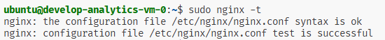

#### Домашняя работа terrafrom 04

## Задание 1

sudo nginx:  
  


console cloud:  


terraform output:  


## Задание 2

## Задание 3

terraform state list:  


terraform state rm 'module.vpc_develop':  


terraform state rm 'module.marketing-vm', terraform state rm 'module.analytics-vm':  


import vpc modules:  
  

import vm instances:  
  
  

terraform plan:  


## Задание 4

Результат terraform plan:

часть вывода с vpc (в яндекс нет зоны ru-central1-с, apply вываливался с ошибкой. Заменил на ru-central1-d):  


Для передачи id в инстансы vm заведен output в модуле vpc

## Задание 5

кластер с 2 хостами:

```hcl
module "mysql-managed" {
    source = "./modules/mysql"
    cluster_name = "example"
    network_id = module.vpc_develop.network.id
    subnet_ids = module.vpc_develop.subnet_ids
    HA = true
}
```


кластер с 1 хостом:

```hcl
module "mysql-managed" {
    source = "./modules/mysql"
    cluster_name = "example"
    network_id = module.vpc_develop.network.id
    subnet_ids = module.vpc_develop.subnet_ids
    HA = false
}
```


ресурсы db и user:


Вывод из cli yandex cloud:


Два хоста:


## Задание 6

## Задание 7

секрет из vault:  


сектрет записал:  

```hcl
resource "vault_generic_secret" "vault_my_example"{
 path = "secret/my_example"

 data_json = jsonencode({
    username = "admin"
    password = var.mysql_db_user_password
  })
}
```


## Задание 8
