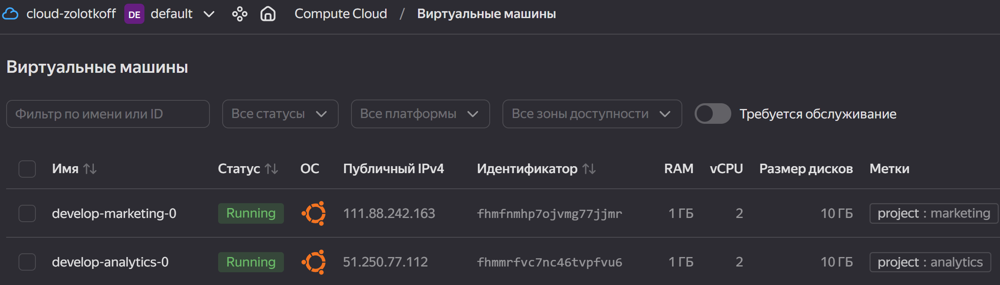
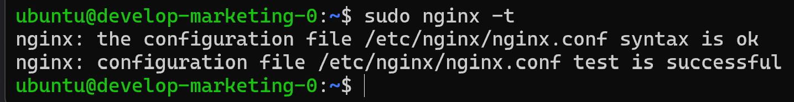
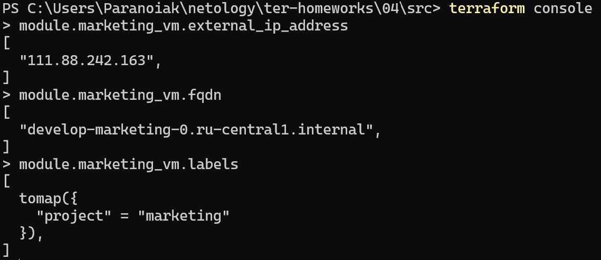
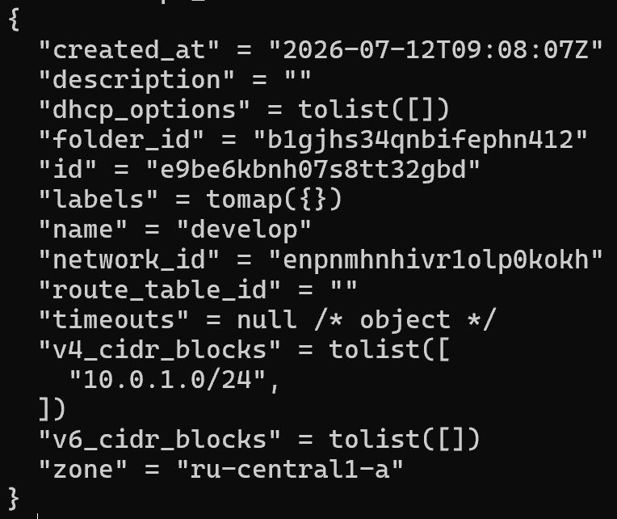
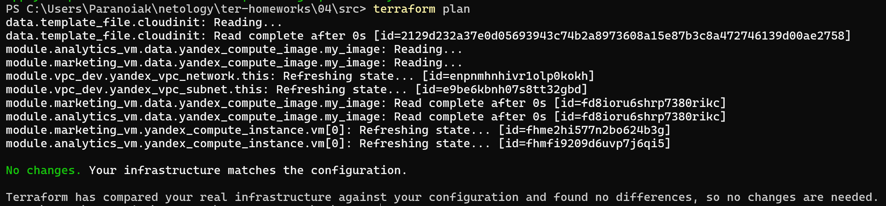

# Домашнее задание «Продвинутые методы работы с Terraform»
 
Ветка: `terraform-04`
Версия Terraform: `~> 1.12.0` (используется `1.12.2`)
Провайдеры: `yandex-cloud/yandex`, `hashicorp/template` (через зеркало `terraform-mirror.yandexcloud.net`)
 
> Все ВМ — прерываемые (`preemptible = true`, дефолт remote-модуля). Хардкод-значений нет: параметры вынесены в переменные, SSH-ключ передаётся через `vars` шаблона.
 
---
 
## Задание 1. Два вызова remote-модуля + cloud-init
 
Две ВМ разных проектов (`marketing` и `analytics`) созданы двумя вызовами одного remote-модуля `git::https://github.com/udjin10/yandex_compute_instance.git?ref=main`. Принадлежность обозначена через `labels`. SSH-ключ передаётся в `cloud-init.yml` через переменную (не хардкод) с помощью `template_file` и блока `vars`. В cloud-init добавлена установка nginx.
 
### `cloud-init.yml`
 
Ключ подставляется как элемент списка `ssh_authorized_keys` (список, а не строка):
 
```yaml
#cloud-config
users:
  - name: ubuntu
    groups: sudo
    shell: /bin/bash
    sudo: ["ALL=(ALL) NOPASSWD:ALL"]
    ssh_authorized_keys:
      - ${ssh_key}
package_update: true
package_upgrade: false
packages:
  - nginx
runcmd:
  - systemctl enable nginx
  - systemctl start nginx
```
 
### Передача ключа в шаблон (`main.tf`)
 
```hcl
locals {
  ssh_key = file(pathexpand("~/.ssh/id_rsa.pub"))
}
 
data "template_file" "cloudinit" {
  template = file("${path.module}/cloud-init.yml")
  vars = {
    ssh_key = local.ssh_key
  }
}
```
 
### Вызовы remote-модуля с labels
 
```hcl
module "marketing_vm" {
  source        = "git::https://github.com/udjin10/yandex_compute_instance.git?ref=main"
  env_name      = "develop"
  network_id    = module.vpc_dev.subnet.network_id
  subnet_zones  = [module.vpc_dev.subnet.zone]
  subnet_ids    = [module.vpc_dev.subnet.id]
  instance_name = "marketing"
  image_family  = "ubuntu-2004-lts"
  public_ip     = true
 
  labels = { project = "marketing" }
 
  metadata = {
    user-data          = data.template_file.cloudinit.rendered
    serial-port-enable = 1
  }
}
 
module "analytics_vm" {
  source        = "git::https://github.com/udjin10/yandex_compute_instance.git?ref=main"
  env_name      = "develop"
  network_id    = module.vpc_dev.subnet.network_id
  subnet_zones  = [module.vpc_dev.subnet.zone]
  subnet_ids    = [module.vpc_dev.subnet.id]
  instance_name = "analytics"
  image_family  = "ubuntu-2004-lts"
  public_ip     = true
 
  labels = { project = "analytics" }
 
  metadata = {
    user-data          = data.template_file.cloudinit.rendered
    serial-port-enable = 1
  }
}
```
 
> Примечание: при выполнении облако несколько раз возвращало `Quota vpc.externalAddressesCreation.rate exceeded` (лимит на частоту выдачи внешних IP). Чтобы обойти его, ВМ `marketing` временно поднималась с `public_ip = false` — на логику задания (labels, cloud-init, nginx) это не влияет.
 
### Проверка
 
Метки ВМ в консоли Yandex Cloud:
 

 
Подключение по SSH и проверка конфигурации nginx (`sudo nginx -t`):
 

 
Содержимое модуля (`terraform console` → `module.marketing_vm`) — приложено в файле `module_marketing.txt` / скриншот:
 

 
---
 
## Задание 2. Локальный модуль `vpc`
 
Написан локальный модуль `./vpc`, создающий одну сеть и одну подсеть в переданной зоне. Прямые ресурсы `yandex_vpc_network`/`yandex_vpc_subnet` в root заменены вызовом модуля. Документация сгенерирована `terraform-docs`.
 
### `vpc/variables.tf`
 
```hcl
variable "env_name" {
  type        = string
  description = "VPC network & subnet name"
}
variable "zone" {
  type        = string
  description = "Availability zone for the subnet"
}
variable "cidr" {
  type        = string
  description = "CIDR block for the subnet"
}
```
 
### `vpc/main.tf`
 
```hcl
resource "yandex_vpc_network" "this" {
  name = var.env_name
}
 
resource "yandex_vpc_subnet" "this" {
  name           = var.env_name
  zone           = var.zone
  network_id     = yandex_vpc_network.this.id
  v4_cidr_blocks = [var.cidr]
}
```
 
### `vpc/providers.tf`
 
Модуль явно декларирует, какой провайдер использует (иначе Terraform ищет несуществующий `hashicorp/yandex`):
 
```hcl
terraform {
  required_providers {
    yandex = {
      source = "yandex-cloud/yandex"
    }
  }
}
```
 
### `vpc/outputs.tf`
 
Модуль возвращает наружу информацию о подсети (пункт 3):
 
```hcl
output "subnet" {
  description = "Subnet resource"
  value       = yandex_vpc_subnet.this
}
```
 
### Вызов модуля в root (`main.tf`)
 
Модули ВМ получают параметры сети из output модуля `vpc` (пункт 4):
 
```hcl
module "vpc_dev" {
  source   = "./vpc"
  env_name = var.vpc_name
  zone     = var.default_zone
  cidr     = var.default_cidr[0]
}
# ... module.marketing_vm / analytics_vm ссылаются на module.vpc_dev.subnet.{id,network_id,zone}
```
 
### Проверка
 
Информация о модуле (`terraform console` → `module.vpc_dev.subnet`):
 

 
Документация модуля сгенерирована командой:
 
```powershell
terraform-docs markdown table vpc\ --output-file README.md
```
 
Результат — `vpc/README.md` с таблицами Inputs (`cidr`, `env_name`, `zone`), Resources (`yandex_vpc_network.this`, `yandex_vpc_subnet.this`) и Outputs (`subnet`).
 
---
 
## Задание 3. Операции со state
 
Продемонстрирован цикл «удаление из стейта → импорт обратно» без пересоздания ресурсов.
 
### 3.1. Список ресурсов в стейте
 
```powershell
terraform state list
```
```
data.template_file.cloudinit
module.analytics_vm.data.yandex_compute_image.my_image
module.analytics_vm.yandex_compute_instance.vm[0]
module.marketing_vm.data.yandex_compute_image.my_image
module.marketing_vm.yandex_compute_instance.vm[0]
module.vpc_dev.yandex_vpc_network.this
module.vpc_dev.yandex_vpc_subnet.this
```
 
### 3.2 – 3.3. Удаление модулей из стейта
 
`state rm` убирает записи из стейта, но НЕ трогает ресурсы в облаке:
 
```powershell
terraform state rm module.vpc_dev
terraform state rm module.marketing_vm
terraform state rm module.analytics_vm
```
```
Removed module.vpc_dev.yandex_vpc_network.this
Removed module.vpc_dev.yandex_vpc_subnet.this
Removed module.marketing_vm.yandex_compute_instance.vm[0]
Removed module.analytics_vm.yandex_compute_instance.vm[0]
```
 
### 3.4. Импорт обратно
 
Импортируются только реальные ресурсы (data-источники восстанавливаются сами). Адреса с `[0]` в PowerShell берутся в одинарные кавычки:
 
```powershell
terraform import module.vpc_dev.yandex_vpc_network.this enpnmhnhivr1olp0kokh
terraform import module.vpc_dev.yandex_vpc_subnet.this  e9be6kbnh07s8tt32gbd
terraform import 'module.marketing_vm.yandex_compute_instance.vm[0]' fhme2hi577n2bo624b3g
terraform import 'module.analytics_vm.yandex_compute_instance.vm[0]' fhmfi9209d6uvp7j6qi5
```
 
Все четыре — `Import successful!`
 
### Проверка: plan без значимых изменений
 
После импорта `plan` показал только добавление служебного флага `allow_stopping_for_update` (поведенческий флаг Terraform, не хранится в облаке и не затрагивает реальные ресурсы) — значимых изменений нет. После `terraform apply` (0 added, 2 changed, 0 destroyed) состояние выровнено полностью:
 
```powershell
terraform plan
```
```
No changes. Your infrastructure matches the configuration.
```
 

 
---
 
## Удаление ресурсов
 
После сдачи все созданные ресурсы удалены командой `terraform destroy`.