### Задание 1

[ДЗ к лекции 4](https://github.com/netology-code/ter-homeworks/tree/main/04/src)

[демо к лекции 4](https://github.com/netology-code/ter-homeworks/tree/main/04/demonstration1):

TFLint

- не  укаазана версия для провайдера  yandex
- не указана версия для провайдера template
- переменные  vms_ssh_root_key, vm_web_name, vm_db_name, public_key объявлены в  коде, но нигде не используются
- в модулях присутствуют ссылки на ветку main из git без указания конкретного коммита. 

Checkov

- на ВМ назначены публичные  IP, что создает дополнительную  угрозу безопасности,  т.к.  на машину можно попасть  извне
- не назначены  групп  безопасности на сетевые интерфейсы (используется дефолтная группа)
- используется ссылка на источник модуля без хеша, который бы обеспечил неизменяемость данных в источнике

### Задание 2

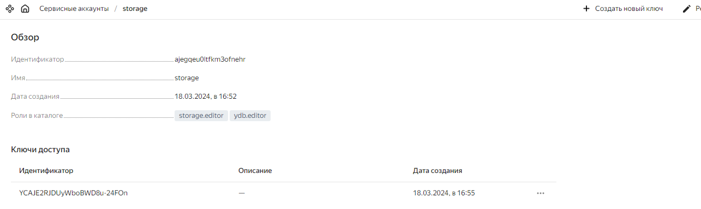
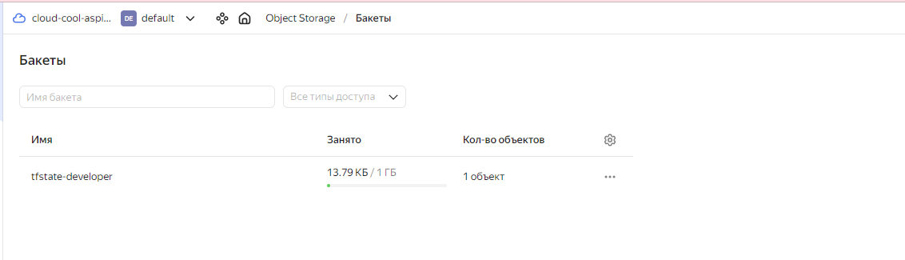
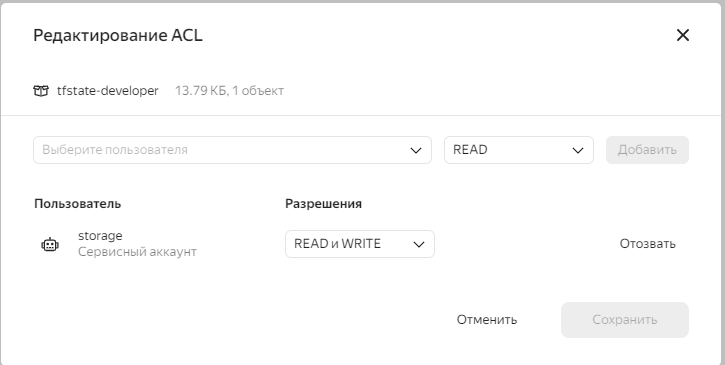
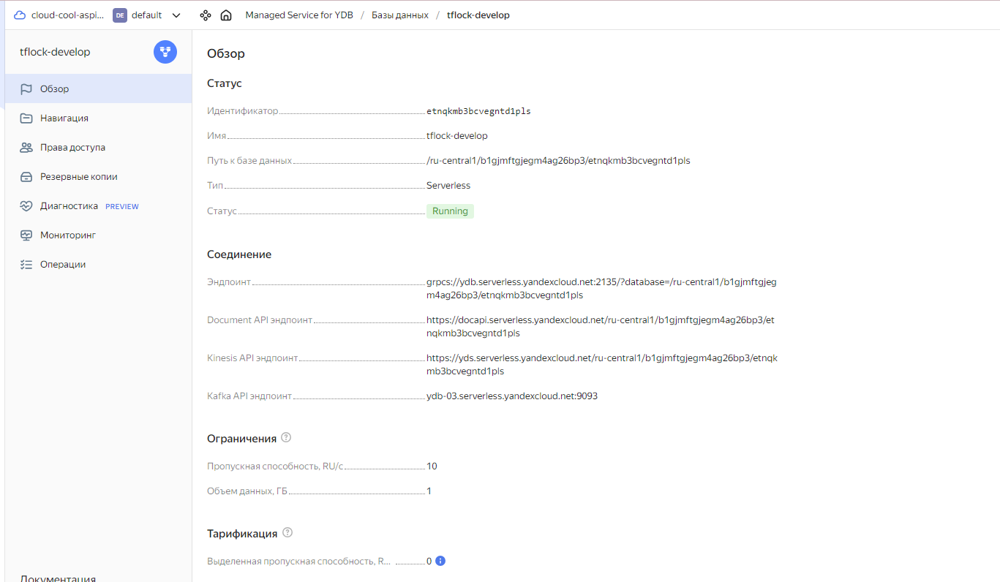
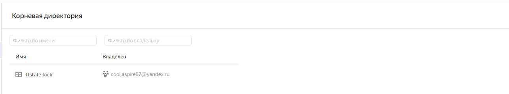
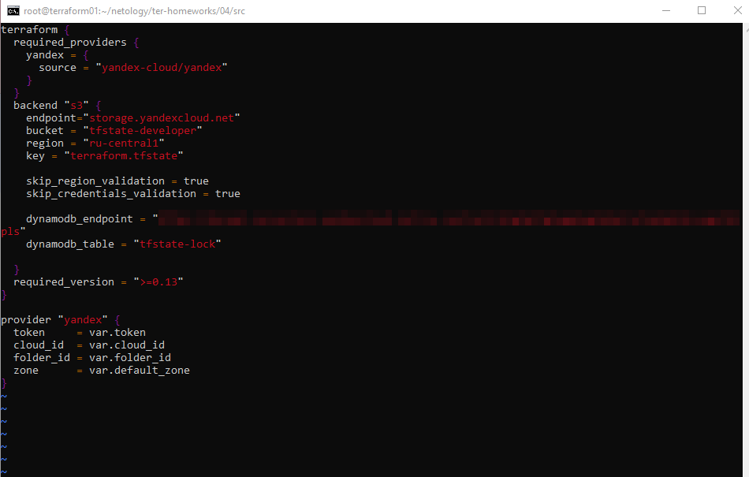
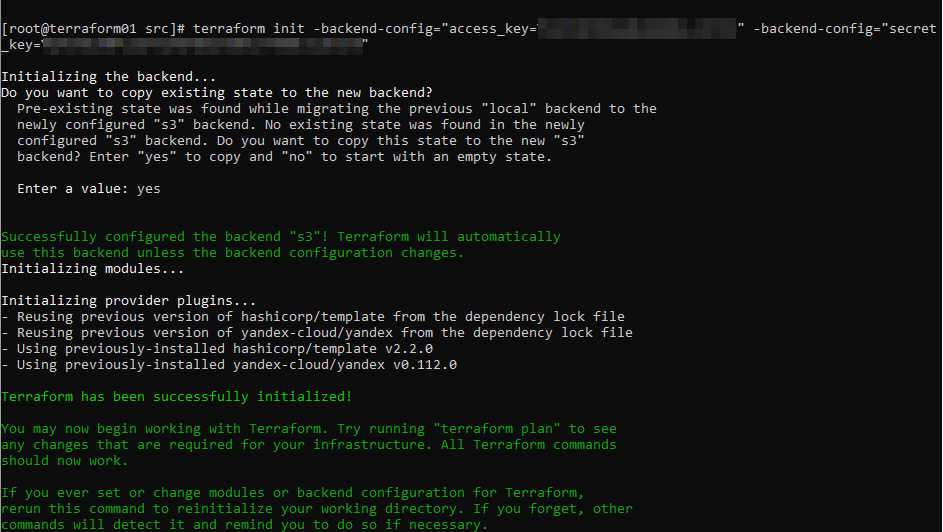
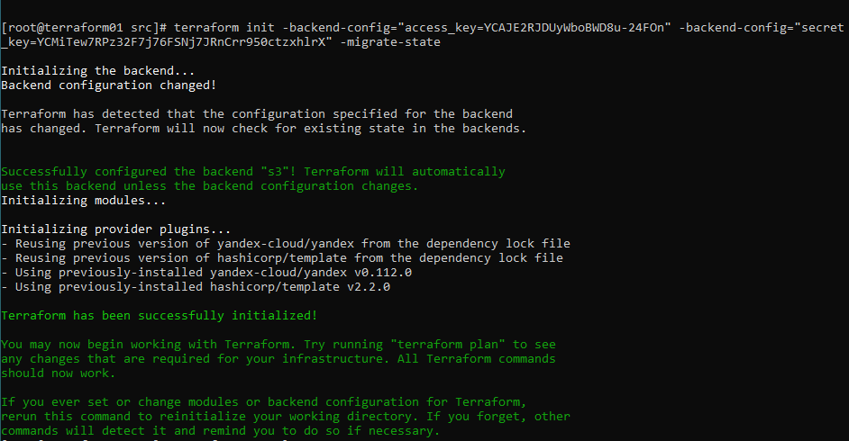
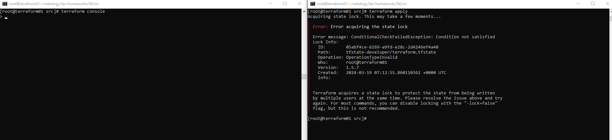
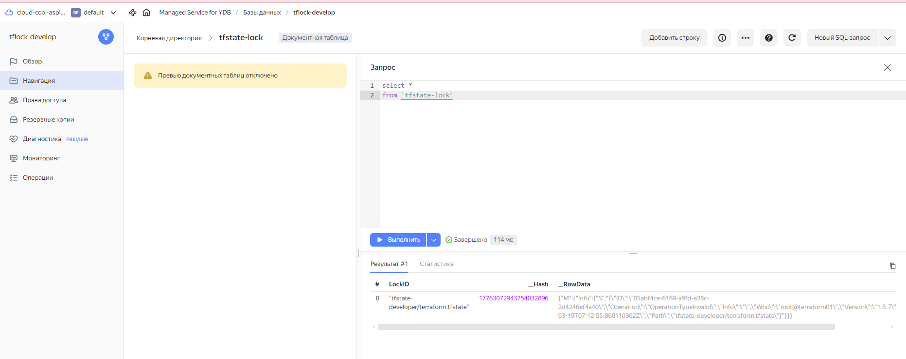
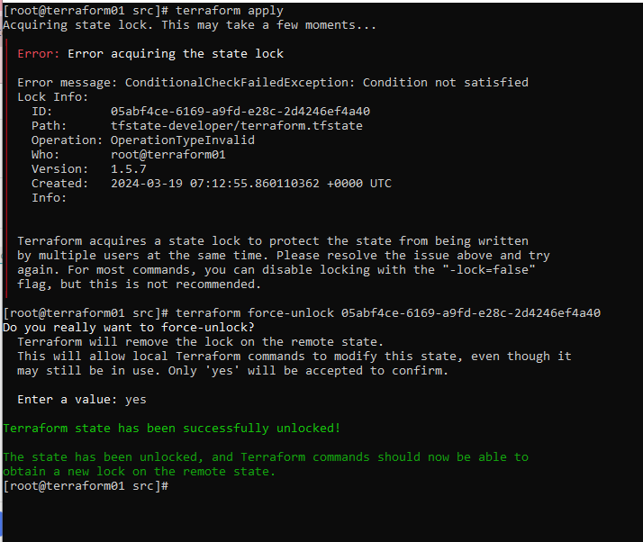

