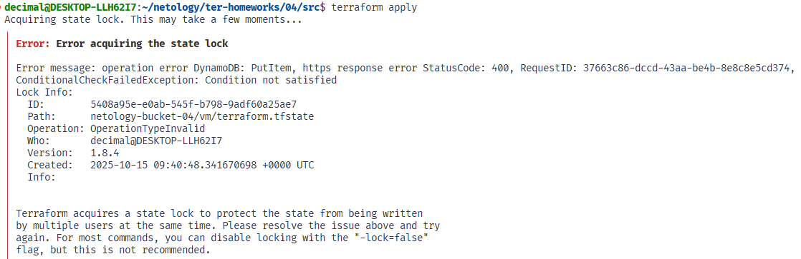
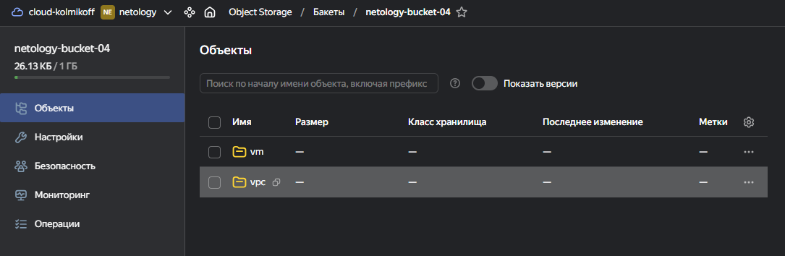

## Задание 1

### TFLint

Ругается на использование дефолтной ветки на гитхабе в модуле, поскольку изменения в дефолтных ветках могут происходить в любой момент, это может нарушить инфраструктуру при обновлении
```tflint
Warning: Module source "git::https://github.com/udjin10/yandex_compute_instance.git?ref=main" uses a default branch as ref (main) (terraform_module_pinned_source)

  on main.tf line 12:
  12:   source         = "git::https://github.com/udjin10/yandex_compute_instance.git?ref=main"
```

В файле конфигурации Terraform не указано ограничение версии для провайдера
```tflint
Warning: Missing version constraint for provider "yandex" in `required_providers` (terraform_required_providers)

  on providers.tf line 3:
   3:     yandex = {
   4:       source = "yandex-cloud/yandex"
   5:     }
```

### Checkov

Для модуля marketing_vm не указан хеш коммита для источника модуля
```checkov
Check: CKV_TF_1: "Ensure Terraform module sources use a commit hash"
        FAILED for resource: marketing_vm
        File: /main.tf:11-31
```

Для модуля marketing_vm не указан тег с версией. Checkov рекомендует использовать теги с номерами версий для обеспечения стабильности и предсказуемости кода 
```checkov
Check: CKV_TF_2: "Ensure Terraform module sources use a tag with a version number"
        FAILED for resource: marketing_vm
        File: /main.tf:11-31
```

Ругается на внешний IP и что это приводит к рискам безопасности
```checkov
Check: CKV_YC_2: "Ensure compute instance does not have public IP."
        FAILED for resource: module.devops.yandex_compute_instance.devops["dev"]
        File: /vps/main.tf:14-43
        Calling File: /main.tf:56-67
```

Ругается на отсутствие группы безопасности на сетевом интерфейсе
```checkov
Check: CKV_YC_11: "Ensure security group is assigned to network interface."
        FAILED for resource: module.devops.yandex_compute_instance.devops["dev"]
        File: /vps/main.tf:14-43
        Calling File: /main.tf:56-67
```

## Задание 2







## Задание 3

[Pull Request terraform-hotfix --> terraform-05](https://github.com/gaidarvu/ter-homeworks/pull/1)

## Задание 4

### Проверка на cidrhost()


### Проверка на regex()


[Файл variables.tf с используемыми переменными (в низу)](https://github.com/gaidarvu/ter-homeworks/blob/terraform-05/04/src/variables.tf)

## Итог
[Финальный код (ссылка на ветку terraform-05)](https://github.com/gaidarvu/ter-homeworks/tree/terraform-05/04/src)
