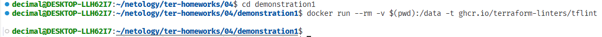
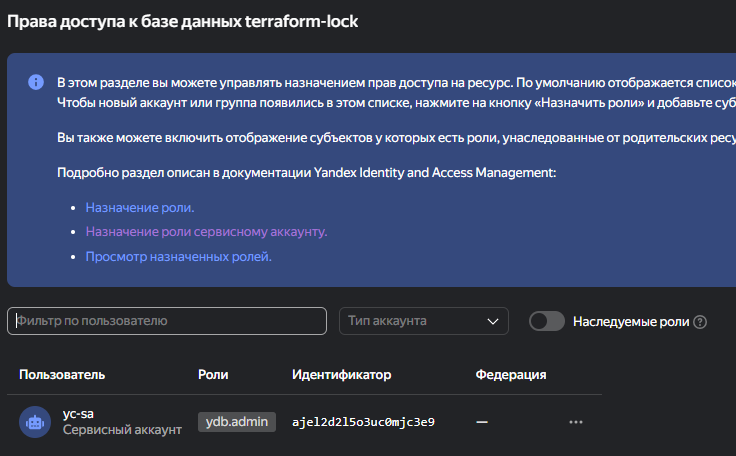
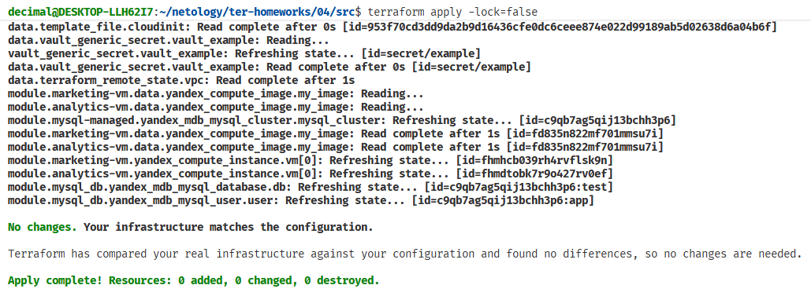

# Задание 1
## tflint:  

### в ДЗ:  

1: Warning: [Fixable] Interpolation-only expressions are deprecated in Terraform v0.12.14 (terraform_deprecated_interpolation)  
Описание ошибки: В файлах `locals.tf` (строка 2) и `outputs.tf` (строка 10) используется устаревший синтаксис интерполяции `${...}` для выражений, содержащих только функции (`file` и `nonsensitive`). Начиная с Terraform 0.12.14, такой синтаксис не рекомендуется. Необходимо заменить `"${file(...)}` на `file(...)` и `"${nonsensitive(...)}` на `nonsensitive(...)`, убрав лишние кавычки и знак `$`.

2: Warning: Module source "git::https://github.com/udjin10/yandex_compute_instance.git?ref=main" uses a default branch as ref (main) (terraform_module_pinned_source)  
Описание ошибки: В файле `main.tf` дважды (на строках 21 и 44) указан источник модуля, ссылающийся на ветку `main`. Использование динамической ветки в качестве ссылки делает конфигурацию непредсказуемой, так как её содержимое может меняться. Рекомендуется указать конкретную версию модуля — тег или хеш коммита — вместо `ref=main`, чтобы обеспечить стабильность и воспроизводимость.

3: Warning: Missing version constraint for provider {some provider}...
Версии не указаны

4: Warning: [Fixable] variable {some variable} is declared but not used:
Переменная объявлнена, но не используется

### в демо ничего не показал, видимо код идеальный:   

# Задание 2

### права доступа для сервисного акк (пусть пока admin):  

### бакет и два раздельных state:

### база и terraform-lock:

### блокировка state:  

### если -lock=false:
